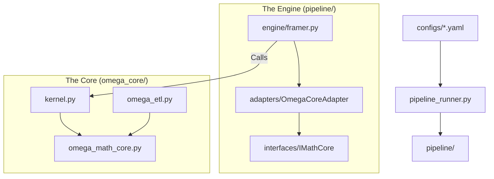

# OMEGA: The Epistemic Release (Distributed Controller-Worker)

> **"Physics is invariant. Structure is emergent. The observer is bounded."**

OMEGA represents the convergence of **Universal Market Physics** (Sato 2025) and **Computational Information Theory** (Finzi 2026), plus a hard engineering pivot:

- **DoD 指标换轨**：`Vector Alignment (Physics)` -> `Model_Alignment (Epistemic)`，并保留 `Phys_Alignment` 作为基线对照。
- **内存/吞吐换轨**：禁用 `to_dicts()` 行级展开；核心算子张量化/向量化；仅保留严格因果的轻量 IIR 递推。
- **分布式执行换轨**：Mac 作为 **Controller（代码与配置权威）**；Windows1 + Linux 作为 **Workers（只拉代码、跑 framing）**；原始 `.7z` 数据不进 Git。

---

## 宪法优先（2026-02-18）

- 最高宪法文件：`audit/constitution_v2.md`
- 所有 agent 在任何任务（规划/实现/审计）前，必须先阅读一次该文件。
- 该文件在常规任务流中视为不可更改（immutable）；仅允许人工显式宪法修订流程变更。

---

## 当前执行方式（2026-02-15，必须读）

你现在的实际环境是：

- **Mac**：Codex IDE 所在机，负责“改代码/写文档/发版本/分片编排”。
- **Windows1 + Linux**：各自外挂 `USB4 8T NVMe SSD`，两块盘内原始 `.7z` 数据完全一致；因此 **不需要内网搬运 raw 数据**，只需要同步代码与分片清单。

对应的落地文件/入口：

- 分布式治理入口：`audit/multi_agents.md`
- 运行治理入口：`audit/runtime/multi_agent/README.md`
- 运行元信息模板：`audit/runtime/current/run_meta.template.json`

### 强制纪律（否则会踩坑）

1. **禁止在 SMB/磁盘映射目录里当主工作区改代码**（会和 worker 跑任务互相污染）。
   - Controller（Mac）必须在本机磁盘持有完整 repo（例如 `~/work/Omega_vNext`）。
2. **Workers 永远只读拉取代码**（不要 push；不要在 worker 上改核心逻辑）。
3. **任何 framing/training/run 必须 pin 到明确的 Git commit 或 tag**，并写入 `run_meta.json`（由 `run_meta.template.json` 复制）。
4. `.gitignore` 负责隔离：`.7z` / `.parquet` / artifacts / logs 一律不进 Git。

## Handover 记忆体系使用教程（2026-02-18）

本项目的 handover 记忆体系由 `deploy_and_check.py` 统一驱动。

主命令：

```bash
python3 .codex/skills/multi-agent-ops/scripts/deploy_and_check.py
```

### 快速使用（每个任务都按这个节奏）

1. 任务开始前运行一次主命令。
2. 查看 `handover/ai-direct/live/00_Lesson_Recall.md` 的 Top-K 历史经验，避免重复踩坑。
3. 执行任务；若出现重大故障或修复，更新 `handover/ai-direct/live/01..05_*.md` 后再运行一次主命令刷新记忆。
4. 任务结束前写入交接事实：
   - `handover/ai-direct/entries/*.md`
   - `handover/DEBUG_LESSONS.md`
5. 结束前再次运行主命令，确保索引、召回和治理校验全部通过。

### 命令选项

1. 初始化/修复缺失文件：

```bash
python3 .codex/skills/multi-agent-ops/scripts/deploy_and_check.py --repair
```

1. 增加召回条目数：

```bash
python3 .codex/skills/multi-agent-ops/scripts/deploy_and_check.py --memory-top-k 8
```

1. 临时关闭索引与召回：

```bash
python3 .codex/skills/multi-agent-ops/scripts/deploy_and_check.py --no-memory-recall
```

1. 输出 JSON 便于自动化/CI：

```bash
python3 .codex/skills/multi-agent-ops/scripts/deploy_and_check.py --json
```

### 数据流（重要）

1. 真相源（可写）：
   - `handover/ai-direct/entries/*.md`
   - `handover/DEBUG_LESSONS.md`
2. 派生层（只读，不手改）：
   - `handover/index/memory_index.jsonl`
   - `handover/index/memory_index.sqlite3`
   - `handover/ai-direct/live/00_Lesson_Recall.md`

---

## 分布式同步与运行（推荐路径）

### 1) Mac Controller：本地 clone + 本地 bare origin

推荐目录约定（示例）：

- 控制工作区（可编辑）：`~/work/Omega_vNext`
- 局域网 origin（bare repo，仅存 git objects）：`~/git/Omega_vNext.git`

> 注意：如果你无法在 macOS 开启 SSH（Remote Login），也可以走只读 `git://`（见下文）。

### 2) Workers：从 Mac 拉代码（两种传输方式选一个）

#### Option A：SSH（安全，需开启 macOS Remote Login）

- URL 形如：`ssh://<mac_user>@<mac_ip>/Users/<mac_user>/git/Omega_vNext.git`

#### Option B：`git://` daemon（只读，免管理员权限）

Controller（Mac）启动方式（一次性/或由 LaunchAgent 常驻）：

```bash
touch ~/git/Omega_vNext.git/git-daemon-export-ok
git daemon --reuseaddr --base-path=$HOME/git --listen=0.0.0.0 --port=9418 $HOME/git/Omega_vNext.git
```

Worker clone URL：

```bash
git clone git://<mac_ip>/Omega_vNext.git
```

验证连通：

```bash
git ls-remote git://<mac_ip>/Omega_vNext.git
```

安全提示：`git://` 无鉴权，仅限可信内网使用。

---

## 并行 framing（Windows1 + Linux 同时跑，零 raw 传输）

### 1) 生成分片清单（在任意一台“有 raw .7z”的机器上执行）

> 因为 Windows1 与 Linux 的 raw 盘内容完全一致，所以分片清单在哪台生成都一样。

```bash
python tools/build_7z_shards.py --root <RAW_ROOT> --out-dir audit/runtime/current --rule date_mod2
```

输出：

- `audit/runtime/current/archive_manifest_7z.txt`
- `audit/runtime/current/shard_windows1.txt`
- `audit/runtime/current/shard_linux.txt`

将这 3 个小文件同步回 Mac Controller 的 repo 后，由 Mac 提交并 push（Workers 只 pull）。

### 2) Workers 各跑各的 shard（核心入口：`--archive-list`）

Windows1：

```bash
python pipeline_runner.py --stage frame --config configs/hardware/windows1.yaml --archive-list audit/runtime/current/shard_windows1.txt
```

Linux：

```bash
python pipeline_runner.py --stage frame --config configs/hardware/linux.yaml --archive-list audit/runtime/current/shard_linux.txt
```

`--archive-list` 支持：

- 清单内为相对路径（相对 `storage.source_root`）
- 或绝对路径（Windows/Linux 都可）

### 3) staging 与输出目录建议（重要）

- `RAW_ROOT`：USB4 盘（顺序读为主）
- `STAGE_ROOT`：尽量走内置 NVMe（解压/IO 压力大）
- `OUTPUT_ROOT`（frames parquet）：USB4 盘或内置大盘均可，但两台机器不要写同一目录（避免覆盖）

---

## 原始数据双备份同步机制（未来 raw data 变更时）

目标：当 raw `.7z` 有新增/修正时，能快速确认 Windows1 与 Linux 两份 raw 是否一致，并只补齐差异。

### 1) 各自生成 raw manifest（不进 Git）

```bash
python tools/gen_raw_manifest.py --root <RAW_ROOT> --ext .7z --out raw_manifest_<host>.jsonl
```

怀疑静默损坏时用强校验（慢）：

```bash
python tools/gen_raw_manifest.py --root <RAW_ROOT> --ext .7z --hash sha256 --out raw_manifest_<host>.jsonl
```

### 2) 比对 manifest，生成差异清单

```bash
python tools/compare_raw_manifests.py \
  --a raw_manifest_source.jsonl \
  --b raw_manifest_mirror.jsonl \
  --out-missing-in-b raw_missing_or_changed.txt
```

然后用 `rsync/rclone/robocopy` 按清单复制缺失/变更文件；复制后两边重新生成 manifest 再 compare 复核。

---

## 核心哲学 (The Theoretical Pillars)

1. **The Universal Law (Sato 2025)**
    - **Principle:** The price impact exponent $\delta$ is **strictly 0.5**.
    - **Action:** Removed "SRL Race". Hardcoded $\delta = 0.5$.
    - **Implied Y:** We invert the law ($Y = \frac{\Delta P}{\sigma \sqrt{Q/D}}$) to measure the instantaneous "rigidity" of the market structure.

2. **Epiplexity as Compression Gain (Finzi 2026)**
    - **Principle:** Complexity is not randomness. Structure is defined by the ability of a bounded observer (Linear Model) to outperform a naive observer (Mean).
    - **Metric:** $Gain = 1 - \frac{Var(Residuals)}{Var(Total)}$.
    - **Action:** Replaced LZ76 with Compression Gain. High Gain = High Structure = Actionable Signal.

3. **The Holographic Damper**
    - **Problem:** Updating internal state ($Y$) during noise (Low Epiplexity) causes model drift.
    - **Solution:** A gating mechanism. The model only learns/updates when Epiplexity > Threshold.
    - **Metaphor:** A damper that stiffens when it hits a solid object (Structure) but remains loose in air (Noise).

4. **Causal Volume Projection (Paradox 3 Fix)**
    - **Fix:** Volume buckets are now sized by linearly extrapolating current cumulative volume based on elapsed time. This eliminates look-ahead bias found in earlier implementations.
    - **Implementation:** `omega_etl.py` now strictly enforces time-sorting of slices to ensure `cum_vol` is monotonic and causal.

---

## 系统架构 (Modular Architecture)

OMEGA adopts a **Modular Pipeline Architecture**, separating Configuration, Logic, and Execution.



### 目录结构 (Directory Structure)

- **`pipeline/`**: **The Execution Engine.**
  - `config/`: Pydantic/Dataclass schemas for Hardware & Model.
  - `interfaces/`: Abstract Base Classes (IMathCore) for future-proofing.
  - `adapters/`: Glue code that binds `omega_core` to the pipeline.
  - `engine/`: The logic for Framing, Training, and Backtesting.
- **`omega_core/`**: **The Math Core.**
  - `omega_math_core.py`: Pure physics formulas (SRL 0.5, Compression Gain).
  - `kernel.py`: The Holographic Damper logic.
  - `trainer.py`: SGD Online Learning implementation (Multi-Symbol Aware).
- **`configs/`**: **Configuration as Code.**
  - `hardware/`: Hardware profiles (e.g., `active_profile.yaml`).
- **`parallel_trainer/`**: **High-Performance Driver.**
  - Legacy-compatible multiprocessing drivers for Training/Backtesting.
- **`archive/`**: Historical code that is no longer active.

---

## 快速开始 (Quick Start - V62 Two-Stage Pipeline)

在 V62 架构中，数据提炼(Base Lake)与物理计算(Physics Engine)被严格正交解耦，以彻底消灭 Python GIL 与 ZFS 的读写死锁。所有的操作均已迁移至 `tools/` 目录下的剥离脚本。

### Stage 1: Base Lake (这辈子只跑一次)

将海量 `.7z` 压缩包提炼为只包含基础量价数据的 `Base_L1.parquet`。**绝对禁止在此阶段加入任何高阶数学**。依靠多节点哈希分片完成。

**Linux 主节点 (75% 算力, 依托 4TB NVMe 缓存):**

```bash
python3 tools/stage1_linux_base_etl.py --years 2023,2024,2025,2026 --total-shards 4 --shard 0,1,2 --workers 6
```

**Windows 辅助节点 (25% 算力, 防御 Swap 崩溃):**

```powershell
python tools\stage1_windows_base_etl.py --years 2023,2024,2025,2026 --total-shards 4 --shard 3 --workers 2
```

### Stage 2: Physics Engine & Numba Compute (高频迭代)

这部分代码在每一次修改 `omega_core/` 的数学逻辑后都需要重新运行。它直接从高速内存中读取 `Base_L1.parquet`，然后将其灌入 `@numba.njit` 加速的内核中生成高维特征矩阵。

```bash
python tools/stage2_physics_compute.py \
  --input-dir /omega_pool/parquet_data/v62_base_l1 \
  --output-dir /omega_pool/parquet_data/v62_feature_l2 \
  --workers 4
```

### Stage 3: Vertex AI XGBoost Training & Backtest

所有生成好的特征最终会被统一打包，通过 `tools/gcp_upload.py` 提交至 Google Cloud Vertex AI 进行数千节点的无服务器模型训练。

```bash
# 启动云端训练任务
python tools/run_vertex_xgb_train.py

# 在本地快速回测并验证结果
python tools/run_local_backtest.py
```

### 6. Mac 主控 SSH（Windows_1）

已验证可从 Mac 无交互连接 Windows_1（仅连通 smoke，不触发 framing/train/backtest）。

Windows_1:

- Hostname: `DESKTOP-41JIDL2`
- User: `jiazi`
- IP: `192.168.3.112`

Mac `~/.ssh/config` 固化条目：

```sshconfig
Host windows1-w1
    HostName 192.168.3.112
    User jiazi
    BindAddress 192.168.3.49
    IdentityFile ~/.ssh/id_ed25519
    IdentitiesOnly yes
    PreferredAuthentications publickey
    StrictHostKeyChecking accept-new
    ConnectTimeout 8
```

连通 smoke:

```bash
ssh windows1-w1 "hostname && whoami"
```

说明：当前 Mac 存在双网卡同网段场景，需绑定源地址（`BindAddress 192.168.3.49`）以避免偶发 `No route to host`。

### 8. 审计门控说明（回测阶段）

- 默认 `fail_on_audit_failed=true`。
- 若最终 `FINAL AUDIT STATUS: FAILED`，进程会以 `exit code 1` 退出（属于策略审计失败，不是进程崩溃）。
- 若希望回测始终产出报告但不因审计失败返回非零，可在脚本参数中加入 `--allow-audit-failed`。

---

## 关键文档 (Documentation)

- **[AGENTS.md](AGENTS.md)**: 跨 CLI 统一规则入口（稳定路径优先，版本兼容别名策略）。
- **[audit/multi_agents.md](audit/multi_agents.md)**: 版本无关的多 Agent 架构规范（主入口）。
- **[audit/runtime/multi_agent/README.md](audit/runtime/multi_agent/README.md)**: 多 Agent 运行配置说明（主路径与兼容策略）。
- **[audit/runtime/multi_agent/agent_profiles.yaml](audit/runtime/multi_agent/agent_profiles.yaml)**: 模型档位与角色路由配置（热切换入口）。
- **[audit/runtime/multi_agent/recursive_audit_prompts.md](audit/runtime/multi_agent/recursive_audit_prompts.md)**: 双审递归审计提示词模板。
- **[handover/DEBUG_LESSONS.md](handover/DEBUG_LESSONS.md)**: Debug 经验沉淀总账（由 `deploy_and_check.py` 自动维护，供各 agent 复用与防回归）。
- **[audit/filesystem_naming_archive_plan_2026-02-13.md](audit/filesystem_naming_archive_plan_2026-02-13.md)**: 文件命名去版本号与归档迁移方案（分阶段执行）。
- **[audit/OMEGA_NextGen_Architecture_Plan.md](audit/OMEGA_NextGen_Architecture_Plan.md)**: 未来架构演进路线图。
- **[docs/git_multi_machine_hub.md](docs/git_multi_machine_hub.md)**: Mac + Windows1 + Windows2 代码同步/发布规范（避免手工复制粘贴）。
- **[handover/README.md](handover/README.md)**: AI 会话交接目录规范。
- **[handover/ai-direct/README.md](handover/ai-direct/README.md)**: 快速恢复与 `01..05` 交接总线规则。
- **[omega_core/README.md](omega_core/README.md)**: Core 数学内核说明。
- **[parallel_trainer/README.md](parallel_trainer/README.md)**: 并行训练/回测执行说明。
- **[rq/README.md](rq/README.md)**: RQ 相关模块说明。

## Agent Skills Index

- [.agent/skills/ai_handover/SKILL.md](.agent/skills/ai_handover/SKILL.md)
- [.agent/skills/config_promotion_protocol/SKILL.md](.agent/skills/config_promotion_protocol/SKILL.md)
- [.agent/skills/data_download/SKILL.md](.agent/skills/data_download/SKILL.md)
- [.agent/skills/data_integrity_guard/SKILL.md](.agent/skills/data_integrity_guard/SKILL.md)
- [.agent/skills/engineering/SKILL.md](.agent/skills/engineering/SKILL.md)
- [.agent/skills/evidence_based_reasoning/SKILL.md](.agent/skills/evidence_based_reasoning/SKILL.md)
- [.agent/skills/evolution_knowledge/SKILL.md](.agent/skills/evolution_knowledge/SKILL.md)
- [.agent/skills/hardcode_guard/SKILL.md](.agent/skills/hardcode_guard/SKILL.md)
- [.agent/skills/innovation_sandbox/SKILL.md](.agent/skills/innovation_sandbox/SKILL.md)
- [.agent/skills/math_consistency/SKILL.md](.agent/skills/math_consistency/SKILL.md)
- [.agent/skills/math_core/SKILL.md](.agent/skills/math_core/SKILL.md)
- [.agent/skills/multi_agent_rule_sync/SKILL.md](.agent/skills/multi_agent_rule_sync/SKILL.md)
- [.agent/skills/omega_data/SKILL.md](.agent/skills/omega_data/SKILL.md)
- [.agent/skills/omega_development/SKILL.md](.agent/skills/omega_development/SKILL.md)
- [.agent/skills/omega_engineering/SKILL.md](.agent/skills/omega_engineering/SKILL.md)
- [.agent/skills/ops/SKILL.md](.agent/skills/ops/SKILL.md)
- [.agent/skills/parallel-backtest-debugger/SKILL.md](.agent/skills/parallel-backtest-debugger/SKILL.md)
- [.agent/skills/physics/SKILL.md](.agent/skills/physics/SKILL.md)
- [.agent/skills/pipeline_performance/SKILL.md](.agent/skills/pipeline_performance/SKILL.md)
- [.agent/skills/qmtsdk/SKILL.md](.agent/skills/qmtsdk/SKILL.md)
- [.agent/skills/rqsdk/SKILL.md](.agent/skills/rqsdk/SKILL.md)

## Codex Executable Skills

- [.codex/skills/multi-agent-ops/SKILL.md](.codex/skills/multi-agent-ops/SKILL.md) (stable)
- [.codex/skills/omega-run-ops/SKILL.md](.codex/skills/omega-run-ops/SKILL.md)

---

> **Note:** Historical frame artifacts from older pipelines are not guaranteed to be compatible with the current framing logic. Please re-run framing.
