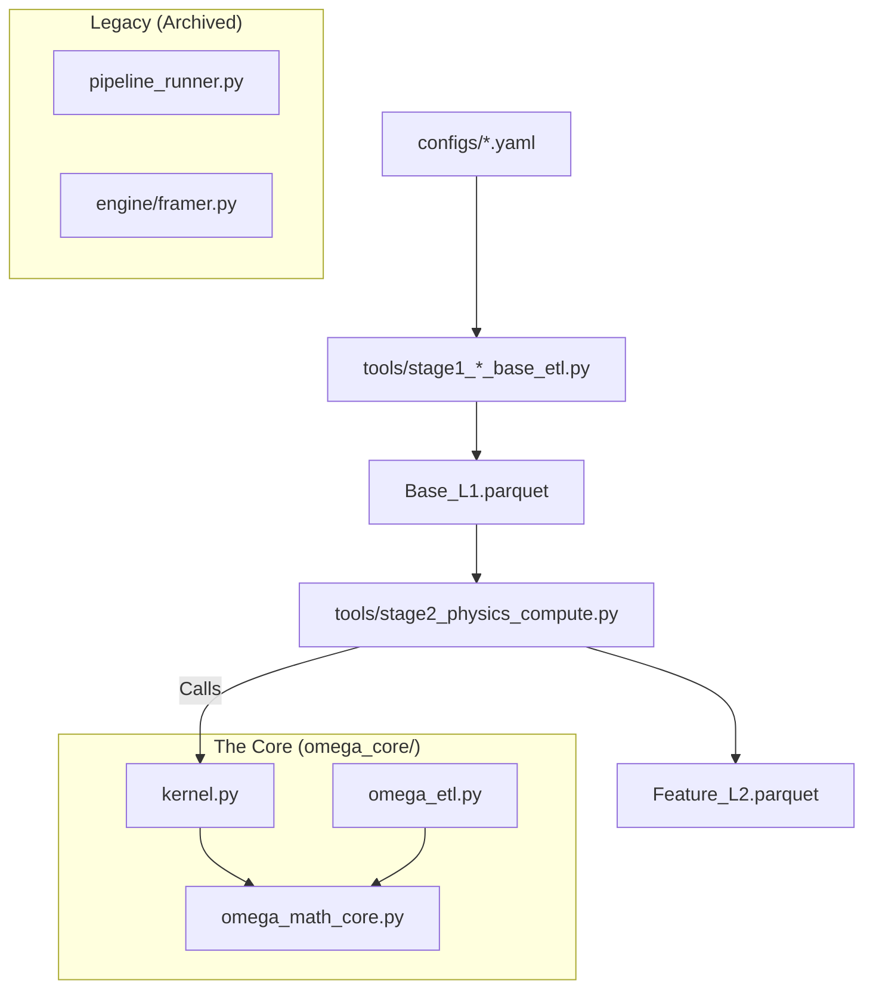

# OMEGA: The Epistemic Release (Distributed Controller-Worker)

> **"Physics is invariant. Structure is emergent. The observer is bounded."**

OMEGA represents the convergence of **Universal Market Physics** (Sato 2025) and **Computational Information Theory** (Finzi 2026), plus a hard engineering pivot:

- **DoD 指标换轨**：`Vector Alignment (Physics)` -> `Model_Alignment (Epistemic)`，并保留 `Phys_Alignment` 作为基线对照。
- **内存/吞吐换轨**：禁用 `to_dicts()` 行级展开；核心算子张量化/向量化；仅保留严格因果的轻量 IIR 递推。
- **分布式执行换轨**：Mac 作为 **Controller（代码与配置权威）**；Windows1 + Linux 作为 **Workers（只拉代码、跑 framing）**；原始 `.7z` 数据不进 Git。

---

## 宪法优先（2026-02-18）

- 最高宪法文件：`audit/constitution_v2.md`
- 所有 agent 在任何任务（规划/实现/审计）前，必须先阅读一次该文件。
- 该文件在常规任务流中视为不可更改（immutable）；仅允许人工显式宪法修订流程变更。

---

## 当前执行方式（2026-02-15，必须读）

你现在的实际环境是：

- **Mac**：Codex IDE 所在机，负责“改代码/写文档/发版本/分片编排”。
- **Windows1 + Linux**：各自外挂 `USB4 8T NVMe SSD`，两块盘内原始 `.7z` 数据完全一致；因此 **不需要内网搬运 raw 数据**，只需要同步代码与分片清单。

对应的落地文件/入口：

- 分布式治理入口：`audit/multi_agents.md`
- 运行治理入口：`audit/runtime/multi_agent/README.md`
- 运行元信息模板：`audit/runtime/current/run_meta.template.json`

### 强制纪律（否则会踩坑）

1. **禁止在 SMB/磁盘映射目录里当主工作区改代码**（会和 worker 跑任务互相污染）。
   - Controller（Mac）必须在本机磁盘持有完整 repo（例如 `~/work/Omega_vNext`）。
2. **Workers 永远只读拉取代码**（不要 push；不要在 worker 上改核心逻辑）。
3. **任何 framing/training/run 必须 pin 到明确的 Git commit 或 tag**，并写入 `run_meta.json`（由 `run_meta.template.json` 复制）。
4. `.gitignore` 负责隔离：`.7z` / `.parquet` / artifacts / logs 一律不进 Git。

## Handover 记忆体系使用教程（2026-02-18）

本项目的 handover 记忆体系由 `deploy_and_check.py` 统一驱动。

主命令：

```bash
python3 .codex/skills/multi-agent-ops/scripts/deploy_and_check.py
```

### 快速使用（每个任务都按这个节奏）

1. 任务开始前运行一次主命令。
2. 查看 `handover/ai-direct/live/00_Lesson_Recall.md` 的 Top-K 历史经验，避免重复踩坑。
3. 执行任务；若出现重大故障或修复，更新 `handover/ai-direct/live/01..05_*.md` 后再运行一次主命令刷新记忆。
4. 任务结束前写入交接事实：
   - `handover/ai-direct/entries/*.md`
   - `handover/DEBUG_LESSONS.md`
5. 结束前再次运行主命令，确保索引、召回和治理校验全部通过。

### 命令选项

1. 初始化/修复缺失文件：

```bash
python3 .codex/skills/multi-agent-ops/scripts/deploy_and_check.py --repair
```

1. 增加召回条目数：

```bash
python3 .codex/skills/multi-agent-ops/scripts/deploy_and_check.py --memory-top-k 8
```

1. 临时关闭索引与召回：

```bash
python3 .codex/skills/multi-agent-ops/scripts/deploy_and_check.py --no-memory-recall
```

1. 输出 JSON 便于自动化/CI：

```bash
python3 .codex/skills/multi-agent-ops/scripts/deploy_and_check.py --json
```

### 数据流（重要）

1. 真相源（可写）：
   - `handover/ai-direct/entries/*.md`
   - `handover/DEBUG_LESSONS.md`
2. 派生层（只读，不手改）：
   - `handover/index/memory_index.jsonl`
   - `handover/index/memory_index.sqlite3`
   - `handover/ai-direct/live/00_Lesson_Recall.md`

---

## 分布式同步与运行（推荐路径）

### 1) Mac Controller：本地 clone + 本地 bare origin

推荐目录约定（示例）：

- 控制工作区（可编辑）：`~/work/Omega_vNext`
- 局域网 origin（bare repo，仅存 git objects）：`~/git/Omega_vNext.git`

> 注意：如果你无法在 macOS 开启 SSH（Remote Login），也可以走只读 `git://`（见下文）。

### 2) Workers：从 Mac 拉代码（两种传输方式选一个）

#### Option A：SSH（安全，需开启 macOS Remote Login）

- URL 形如：`ssh://<mac_user>@<mac_ip>/Users/<mac_user>/git/Omega_vNext.git`

#### Option B：`git://` daemon（只读，免管理员权限）

Controller（Mac）启动方式（一次性/或由 LaunchAgent 常驻）：

```bash
touch ~/git/Omega_vNext.git/git-daemon-export-ok
git daemon --reuseaddr --base-path=$HOME/git --listen=0.0.0.0 --port=9418 $HOME/git/Omega_vNext.git
```

Worker clone URL：

```bash
git clone git://<mac_ip>/Omega_vNext.git
```

验证连通：

```bash
git ls-remote git://<mac_ip>/Omega_vNext.git
```

安全提示：`git://` 无鉴权，仅限可信内网使用。

---

## 并行 framing（Windows1 + Linux 同时跑，零 raw 传输）

### 1) 生成分片清单（在任意一台“有 raw .7z”的机器上执行）

> 因为 Windows1 与 Linux 的 raw 盘内容完全一致，所以分片清单在哪台生成都一样。

```bash
python tools/build_7z_shards.py --root <RAW_ROOT> --out-dir audit/runtime/current --rule date_mod2
```

输出：

- `audit/runtime/current/archive_manifest_7z.txt`
- `audit/runtime/current/shard_windows1.txt`
- `audit/runtime/current/shard_linux.txt`

将这 3 个小文件同步回 Mac Controller 的 repo 后，由 Mac 提交并 push（Workers 只 pull）。

### 2) Workers 各跑各的 shard（v62 入口）

`pipeline_runner.py` / `pipeline.engine.framer` 已归档并禁用，避免旧链路与 v62 混跑。

Windows1：

```bash
python tools/stage1_windows_base_etl.py --years 2023,2024,2025,2026 --total-shards 4 --shard 3 --workers 1
```

Linux：

```bash
bash tools/launch_linux_stage1_heavy_slice.sh -- --years 2023,2024,2025,2026 --total-shards 4 --shard 0,1,2 --workers 1
```

v62 采用 `--total-shards` + `--shard` 做切分，不再走旧 `--archive-list` Framer 路径。

### 3) staging 与输出目录建议（重要）

- `RAW_ROOT`：USB4 盘（顺序读为主）
- `STAGE_ROOT`：尽量走内置 NVMe（解压/IO 压力大）
- `OUTPUT_ROOT`（frames parquet）：USB4 盘或内置大盘均可，但两台机器不要写同一目录（避免覆盖）

---

## 原始数据双备份同步机制（未来 raw data 变更时）

目标：当 raw `.7z` 有新增/修正时，能快速确认 Windows1 与 Linux 两份 raw 是否一致，并只补齐差异。

### 1) 各自生成 raw manifest（不进 Git）

```bash
python tools/gen_raw_manifest.py --root <RAW_ROOT> --ext .7z --out raw_manifest_<host>.jsonl
```

怀疑静默损坏时用强校验（慢）：

```bash
python tools/gen_raw_manifest.py --root <RAW_ROOT> --ext .7z --hash sha256 --out raw_manifest_<host>.jsonl
```

### 2) 比对 manifest，生成差异清单

```bash
python tools/compare_raw_manifests.py \
  --a raw_manifest_source.jsonl \
  --b raw_manifest_mirror.jsonl \
  --out-missing-in-b raw_missing_or_changed.txt
```

然后用 `rsync/rclone/robocopy` 按清单复制缺失/变更文件；复制后两边重新生成 manifest 再 compare 复核。

---

## 核心哲学 (The Theoretical Pillars)

1. **The Universal Law (Sato 2025)**
    - **Principle:** The price impact exponent $\delta$ is **strictly 0.5**.
    - **Action:** Removed "SRL Race". Hardcoded $\delta = 0.5$.
    - **Implied Y:** We invert the law ($Y = \frac{\Delta P}{\sigma \sqrt{Q/D}}$) to measure the instantaneous "rigidity" of the market structure.

2. **Epiplexity as Compression Gain (Finzi 2026)**
    - **Principle:** Complexity is not randomness. Structure is defined by the ability of a bounded observer (Linear Model) to outperform a naive observer (Mean).
    - **Metric:** $Gain = 1 - \frac{Var(Residuals)}{Var(Total)}$.
    - **Action:** Replaced LZ76 with Compression Gain. High Gain = High Structure = Actionable Signal.

3. **The Holographic Damper**
    - **Problem:** Updating internal state ($Y$) during noise (Low Epiplexity) causes model drift.
    - **Solution:** A gating mechanism. The model only learns/updates when Epiplexity > Threshold.
    - **Metaphor:** A damper that stiffens when it hits a solid object (Structure) but remains loose in air (Noise).

4. **Causal Volume Projection (Paradox 3 Fix)**
    - **Fix:** Volume buckets are now sized by linearly extrapolating current cumulative volume based on elapsed time. This eliminates look-ahead bias found in earlier implementations.
    - **Implementation:** `omega_etl.py` now strictly enforces time-sorting of slices to ensure `cum_vol` is monotonic and causal.

---

## 系统架构 (Modular Architecture)

OMEGA adopts a **Modular Two-Stage Architecture**, separating extraction and physics.



### 目录结构 (Directory Structure)

- **`pipeline/`**: **Legacy execution engine (archived for v62 runtime).**
  - `config/`: Pydantic/Dataclass schemas for Hardware & Model.
  - `interfaces/`: Abstract Base Classes (IMathCore) for future-proofing.
  - `adapters/`: Glue code that binds `omega_core` to the pipeline.
  - `engine/`: The logic for Framing, Training, and Backtesting.
- **`omega_core/`**: **The Math Core.**
  - `omega_math_core.py`: Pure physics formulas (SRL 0.5, Compression Gain).
  - `kernel.py`: The Holographic Damper logic.
  - `trainer.py`: SGD Online Learning implementation (Multi-Symbol Aware).
- **`configs/`**: **Configuration as Code.**
  - `hardware/`: Hardware profiles (e.g., `active_profile.yaml`).
- **`parallel_trainer/`**: **High-Performance Driver.**
  - Legacy-compatible multiprocessing drivers for Training/Backtesting.
- **`archive/`**: Historical code that is no longer active.

---

## 快速开始 (Quick Start - V62 Two-Stage Pipeline)

在 V62 架构中，数据提炼(Base Lake)与物理计算(Physics Engine)被严格正交解耦，以彻底消灭 Python GIL 与 ZFS 的读写死锁。所有的操作均已迁移至 `tools/` 目录下的剥离脚本。

### Stage 1: Base Lake (这辈子只跑一次)

将海量 `.7z` 压缩包提炼为只包含基础量价数据的 `Base_L1.parquet`。**绝对禁止在此阶段加入任何高阶数学**。依靠多节点哈希分片完成。

**Linux 主节点 (75% 算力, 依托 4TB NVMe 缓存):**

```bash
python3 tools/stage1_linux_base_etl.py --years 2023,2024,2025,2026 --total-shards 4 --shard 0,1,2 --workers 6
```

**Windows 辅助节点 (25% 算力, 防御 Swap 崩溃):**

```powershell
python tools\stage1_windows_base_etl.py --years 2023,2024,2025,2026 --total-shards 4 --shard 3 --workers 2
```

### Stage 2: Physics Engine & Numba Compute (高频迭代)

这部分代码在每一次修改 `omega_core/` 的数学逻辑后都需要重新运行。它直接从高速内存中读取 `Base_L1.parquet`，然后将其灌入 `@numba.njit` 加速的内核中生成高维特征矩阵。

```bash
python tools/stage2_physics_compute.py \
  --input-dir /omega_pool/parquet_data/latest_base_l1 \
  --output-dir /omega_pool/parquet_data/latest_feature_l2 \
  --workers 4
```

### Stage 3: Vertex AI XGBoost Training & Backtest

所有生成好的特征最终会被统一打包，通过 `tools/gcp_upload.py` 提交至 Google Cloud Vertex AI 进行数千节点的无服务器模型训练。

```bash
# 启动云端训练任务
python tools/run_vertex_xgb_train.py

# 在本地快速回测并验证结果
python tools/run_local_backtest.py
```

### 6. Mac 主控 SSH（Windows_1）

已验证可从 Mac 无交互连接 Windows_1（仅连通 smoke，不触发 framing/train/backtest）。

Windows_1:

- Hostname: `DESKTOP-41JIDL2`
- User: `jiazi`
- IP: `192.168.3.112`

Mac `~/.ssh/config` 固化条目：

```sshconfig
Host windows1-w1
    HostName 192.168.3.112
    User jiazi
    BindAddress 192.168.3.49
    IdentityFile ~/.ssh/id_ed25519
    IdentitiesOnly yes
    PreferredAuthentications publickey
    StrictHostKeyChecking accept-new
    ConnectTimeout 8
```

连通 smoke:

```bash
ssh windows1-w1 "hostname && whoami"
```

说明：当前 Mac 存在双网卡同网段场景，需绑定源地址（`BindAddress 192.168.3.49`）以避免偶发 `No route to host`。

### 8. 审计门控说明（回测阶段）

- 默认 `fail_on_audit_failed=true`。
- 若最终 `FINAL AUDIT STATUS: FAILED`，进程会以 `exit code 1` 退出（属于策略审计失败，不是进程崩溃）。
- 若希望回测始终产出报告但不因审计失败返回非零，可在脚本参数中加入 `--allow-audit-failed`。

---

## 关键文档 (Documentation)

- **[AGENTS.md](AGENTS.md)**: 跨 CLI 统一规则入口（稳定路径优先，版本兼容别名策略）。
- **[audit/multi_agents.md](audit/multi_agents.md)**: 版本无关的多 Agent 架构规范（主入口）。
- **[audit/runtime/multi_agent/README.md](audit/runtime/multi_agent/README.md)**: 多 Agent 运行配置说明（主路径与兼容策略）。
- **[audit/runtime/multi_agent/agent_profiles.yaml](audit/runtime/multi_agent/agent_profiles.yaml)**: 模型档位与角色路由配置（热切换入口）。
- **[audit/runtime/multi_agent/recursive_audit_prompts.md](audit/runtime/multi_agent/recursive_audit_prompts.md)**: 双审递归审计提示词模板。
- **[handover/DEBUG_LESSONS.md](handover/DEBUG_LESSONS.md)**: Debug 经验沉淀总账（由 `deploy_and_check.py` 自动维护，供各 agent 复用与防回归）。
- **[audit/filesystem_naming_archive_plan_2026-02-13.md](audit/filesystem_naming_archive_plan_2026-02-13.md)**: 文件命名去版本号与归档迁移方案（分阶段执行）。
- **[audit/OMEGA_NextGen_Architecture_Plan.md](audit/OMEGA_NextGen_Architecture_Plan.md)**: 未来架构演进路线图。
- **[docs/git_multi_machine_hub.md](docs/git_multi_machine_hub.md)**: Mac + Windows1 + Windows2 代码同步/发布规范（避免手工复制粘贴）。
- **[handover/README.md](handover/README.md)**: AI 会话交接目录规范。
- **[handover/ai-direct/README.md](handover/ai-direct/README.md)**: 快速恢复与 `01..05` 交接总线规则。
- **[omega_core/README.md](omega_core/README.md)**: Core 数学内核说明。
- **[parallel_trainer/README.md](parallel_trainer/README.md)**: 并行训练/回测执行说明。
- **[rq/README.md](rq/README.md)**: RQ 相关模块说明。

## Agent Skills Index

- [.agent/skills/ai_handover/SKILL.md](.agent/skills/ai_handover/SKILL.md)
- [.agent/skills/config_promotion_protocol/SKILL.md](.agent/skills/config_promotion_protocol/SKILL.md)
- [.agent/skills/data_download/SKILL.md](.agent/skills/data_download/SKILL.md)
- [.agent/skills/data_integrity_guard/SKILL.md](.agent/skills/data_integrity_guard/SKILL.md)
- [.agent/skills/engineering/SKILL.md](.agent/skills/engineering/SKILL.md)
- [.agent/skills/evidence_based_reasoning/SKILL.md](.agent/skills/evidence_based_reasoning/SKILL.md)
- [.agent/skills/evolution_knowledge/SKILL.md](.agent/skills/evolution_knowledge/SKILL.md)
- [.agent/skills/hardcode_guard/SKILL.md](.agent/skills/hardcode_guard/SKILL.md)
- [.agent/skills/innovation_sandbox/SKILL.md](.agent/skills/innovation_sandbox/SKILL.md)
- [.agent/skills/math_consistency/SKILL.md](.agent/skills/math_consistency/SKILL.md)
- [.agent/skills/math_core/SKILL.md](.agent/skills/math_core/SKILL.md)
- [.agent/skills/multi_agent_rule_sync/SKILL.md](.agent/skills/multi_agent_rule_sync/SKILL.md)
- [.agent/skills/omega_data/SKILL.md](.agent/skills/omega_data/SKILL.md)
- [.agent/skills/omega_development/SKILL.md](.agent/skills/omega_development/SKILL.md)
- [.agent/skills/omega_engineering/SKILL.md](.agent/skills/omega_engineering/SKILL.md)
- [.agent/skills/ops/SKILL.md](.agent/skills/ops/SKILL.md)
- [.agent/skills/parallel-backtest-debugger/SKILL.md](.agent/skills/parallel-backtest-debugger/SKILL.md)
- [.agent/skills/physics/SKILL.md](.agent/skills/physics/SKILL.md)
- [.agent/skills/pipeline_performance/SKILL.md](.agent/skills/pipeline_performance/SKILL.md)
- [.agent/skills/qmtsdk/SKILL.md](.agent/skills/qmtsdk/SKILL.md)
- [.agent/skills/rqsdk/SKILL.md](.agent/skills/rqsdk/SKILL.md)

## Codex Executable Skills

- [.codex/skills/multi-agent-ops/SKILL.md](.codex/skills/multi-agent-ops/SKILL.md) (stable)
- [.codex/skills/omega-run-ops/SKILL.md](.codex/skills/omega-run-ops/SKILL.md)

---

> **Note:** Historical frame artifacts from older pipelines are not guaranteed to be compatible with the current framing logic. Please re-run framing.

## 全局文件索引图谱 (Global File Index for Agents)

本索引旨在帮助所有的 AI Agents 快速了解清理后的精简代码库全貌，避免在历史遗留的 `_archived` 归档目录中迷失。

### `".trae/` 目录
- **`".trae/documents/Gemini 3 Deep Think vs OpenAI 5.2 Pro \346\225\260\345\255\246\350\203\275\345\212\233\346\267\261\345\272\246\345\257\271\346\257\224\350\260\203\347\240\224\350\256\241\345\210\222.md"`**
- **`".trae/documents/trainer.py \345\271\266\350\241\214\345\214\226\344\270\216\347\241\254\344\273\266\345\210\251\347\224\250\350\256\241\345\210\222.md"`**

### 根目录核心文件 (Root Files)
- **`.gitattributes`**
- **`.gitignore`**
- **`99-memory-hardening-v61.conf`**
- **`AGENTS.md`**
- **`Bible_AUDIT.MD`**
- **`CLAUDE.md`**
- **`GIT_LOCAL_WORKFLOW_WINDOWS_AI.md`**
- **`GIT_UPGRADE_RECORD_2026-02-07.md`**
- **`GIT_VERSION_CHANGELOG_2026-02-08.md`**
- **`OMEGA_CONSTITUTION.md`**
- **`README.md`**
- **`README_TRAINER.md`**
- **`config.py`**
- **`config_v6.py`**
- **`context.md`**
- **`gemini.md`**
- **`n2-standard-32`**
- **`n2-standard-48`**
- **`n2-standard-64`**
- **`openclaw_config.json`**
- **`orchestrator.py`**
- **`parallel-backtest-debugger.skill`**
- **`pipeline_runner.py`**
- **`raw_log_dump.txt`**
- **`requirements.lock`**
- **`requirements.txt`**
- **`smoke_test_payload.py`**
- **`training_data_analysis.md`**

### `.antigravity/` 目录
- **`.antigravity/config.yaml`**

### `.claude/` 目录
- **`.claude/knowledge/ricequant-doc-index.md`**

### `.cursor/` 目录
- **`.cursor/rules/math-kernel.mdc`**
- **`.cursor/rules/omega-core.mdc`**
- **`.cursor/rules/pipeline.mdc`**

### `.gemini/` 目录
- **`.gemini/context.md`**

### `.tmp/` 目录
- **`.tmp/gcloud_cfg/access_tokens.db`**
- **`.tmp/gcloud_cfg/active_config`**
- **`.tmp/gcloud_cfg/application_default_credentials.json`**
- **`.tmp/gcloud_cfg/config_sentinel`**
- **`.tmp/gcloud_cfg/configurations/config_default`**
- **`.tmp/gcloud_cfg/credentials.db`**
- **`.tmp/gcloud_cfg/default_configs.db`**
- **`.tmp/gcloud_cfg/gce`**
- **`.tmp/gcloud_cfg/hidden_gcloud_config_universe_descriptor_data_cache_configs.db`**
- **`.tmp/gcloud_cfg/legacy_credentials/ziqian.jia@gmail.com/.boto`**
- **`.tmp/gcloud_cfg/legacy_credentials/ziqian.jia@gmail.com/adc.json`**
- **`.tmp/gcloud_cfg/surface_data/storage/tracker_files/parallel_upload_TRACKER_0b8773fa95927c1ae46caf4b5bd78e3a848e208b..parquet__gs.url`**
- **`.tmp/gcloud_cfg/surface_data/storage/tracker_files/parallel_upload_TRACKER_0e1aa80360399e86ab45ca42f7711fab065887ad..parquet__gs.url`**
- **`.tmp/gcloud_cfg/surface_data/storage/tracker_files/parallel_upload_TRACKER_0eb5b5ff9ae8671018567954d1648a2ccbd853f3..parquet__gs.url`**
- **`.tmp/gcloud_cfg/surface_data/storage/tracker_files/parallel_upload_TRACKER_105890096f630373221d3031136071b2e8649724..parquet__gs.url`**
- **`.tmp/gcloud_cfg/surface_data/storage/tracker_files/parallel_upload_TRACKER_143f560e816c8e449d05c157d497e7ed355df167..parquet__gs.url`**
- **`.tmp/gcloud_cfg/surface_data/storage/tracker_files/parallel_upload_TRACKER_144fac34be4aa86604c0ef52d0985a21df20dbd0..parquet__gs.url`**
- **`.tmp/gcloud_cfg/surface_data/storage/tracker_files/parallel_upload_TRACKER_17c25d1c3ce132394fdfcd34264b74734b979032..parquet__gs.url`**
- **`.tmp/gcloud_cfg/surface_data/storage/tracker_files/parallel_upload_TRACKER_19a7e8475b0e9c86d9e81ee6e180b3b71dfa6cfd..parquet__gs.url`**
- **`.tmp/gcloud_cfg/surface_data/storage/tracker_files/parallel_upload_TRACKER_1a6bc9da6ca2fa18a27e4cfb3cae334196fb6a3f..parquet__gs.url`**
- **`.tmp/gcloud_cfg/surface_data/storage/tracker_files/parallel_upload_TRACKER_202a0f7a9f50d1e4324aa49c9f3aa402057382a1..parquet__gs.url`**
- **`.tmp/gcloud_cfg/surface_data/storage/tracker_files/parallel_upload_TRACKER_21c7dc47a94b84c1915f3c275c9e242228b89be3..parquet__gs.url`**
- **`.tmp/gcloud_cfg/surface_data/storage/tracker_files/parallel_upload_TRACKER_2581331d7f6b29c9094054a8ba91570e409844b3..parquet__gs.url`**
- **`.tmp/gcloud_cfg/surface_data/storage/tracker_files/parallel_upload_TRACKER_269e47e38d3da98e9088c2fc4750de45287b6658..parquet__gs.url`**
- **`.tmp/gcloud_cfg/surface_data/storage/tracker_files/parallel_upload_TRACKER_27e7ec216b151009acabe577687de83bd39ea34f..parquet__gs.url`**
- **`.tmp/gcloud_cfg/surface_data/storage/tracker_files/parallel_upload_TRACKER_3113a21b5e8a4352432e851d3af492382034f299..parquet__gs.url`**
- **`.tmp/gcloud_cfg/surface_data/storage/tracker_files/parallel_upload_TRACKER_3154f75a253475902b8d25fb42b182bab0824369..parquet__gs.url`**
- **`.tmp/gcloud_cfg/surface_data/storage/tracker_files/parallel_upload_TRACKER_318bc23cb3189a3b86f864f240d679728c7eee71..parquet__gs.url`**
- **`.tmp/gcloud_cfg/surface_data/storage/tracker_files/parallel_upload_TRACKER_37dca8dfc6c2aef915de005806491c8134f7e390..parquet__gs.url`**
- **`.tmp/gcloud_cfg/surface_data/storage/tracker_files/parallel_upload_TRACKER_38263100cd44d42fa03dff0d28c9eb4e681c39dc..parquet__gs.url`**
- **`.tmp/gcloud_cfg/surface_data/storage/tracker_files/parallel_upload_TRACKER_3d70daa67a64e45c1372bf6bd18f723e23a98670..parquet__gs.url`**
- **`.tmp/gcloud_cfg/surface_data/storage/tracker_files/parallel_upload_TRACKER_407ef8aee2df90d669a6571fdc34d058b4974f5b..parquet__gs.url`**
- **`.tmp/gcloud_cfg/surface_data/storage/tracker_files/parallel_upload_TRACKER_46da46310a462f515ecead47137df6f77029172d..parquet__gs.url`**
- **`.tmp/gcloud_cfg/surface_data/storage/tracker_files/parallel_upload_TRACKER_49c4d1c91ed630dda9012814e7d103c0007321cd..parquet__gs.url`**
- **`.tmp/gcloud_cfg/surface_data/storage/tracker_files/parallel_upload_TRACKER_4c04dd8be5e88f49cae84abe6fcb4b6fb17b664b..parquet__gs.url`**
- **`.tmp/gcloud_cfg/surface_data/storage/tracker_files/parallel_upload_TRACKER_4f6d07c7a77f152ace020c135a586bca29764bea..parquet__gs.url`**
- **`.tmp/gcloud_cfg/surface_data/storage/tracker_files/parallel_upload_TRACKER_5006d7ddb60b71738e415b46a6c10d7a82e8a5b2..parquet__gs.url`**
- **`.tmp/gcloud_cfg/surface_data/storage/tracker_files/parallel_upload_TRACKER_52b420a75deaa3c23bd808b16dfb625f465f72e3..parquet__gs.url`**
- **`.tmp/gcloud_cfg/surface_data/storage/tracker_files/parallel_upload_TRACKER_5476bfe61b1185cb0da0b133cb61f58fe517fd39..parquet__gs.url`**
- **`.tmp/gcloud_cfg/surface_data/storage/tracker_files/parallel_upload_TRACKER_59dac784c4aec207d04383af92094a366be092dc..parquet__gs.url`**
- **`.tmp/gcloud_cfg/surface_data/storage/tracker_files/parallel_upload_TRACKER_5b2bc0be2fd83508f46fac5564b6f187a37cdab6..parquet__gs.url`**
- **`.tmp/gcloud_cfg/surface_data/storage/tracker_files/parallel_upload_TRACKER_5d8315860cc7f8f029a0253b633c6c21548983e9..parquet__gs.url`**
- **`.tmp/gcloud_cfg/surface_data/storage/tracker_files/parallel_upload_TRACKER_5df643641d81984912470374294b7154ea7fb06b..parquet__gs.url`**
- **`.tmp/gcloud_cfg/surface_data/storage/tracker_files/parallel_upload_TRACKER_6137afa9b6d12d3b2ceb5194df36995edcf5e39a..parquet__gs.url`**
- **`.tmp/gcloud_cfg/surface_data/storage/tracker_files/parallel_upload_TRACKER_613839f0db2f6a4700745a0b62f26b9724348aad..parquet__gs.url`**
- **`.tmp/gcloud_cfg/surface_data/storage/tracker_files/parallel_upload_TRACKER_637c360f80c16f3870b0d60bba853234c6fb4b17..parquet__gs.url`**
- **`.tmp/gcloud_cfg/surface_data/storage/tracker_files/parallel_upload_TRACKER_64d38ab9a14a7d0a200c96fa32b198eac33d100d..parquet__gs.url`**
- **`.tmp/gcloud_cfg/surface_data/storage/tracker_files/parallel_upload_TRACKER_6869efcaa2aca7c40819d8eeef09e9be8d72d4fe..parquet__gs.url`**
- **`.tmp/gcloud_cfg/surface_data/storage/tracker_files/parallel_upload_TRACKER_69058d23d2aa62f840eb9098ded32667febfc868..parquet__gs.url`**
- **`.tmp/gcloud_cfg/surface_data/storage/tracker_files/parallel_upload_TRACKER_69df1f1bc2ad1dc0d7d8743163dd851cfe137f63..parquet__gs.url`**
- **`.tmp/gcloud_cfg/surface_data/storage/tracker_files/parallel_upload_TRACKER_6b71d1d78c13a16ce222effcf023a7aed7620e4d..parquet__gs.url`**
- **`.tmp/gcloud_cfg/surface_data/storage/tracker_files/parallel_upload_TRACKER_6bf42e413ff74b6a42f7050d2b2124943188d8ba..parquet__gs.url`**
- **`.tmp/gcloud_cfg/surface_data/storage/tracker_files/parallel_upload_TRACKER_6cdbfbe89d84879d48db5401c2e9400c816213fe..parquet__gs.url`**
- **`.tmp/gcloud_cfg/surface_data/storage/tracker_files/parallel_upload_TRACKER_6e48e0f7a135ce9a81badea0c98347bd04ee4cf9..parquet__gs.url`**
- **`.tmp/gcloud_cfg/surface_data/storage/tracker_files/parallel_upload_TRACKER_6f70630056a334b068c58428954442023b828366..parquet__gs.url`**
- **`.tmp/gcloud_cfg/surface_data/storage/tracker_files/parallel_upload_TRACKER_70626ce01a199e9e32abcb84d2767caeb7350ce4..parquet__gs.url`**
- **`.tmp/gcloud_cfg/surface_data/storage/tracker_files/parallel_upload_TRACKER_711472aaed0f0a871a651a1d8d0ca0080c1368f5..parquet__gs.url`**
- **`.tmp/gcloud_cfg/surface_data/storage/tracker_files/parallel_upload_TRACKER_754f179f10c6556a70476b48eab7640cc9213606..parquet__gs.url`**
- **`.tmp/gcloud_cfg/surface_data/storage/tracker_files/parallel_upload_TRACKER_7a544434b46868ca88fa81b1410548896fe9ef90..parquet__gs.url`**
- **`.tmp/gcloud_cfg/surface_data/storage/tracker_files/parallel_upload_TRACKER_8324af0d48c7c5b667c2b81f15929bf8956fe15d..parquet__gs.url`**
- **`.tmp/gcloud_cfg/surface_data/storage/tracker_files/parallel_upload_TRACKER_832c543ee96e70fbab1083d675058b0f31ef8d4a..parquet__gs.url`**
- **`.tmp/gcloud_cfg/surface_data/storage/tracker_files/parallel_upload_TRACKER_848a327dd2f804a5838c73ae6c4463dc1f7b1e5c..parquet__gs.url`**
- **`.tmp/gcloud_cfg/surface_data/storage/tracker_files/parallel_upload_TRACKER_85908c685bee63b80fe787b596ac8704cc5a68ea..parquet__gs.url`**
- **`.tmp/gcloud_cfg/surface_data/storage/tracker_files/parallel_upload_TRACKER_8731788751bc13ac733f7552909d2ce611bd1228..parquet__gs.url`**
- **`.tmp/gcloud_cfg/surface_data/storage/tracker_files/parallel_upload_TRACKER_876e4561d4accfec2cac305b5d8af42be689aecf..parquet__gs.url`**
- **`.tmp/gcloud_cfg/surface_data/storage/tracker_files/parallel_upload_TRACKER_88f04f8b0f0be1269c1bde9eb9e1d449cf91e5fe..parquet__gs.url`**
- **`.tmp/gcloud_cfg/surface_data/storage/tracker_files/parallel_upload_TRACKER_88fd65e247f2361f2291124661715d0be6cdd8ad..parquet__gs.url`**
- **`.tmp/gcloud_cfg/surface_data/storage/tracker_files/parallel_upload_TRACKER_89d8405b34ab3759c9760104ff6fa65300ef7b24..parquet__gs.url`**
- **`.tmp/gcloud_cfg/surface_data/storage/tracker_files/parallel_upload_TRACKER_8bed4b1dddced040ce3b99a31c725e419c929f61..parquet__gs.url`**
- **`.tmp/gcloud_cfg/surface_data/storage/tracker_files/parallel_upload_TRACKER_8e4cd46b182a18773d1ae5e0a8425d017f44c4a9..parquet__gs.url`**
- **`.tmp/gcloud_cfg/surface_data/storage/tracker_files/parallel_upload_TRACKER_8f22826c9f04084dd4dcb1cefbe2bba4dd7e02fc..parquet__gs.url`**
- **`.tmp/gcloud_cfg/surface_data/storage/tracker_files/parallel_upload_TRACKER_8fad7f1a0c28903bb9bcfe8ef00db0c7435a1c50..parquet__gs.url`**
- **`.tmp/gcloud_cfg/surface_data/storage/tracker_files/parallel_upload_TRACKER_96f2c6141430abbbcae740e2ff52600322937eff..parquet__gs.url`**
- **`.tmp/gcloud_cfg/surface_data/storage/tracker_files/parallel_upload_TRACKER_9d598a3a4d159c3f74875886325bb380c56e2eb0..parquet__gs.url`**
- **`.tmp/gcloud_cfg/surface_data/storage/tracker_files/parallel_upload_TRACKER_a232433d5b9a1d2c312d1fc118e36bc9b9af79b0..parquet__gs.url`**
- **`.tmp/gcloud_cfg/surface_data/storage/tracker_files/parallel_upload_TRACKER_a43d2ba26466b2ff0b8f732408fee85e71dfce9e..parquet__gs.url`**
- **`.tmp/gcloud_cfg/surface_data/storage/tracker_files/parallel_upload_TRACKER_a71034129cbff30977083d8b5f4f81bce13ecc44..parquet__gs.url`**
- **`.tmp/gcloud_cfg/surface_data/storage/tracker_files/parallel_upload_TRACKER_a79e13281d842ef5b9fd72ce04b30a706f32752c..parquet__gs.url`**
- **`.tmp/gcloud_cfg/surface_data/storage/tracker_files/parallel_upload_TRACKER_ab5e60a0688a9bd28a7390f42562ac53ae517233..parquet__gs.url`**
- **`.tmp/gcloud_cfg/surface_data/storage/tracker_files/parallel_upload_TRACKER_ac816edd4c35c6a85ed7e90de615b3f1a396b9de..parquet__gs.url`**
- **`.tmp/gcloud_cfg/surface_data/storage/tracker_files/parallel_upload_TRACKER_acb930fd506b4689e6d40ac1704c8336f0826cf1..parquet__gs.url`**
- **`.tmp/gcloud_cfg/surface_data/storage/tracker_files/parallel_upload_TRACKER_b35fa5f6e96a66c73d7f693b9d0ef2a269410c30..parquet__gs.url`**
- **`.tmp/gcloud_cfg/surface_data/storage/tracker_files/parallel_upload_TRACKER_b53e7eda706396a59e33b14b371f1649542dcf52..parquet__gs.url`**
- **`.tmp/gcloud_cfg/surface_data/storage/tracker_files/parallel_upload_TRACKER_b6c423ab3a26c5eade08f0666057e02cdd808111..parquet__gs.url`**
- **`.tmp/gcloud_cfg/surface_data/storage/tracker_files/parallel_upload_TRACKER_b70d347e435408bdb53f54229e5206a6063f340d..parquet__gs.url`**
- **`.tmp/gcloud_cfg/surface_data/storage/tracker_files/parallel_upload_TRACKER_bb74d90b59f16cf22bad236b94f1ee6d19fe016d..parquet__gs.url`**
- **`.tmp/gcloud_cfg/surface_data/storage/tracker_files/parallel_upload_TRACKER_bd8e0599ccc974c8e99dea070e440c1731bb5e92..parquet__gs.url`**
- **`.tmp/gcloud_cfg/surface_data/storage/tracker_files/parallel_upload_TRACKER_c3d16a9d59e24dc8e76a3907db33015e65a7355c..parquet__gs.url`**
- **`.tmp/gcloud_cfg/surface_data/storage/tracker_files/parallel_upload_TRACKER_c5d44ca617c96536ce58089eb74620c2e2ab29bc..parquet__gs.url`**
- **`.tmp/gcloud_cfg/surface_data/storage/tracker_files/parallel_upload_TRACKER_c5fbd4a84c4956d1540ee89884b620df3c153719..parquet__gs.url`**
- **`.tmp/gcloud_cfg/surface_data/storage/tracker_files/parallel_upload_TRACKER_ccbe32287e9da084d7ca83bda720fe4e7f78e4d8..parquet__gs.url`**
- **`.tmp/gcloud_cfg/surface_data/storage/tracker_files/parallel_upload_TRACKER_ccf10b6335928f5bfb973d78b8c52104125a49aa..parquet__gs.url`**
- **`.tmp/gcloud_cfg/surface_data/storage/tracker_files/parallel_upload_TRACKER_d000c34e10f649ad9acf9df28f45b819d7c7da25..parquet__gs.url`**
- **`.tmp/gcloud_cfg/surface_data/storage/tracker_files/parallel_upload_TRACKER_d019da7ec9a13fe89267ced16fa9df5790dd1a18..parquet__gs.url`**
- **`.tmp/gcloud_cfg/surface_data/storage/tracker_files/parallel_upload_TRACKER_d031f39d8144b954a3798b7e7ccd9061ab192e15..parquet__gs.url`**
- **`.tmp/gcloud_cfg/surface_data/storage/tracker_files/parallel_upload_TRACKER_d485887f59024f314e7af5ac73495a2a0c708a1c..parquet__gs.url`**
- **`.tmp/gcloud_cfg/surface_data/storage/tracker_files/parallel_upload_TRACKER_d4ecbf4ad1ebf799d8ab842bdffede45a94a33d0..parquet__gs.url`**
- **`.tmp/gcloud_cfg/surface_data/storage/tracker_files/parallel_upload_TRACKER_d610c31341f8fbf12492c4de1d3d96e0a313ba3c..parquet__gs.url`**
- **`.tmp/gcloud_cfg/surface_data/storage/tracker_files/parallel_upload_TRACKER_d75084a289ed1adc393b5b1defb12ad231db499a..parquet__gs.url`**
- **`.tmp/gcloud_cfg/surface_data/storage/tracker_files/parallel_upload_TRACKER_d80f08e0b27053721ce617c5d0bcb9f5fd9efe56..parquet__gs.url`**
- **`.tmp/gcloud_cfg/surface_data/storage/tracker_files/parallel_upload_TRACKER_dd22c41e7948d73c9b507a0b105ea7e827549390..parquet__gs.url`**
- **`.tmp/gcloud_cfg/surface_data/storage/tracker_files/parallel_upload_TRACKER_def7b6be0112c59c87f47ebe57995eb4437b5920..parquet__gs.url`**
- **`.tmp/gcloud_cfg/surface_data/storage/tracker_files/parallel_upload_TRACKER_e696147b3a03ad5cef4c03c85b7eb2bd709f7922..parquet__gs.url`**
- **`.tmp/gcloud_cfg/surface_data/storage/tracker_files/parallel_upload_TRACKER_eb4e2470289f85fb236a1d1bb0c2ffa77473f596..parquet__gs.url`**
- **`.tmp/gcloud_cfg/surface_data/storage/tracker_files/parallel_upload_TRACKER_eb84d79dfd5efee700baa83439ef40f6a2a5c9d8..parquet__gs.url`**
- **`.tmp/gcloud_cfg/surface_data/storage/tracker_files/parallel_upload_TRACKER_ec69d51dbc78589b15e2501f32e3880fd8995ba4..parquet__gs.url`**
- **`.tmp/gcloud_cfg/surface_data/storage/tracker_files/parallel_upload_TRACKER_ec6c35722833dba2f4170b9ae9359860f3dfb1d1..parquet__gs.url`**
- **`.tmp/gcloud_cfg/surface_data/storage/tracker_files/parallel_upload_TRACKER_ec82ccb1cac517569b6f857e87564035a2426af3..parquet__gs.url`**
- **`.tmp/gcloud_cfg/surface_data/storage/tracker_files/parallel_upload_TRACKER_f21963af105a65a8735b1d8ee25b51d62ce484dd..parquet__gs.url`**
- **`.tmp/gcloud_cfg/surface_data/storage/tracker_files/parallel_upload_TRACKER_f4f406c3b67e2d38481db9b67bfa40c6f3c856ce..parquet__gs.url`**
- **`.tmp/gcloud_cfg/surface_data/storage/tracker_files/parallel_upload_TRACKER_faf2ef0155314e2efbde65d4cee9485dd9c79893..parquet__gs.url`**
- **`.tmp/gcloud_cfg/surface_data/storage/tracker_files/parallel_upload_TRACKER_fd114a743a6071a7bded736428621d864fae2ad4..parquet__gs.url`**
- **`.tmp/gcloud_cfg/surface_data/storage/tracker_files/parallel_upload_TRACKER_ffe64ec15aa9ef4499aa38308a2a62a16db5470e..parquet__gs.url`**
- **`.tmp/gcloud_cfg/surface_data/storage/tracker_files/upload_TRACKER_005deb9e9ea57164668f5c50cbaf463d2fbf85c7.8dd385bf__gs.url_3`**
- **`.tmp/gcloud_cfg/surface_data/storage/tracker_files/upload_TRACKER_019ff5ee5e3ff1c0e46a92a06af2c59d4b6b69c1.138b7c1f__gs.url_3`**
- **`.tmp/gcloud_cfg/surface_data/storage/tracker_files/upload_TRACKER_01bb3436c308a2c69deff893de6ac0783d598e9c.e4f01d55__gs.url_2`**
- **`.tmp/gcloud_cfg/surface_data/storage/tracker_files/upload_TRACKER_01bb3436c308a2c69deff893de6ac0783d598e9c.e4f01d55__gs.url_3`**
- **`.tmp/gcloud_cfg/surface_data/storage/tracker_files/upload_TRACKER_01c6cccd69ed3423c1c05161cbe7d7a6ca4e90d9.8375c401__gs.url_3`**
- **`.tmp/gcloud_cfg/surface_data/storage/tracker_files/upload_TRACKER_02ad5efec30d4e04a0c638faf8e700f41f8a54d1.c3f41791__gs.url_3`**
- **`.tmp/gcloud_cfg/surface_data/storage/tracker_files/upload_TRACKER_04edf6e2c74f7675970365390b190c345fd0eeaf.6086a2bc__gs.url_3`**
- **`.tmp/gcloud_cfg/surface_data/storage/tracker_files/upload_TRACKER_066a5e950d0b61a1311ed2b142bfa70a98f0c85d.f2138f42__gs.url_2`**
- **`.tmp/gcloud_cfg/surface_data/storage/tracker_files/upload_TRACKER_066a5e950d0b61a1311ed2b142bfa70a98f0c85d.f2138f42__gs.url_3`**
- **`.tmp/gcloud_cfg/surface_data/storage/tracker_files/upload_TRACKER_077284458ea6a12d1bceb4b0d45d8a4feb177daf.2f6cd298__gs.url_3`**
- **`.tmp/gcloud_cfg/surface_data/storage/tracker_files/upload_TRACKER_099a8c17fc719ec008f6acb2d36add6c061e48dd.dfe15b1e__gs.url_2`**
- **`.tmp/gcloud_cfg/surface_data/storage/tracker_files/upload_TRACKER_099a8c17fc719ec008f6acb2d36add6c061e48dd.dfe15b1e__gs.url_3`**
- **`.tmp/gcloud_cfg/surface_data/storage/tracker_files/upload_TRACKER_09db2fda2382de1c8d0dc29a0c32d88a04c0429b.66047b7d__gs.url_0`**
- **`.tmp/gcloud_cfg/surface_data/storage/tracker_files/upload_TRACKER_09db2fda2382de1c8d0dc29a0c32d88a04c0429b.66047b7d__gs.url_1`**
- **`.tmp/gcloud_cfg/surface_data/storage/tracker_files/upload_TRACKER_09db2fda2382de1c8d0dc29a0c32d88a04c0429b.66047b7d__gs.url_2`**
- **`.tmp/gcloud_cfg/surface_data/storage/tracker_files/upload_TRACKER_09db2fda2382de1c8d0dc29a0c32d88a04c0429b.66047b7d__gs.url_3`**
- **`.tmp/gcloud_cfg/surface_data/storage/tracker_files/upload_TRACKER_0c654ba27652c74d2640a3706a3d3e9cec7c77cc.9382b162__gs.url_2`**
- **`.tmp/gcloud_cfg/surface_data/storage/tracker_files/upload_TRACKER_0c654ba27652c74d2640a3706a3d3e9cec7c77cc.9382b162__gs.url_3`**
- **`.tmp/gcloud_cfg/surface_data/storage/tracker_files/upload_TRACKER_0e3252c6f3a28a2d21fdcf162173740554cd62d6.ecc070df__gs.url_0`**
- **`.tmp/gcloud_cfg/surface_data/storage/tracker_files/upload_TRACKER_0e3252c6f3a28a2d21fdcf162173740554cd62d6.ecc070df__gs.url_1`**
- **`.tmp/gcloud_cfg/surface_data/storage/tracker_files/upload_TRACKER_0e3252c6f3a28a2d21fdcf162173740554cd62d6.ecc070df__gs.url_2`**
- **`.tmp/gcloud_cfg/surface_data/storage/tracker_files/upload_TRACKER_0e3252c6f3a28a2d21fdcf162173740554cd62d6.ecc070df__gs.url_3`**
- **`.tmp/gcloud_cfg/surface_data/storage/tracker_files/upload_TRACKER_116d30553f134b33e7d968d8423a22c29389feab.4e1e7a02__gs.url_3`**
- **`.tmp/gcloud_cfg/surface_data/storage/tracker_files/upload_TRACKER_12505ab042085c9ff2cc79ab9d2bd264ea285f98.89926209__gs.url_2`**
- **`.tmp/gcloud_cfg/surface_data/storage/tracker_files/upload_TRACKER_12505ab042085c9ff2cc79ab9d2bd264ea285f98.89926209__gs.url_3`**
- **`.tmp/gcloud_cfg/surface_data/storage/tracker_files/upload_TRACKER_13078bd53c44157d3e80b362a14655855ce2cdc9.fdc47d14__gs.url_3`**
- **`.tmp/gcloud_cfg/surface_data/storage/tracker_files/upload_TRACKER_137c8a5a55797727c195197f251335e300212bb1.082162c3__gs.url_3`**
- **`.tmp/gcloud_cfg/surface_data/storage/tracker_files/upload_TRACKER_17c3b2a6bfdd729a56647f1b4c4921bbdccf240d.d55472e7__gs.url_0`**
- **`.tmp/gcloud_cfg/surface_data/storage/tracker_files/upload_TRACKER_17c3b2a6bfdd729a56647f1b4c4921bbdccf240d.d55472e7__gs.url_1`**
- **`.tmp/gcloud_cfg/surface_data/storage/tracker_files/upload_TRACKER_17c3b2a6bfdd729a56647f1b4c4921bbdccf240d.d55472e7__gs.url_2`**
- **`.tmp/gcloud_cfg/surface_data/storage/tracker_files/upload_TRACKER_17c3b2a6bfdd729a56647f1b4c4921bbdccf240d.d55472e7__gs.url_3`**
- **`.tmp/gcloud_cfg/surface_data/storage/tracker_files/upload_TRACKER_181a6f8b62bf1c18da21a86ddc88e7088d734081.3bd192b4__gs.url_0`**
- **`.tmp/gcloud_cfg/surface_data/storage/tracker_files/upload_TRACKER_181a6f8b62bf1c18da21a86ddc88e7088d734081.3bd192b4__gs.url_1`**
- **`.tmp/gcloud_cfg/surface_data/storage/tracker_files/upload_TRACKER_181a6f8b62bf1c18da21a86ddc88e7088d734081.3bd192b4__gs.url_2`**
- **`.tmp/gcloud_cfg/surface_data/storage/tracker_files/upload_TRACKER_1c2a4b86e4c4dc5f0c9492262aea764b202c1604.359bffcb__gs.url_3`**
- **`.tmp/gcloud_cfg/surface_data/storage/tracker_files/upload_TRACKER_277532526d23de390b727304c18606545d7a665e.e6531ad6__gs.url_1`**
- **`.tmp/gcloud_cfg/surface_data/storage/tracker_files/upload_TRACKER_277532526d23de390b727304c18606545d7a665e.e6531ad6__gs.url_2`**
- **`.tmp/gcloud_cfg/surface_data/storage/tracker_files/upload_TRACKER_277532526d23de390b727304c18606545d7a665e.e6531ad6__gs.url_3`**
- **`.tmp/gcloud_cfg/surface_data/storage/tracker_files/upload_TRACKER_36615b49f426d621d39a497415eb6cb612a39020.e61e66fc__gs.url_0`**
- **`.tmp/gcloud_cfg/surface_data/storage/tracker_files/upload_TRACKER_36615b49f426d621d39a497415eb6cb612a39020.e61e66fc__gs.url_1`**
- **`.tmp/gcloud_cfg/surface_data/storage/tracker_files/upload_TRACKER_36615b49f426d621d39a497415eb6cb612a39020.e61e66fc__gs.url_2`**
- **`.tmp/gcloud_cfg/surface_data/storage/tracker_files/upload_TRACKER_36615b49f426d621d39a497415eb6cb612a39020.e61e66fc__gs.url_3`**
- **`.tmp/gcloud_cfg/surface_data/storage/tracker_files/upload_TRACKER_4005aab8182bbfdc48a70365a125bbaedc39d2bd.ffaec191__gs.url_3`**
- **`.tmp/gcloud_cfg/surface_data/storage/tracker_files/upload_TRACKER_414cb27cccb6f64247bcb3aea41fc117da0b2b02.8ac994c8__gs.url_3`**
- **`.tmp/gcloud_cfg/surface_data/storage/tracker_files/upload_TRACKER_47ed856a4df1b78d56f2d75ac460a055ed3e5f93.1b3e483f__gs.url_3`**
- **`.tmp/gcloud_cfg/surface_data/storage/tracker_files/upload_TRACKER_48dde778257b71eb918f4f72d16600d46707a74a.b23c9a7e__gs.url_3`**
- **`.tmp/gcloud_cfg/surface_data/storage/tracker_files/upload_TRACKER_4bc1fa0b537b78a60a33a385fbe3d305f8fe6775.ac597e91__gs.url_3`**
- **`.tmp/gcloud_cfg/surface_data/storage/tracker_files/upload_TRACKER_50a7f04636f8b6a49c869e6c70dda42b84aef4dc.d098213a__gs.url_0`**
- **`.tmp/gcloud_cfg/surface_data/storage/tracker_files/upload_TRACKER_50a7f04636f8b6a49c869e6c70dda42b84aef4dc.d098213a__gs.url_1`**
- **`.tmp/gcloud_cfg/surface_data/storage/tracker_files/upload_TRACKER_50a7f04636f8b6a49c869e6c70dda42b84aef4dc.d098213a__gs.url_2`**
- **`.tmp/gcloud_cfg/surface_data/storage/tracker_files/upload_TRACKER_50a7f04636f8b6a49c869e6c70dda42b84aef4dc.d098213a__gs.url_3`**
- **`.tmp/gcloud_cfg/surface_data/storage/tracker_files/upload_TRACKER_512208e197e888d214d412db36b91ae9a9bc7257.539f8010__gs.url_3`**
- **`.tmp/gcloud_cfg/surface_data/storage/tracker_files/upload_TRACKER_5386f908054c877334db09cbbacc9d9571c6ad8e.08561ea3__gs.url_0`**
- **`.tmp/gcloud_cfg/surface_data/storage/tracker_files/upload_TRACKER_5386f908054c877334db09cbbacc9d9571c6ad8e.08561ea3__gs.url_1`**
- **`.tmp/gcloud_cfg/surface_data/storage/tracker_files/upload_TRACKER_5386f908054c877334db09cbbacc9d9571c6ad8e.08561ea3__gs.url_2`**
- **`.tmp/gcloud_cfg/surface_data/storage/tracker_files/upload_TRACKER_5386f908054c877334db09cbbacc9d9571c6ad8e.08561ea3__gs.url_3`**
- **`.tmp/gcloud_cfg/surface_data/storage/tracker_files/upload_TRACKER_56a54a9f53c02437cae7d615a5f86a1d747834b3.5ee1a7ea__gs.url_0`**
- **`.tmp/gcloud_cfg/surface_data/storage/tracker_files/upload_TRACKER_56a54a9f53c02437cae7d615a5f86a1d747834b3.5ee1a7ea__gs.url_1`**
- **`.tmp/gcloud_cfg/surface_data/storage/tracker_files/upload_TRACKER_56a54a9f53c02437cae7d615a5f86a1d747834b3.5ee1a7ea__gs.url_2`**
- **`.tmp/gcloud_cfg/surface_data/storage/tracker_files/upload_TRACKER_56a54a9f53c02437cae7d615a5f86a1d747834b3.5ee1a7ea__gs.url_3`**
- **`.tmp/gcloud_cfg/surface_data/storage/tracker_files/upload_TRACKER_57997085cbf3c29a8980c6a074814388759cec21.18939a84__gs.url_3`**
- **`.tmp/gcloud_cfg/surface_data/storage/tracker_files/upload_TRACKER_5b12d70ccdfc09bedbfc54fea683bb79a26a9b03.d17ed0ba__gs.url_3`**
- **`.tmp/gcloud_cfg/surface_data/storage/tracker_files/upload_TRACKER_5ee6d244980644824b17b56213fc15d7698761a0.5eaf2b13__gs.url_0`**
- **`.tmp/gcloud_cfg/surface_data/storage/tracker_files/upload_TRACKER_5ee6d244980644824b17b56213fc15d7698761a0.5eaf2b13__gs.url_3`**
- **`.tmp/gcloud_cfg/surface_data/storage/tracker_files/upload_TRACKER_5f0888fa8e532eb0d641c57220ac7113047aaf4f.32244906__gs.url_3`**
- **`.tmp/gcloud_cfg/surface_data/storage/tracker_files/upload_TRACKER_62ed0aeb7721dc94cf52fb5b42ef9b67ce060ac7.6c94f34b__gs.url_3`**
- **`.tmp/gcloud_cfg/surface_data/storage/tracker_files/upload_TRACKER_63b91d5a5eb051e9aa0bdbc75c129bdbd6ebb17a.b9663319__gs.url_0`**
- **`.tmp/gcloud_cfg/surface_data/storage/tracker_files/upload_TRACKER_63b91d5a5eb051e9aa0bdbc75c129bdbd6ebb17a.b9663319__gs.url_1`**
- **`.tmp/gcloud_cfg/surface_data/storage/tracker_files/upload_TRACKER_63b91d5a5eb051e9aa0bdbc75c129bdbd6ebb17a.b9663319__gs.url_2`**
- **`.tmp/gcloud_cfg/surface_data/storage/tracker_files/upload_TRACKER_63b91d5a5eb051e9aa0bdbc75c129bdbd6ebb17a.b9663319__gs.url_3`**
- **`.tmp/gcloud_cfg/surface_data/storage/tracker_files/upload_TRACKER_658658998e22a7b191ef7b9a1cb7aae71fff4a32.522f18fa__gs.url_2`**
- **`.tmp/gcloud_cfg/surface_data/storage/tracker_files/upload_TRACKER_658658998e22a7b191ef7b9a1cb7aae71fff4a32.522f18fa__gs.url_3`**
- **`.tmp/gcloud_cfg/surface_data/storage/tracker_files/upload_TRACKER_6924ef6a0059828aa0ede8802f04f280b08f3c37.25960c98__gs.url_3`**
- **`.tmp/gcloud_cfg/surface_data/storage/tracker_files/upload_TRACKER_714ce40990fcdae7bac31282a392a5a42ec0523c.597ddb25__gs.url_0`**
- **`.tmp/gcloud_cfg/surface_data/storage/tracker_files/upload_TRACKER_714ce40990fcdae7bac31282a392a5a42ec0523c.597ddb25__gs.url_1`**
- **`.tmp/gcloud_cfg/surface_data/storage/tracker_files/upload_TRACKER_714ce40990fcdae7bac31282a392a5a42ec0523c.597ddb25__gs.url_2`**
- **`.tmp/gcloud_cfg/surface_data/storage/tracker_files/upload_TRACKER_714ce40990fcdae7bac31282a392a5a42ec0523c.597ddb25__gs.url_3`**
- **`.tmp/gcloud_cfg/surface_data/storage/tracker_files/upload_TRACKER_71aea6283109f6ddd217ad997ca1cd38add27e96.60bd8826__gs.url_3`**
- **`.tmp/gcloud_cfg/surface_data/storage/tracker_files/upload_TRACKER_76d0b7beb48057da4eadb14dd22310e5fdbe62e5.19752aeb__gs.url_3`**
- **`.tmp/gcloud_cfg/surface_data/storage/tracker_files/upload_TRACKER_7703254a18c05b810c111a67cf23dc7bdbccba7a.44af7742__gs.url_3`**
- **`.tmp/gcloud_cfg/surface_data/storage/tracker_files/upload_TRACKER_79a97c8690d625972ae59045cc77189f5e228c22.fa562f16__gs.url_3`**
- **`.tmp/gcloud_cfg/surface_data/storage/tracker_files/upload_TRACKER_7c6204b42a62a98dce1fef54029e3b895226ae41.89bd4420__gs.url_3`**
- **`.tmp/gcloud_cfg/surface_data/storage/tracker_files/upload_TRACKER_7e8f6885d35903c74ecc8bbb34914184d48bd98e.91129c3f__gs.url_0`**
- **`.tmp/gcloud_cfg/surface_data/storage/tracker_files/upload_TRACKER_7e8f6885d35903c74ecc8bbb34914184d48bd98e.91129c3f__gs.url_1`**
- **`.tmp/gcloud_cfg/surface_data/storage/tracker_files/upload_TRACKER_7e8f6885d35903c74ecc8bbb34914184d48bd98e.91129c3f__gs.url_2`**
- **`.tmp/gcloud_cfg/surface_data/storage/tracker_files/upload_TRACKER_7e8f6885d35903c74ecc8bbb34914184d48bd98e.91129c3f__gs.url_3`**
- **`.tmp/gcloud_cfg/surface_data/storage/tracker_files/upload_TRACKER_7f008c926dc088d13e406d55280a837dbf939a5c.cb114c47__gs.url_2`**
- **`.tmp/gcloud_cfg/surface_data/storage/tracker_files/upload_TRACKER_7f008c926dc088d13e406d55280a837dbf939a5c.cb114c47__gs.url_3`**
- **`.tmp/gcloud_cfg/surface_data/storage/tracker_files/upload_TRACKER_805a9488cda018a6f763ad0c2c847e11bc5f0aa0.8f8160bd__gs.url_1`**
- **`.tmp/gcloud_cfg/surface_data/storage/tracker_files/upload_TRACKER_805a9488cda018a6f763ad0c2c847e11bc5f0aa0.8f8160bd__gs.url_3`**
- **`.tmp/gcloud_cfg/surface_data/storage/tracker_files/upload_TRACKER_8162fbfb0935d2668baaff7a6f2f76ff70d88a43.0d875db7__gs.url_1`**
- **`.tmp/gcloud_cfg/surface_data/storage/tracker_files/upload_TRACKER_8162fbfb0935d2668baaff7a6f2f76ff70d88a43.0d875db7__gs.url_2`**
- **`.tmp/gcloud_cfg/surface_data/storage/tracker_files/upload_TRACKER_8162fbfb0935d2668baaff7a6f2f76ff70d88a43.0d875db7__gs.url_3`**
- **`.tmp/gcloud_cfg/surface_data/storage/tracker_files/upload_TRACKER_86b927c953485a0910a46c2e60b596bcdfb415ba.41f3733c__gs.url_3`**
- **`.tmp/gcloud_cfg/surface_data/storage/tracker_files/upload_TRACKER_87e69b357c20c6d63412449ef44f623a7c866af8.9eb47b72__gs.url_3`**
- **`.tmp/gcloud_cfg/surface_data/storage/tracker_files/upload_TRACKER_9119b1af85337f02e361876676615dd06e27d1ef.8ae2f9e3__gs.url_0`**
- **`.tmp/gcloud_cfg/surface_data/storage/tracker_files/upload_TRACKER_9119b1af85337f02e361876676615dd06e27d1ef.8ae2f9e3__gs.url_1`**
- **`.tmp/gcloud_cfg/surface_data/storage/tracker_files/upload_TRACKER_9119b1af85337f02e361876676615dd06e27d1ef.8ae2f9e3__gs.url_2`**
- **`.tmp/gcloud_cfg/surface_data/storage/tracker_files/upload_TRACKER_9119b1af85337f02e361876676615dd06e27d1ef.8ae2f9e3__gs.url_3`**
- **`.tmp/gcloud_cfg/surface_data/storage/tracker_files/upload_TRACKER_9286e4357eb5ac6e52ed52c0feefb38478020a00.53490b50__gs.url_3`**
- **`.tmp/gcloud_cfg/surface_data/storage/tracker_files/upload_TRACKER_92f559c16f398a70d5a1ff96ba077ab8eff855eb.bdc70a62__gs.url_0`**
- **`.tmp/gcloud_cfg/surface_data/storage/tracker_files/upload_TRACKER_92f559c16f398a70d5a1ff96ba077ab8eff855eb.bdc70a62__gs.url_1`**
- **`.tmp/gcloud_cfg/surface_data/storage/tracker_files/upload_TRACKER_92f559c16f398a70d5a1ff96ba077ab8eff855eb.bdc70a62__gs.url_2`**
- **`.tmp/gcloud_cfg/surface_data/storage/tracker_files/upload_TRACKER_92f559c16f398a70d5a1ff96ba077ab8eff855eb.bdc70a62__gs.url_3`**
- **`.tmp/gcloud_cfg/surface_data/storage/tracker_files/upload_TRACKER_932b861fa60d1f584c533554713389c4f2250ee1.c4607c5d__gs.url_3`**
- **`.tmp/gcloud_cfg/surface_data/storage/tracker_files/upload_TRACKER_96e1ee53cb78146283e293ab5685faca6ecaa4f7.be723982__gs.url_3`**
- **`.tmp/gcloud_cfg/surface_data/storage/tracker_files/upload_TRACKER_9ca23c2577a0db6bb661e80584eab013b6831ed7.df412e87__gs.url_3`**
- **`.tmp/gcloud_cfg/surface_data/storage/tracker_files/upload_TRACKER_9f5ebdbbc3112aa98a14b258bc967a2a9b3e128a.8cd5c3a0__gs.url_3`**
- **`.tmp/gcloud_cfg/surface_data/storage/tracker_files/upload_TRACKER_a22afd3a67bcd5dc7c34b1acbd7d210c7e3e9f86.e53e76a9__gs.url_3`**
- **`.tmp/gcloud_cfg/surface_data/storage/tracker_files/upload_TRACKER_ae70098c8f6bb484a44ad2fc45d50a2bac12de9e.e85e1ffa__gs.url_4`**
- **`.tmp/gcloud_cfg/surface_data/storage/tracker_files/upload_TRACKER_af362d5160876f3c5f15a12ffe8719482aa3943c.4617f40b__gs.url_0`**
- **`.tmp/gcloud_cfg/surface_data/storage/tracker_files/upload_TRACKER_af362d5160876f3c5f15a12ffe8719482aa3943c.4617f40b__gs.url_1`**
- **`.tmp/gcloud_cfg/surface_data/storage/tracker_files/upload_TRACKER_af362d5160876f3c5f15a12ffe8719482aa3943c.4617f40b__gs.url_2`**
- **`.tmp/gcloud_cfg/surface_data/storage/tracker_files/upload_TRACKER_af362d5160876f3c5f15a12ffe8719482aa3943c.4617f40b__gs.url_3`**
- **`.tmp/gcloud_cfg/surface_data/storage/tracker_files/upload_TRACKER_b0be801751209322aa5a8f8a002c58589599e706.2381693c__gs.url_3`**
- **`.tmp/gcloud_cfg/surface_data/storage/tracker_files/upload_TRACKER_b1f33eb6b927ed56405faa9ee6356a82ee8153c2.8f64c192__gs.url_3`**
- **`.tmp/gcloud_cfg/surface_data/storage/tracker_files/upload_TRACKER_b82a5f923ef0fe024d82721f1b8089e757505c5c.cc1712a3__gs.url_0`**
- **`.tmp/gcloud_cfg/surface_data/storage/tracker_files/upload_TRACKER_b82a5f923ef0fe024d82721f1b8089e757505c5c.cc1712a3__gs.url_1`**
- **`.tmp/gcloud_cfg/surface_data/storage/tracker_files/upload_TRACKER_b82a5f923ef0fe024d82721f1b8089e757505c5c.cc1712a3__gs.url_2`**
- **`.tmp/gcloud_cfg/surface_data/storage/tracker_files/upload_TRACKER_b82a5f923ef0fe024d82721f1b8089e757505c5c.cc1712a3__gs.url_3`**
- **`.tmp/gcloud_cfg/surface_data/storage/tracker_files/upload_TRACKER_b866a944e09f5b7b6ec6be287268487e9c6ce2db.c96a4906__gs.url_3`**
- **`.tmp/gcloud_cfg/surface_data/storage/tracker_files/upload_TRACKER_b94c673562dc3c15798c4981c8a1b013cdfd9c07.2e9554c3__gs.url_0`**
- **`.tmp/gcloud_cfg/surface_data/storage/tracker_files/upload_TRACKER_b94c673562dc3c15798c4981c8a1b013cdfd9c07.2e9554c3__gs.url_1`**
- **`.tmp/gcloud_cfg/surface_data/storage/tracker_files/upload_TRACKER_b94c673562dc3c15798c4981c8a1b013cdfd9c07.2e9554c3__gs.url_2`**
- **`.tmp/gcloud_cfg/surface_data/storage/tracker_files/upload_TRACKER_b94c673562dc3c15798c4981c8a1b013cdfd9c07.2e9554c3__gs.url_3`**
- **`.tmp/gcloud_cfg/surface_data/storage/tracker_files/upload_TRACKER_bf2362dcfc5256859b91df83a59a0b7fdd94d93d.a59eaaf3__gs.url_2`**
- **`.tmp/gcloud_cfg/surface_data/storage/tracker_files/upload_TRACKER_bf2362dcfc5256859b91df83a59a0b7fdd94d93d.a59eaaf3__gs.url_3`**
- **`.tmp/gcloud_cfg/surface_data/storage/tracker_files/upload_TRACKER_c244a1f0d6e0c57fac605d60f193572efc728f9b.68cbf16e__gs.url_0`**
- **`.tmp/gcloud_cfg/surface_data/storage/tracker_files/upload_TRACKER_c244a1f0d6e0c57fac605d60f193572efc728f9b.68cbf16e__gs.url_1`**
- **`.tmp/gcloud_cfg/surface_data/storage/tracker_files/upload_TRACKER_c244a1f0d6e0c57fac605d60f193572efc728f9b.68cbf16e__gs.url_2`**
- **`.tmp/gcloud_cfg/surface_data/storage/tracker_files/upload_TRACKER_c244a1f0d6e0c57fac605d60f193572efc728f9b.68cbf16e__gs.url_3`**
- **`.tmp/gcloud_cfg/surface_data/storage/tracker_files/upload_TRACKER_c2952ec463197a705fc8fbbbeb27370c322fca3d.3d4db3e1__gs.url_3`**
- **`.tmp/gcloud_cfg/surface_data/storage/tracker_files/upload_TRACKER_c616dd7e1986a1fc90f6379df97ba213ea2c2989.3bfa066c__gs.url_3`**
- **`.tmp/gcloud_cfg/surface_data/storage/tracker_files/upload_TRACKER_c6f43725f3cd556925a41fb4dcdb7da658a59103.d58f5d78__gs.url_0`**
- **`.tmp/gcloud_cfg/surface_data/storage/tracker_files/upload_TRACKER_c6f43725f3cd556925a41fb4dcdb7da658a59103.d58f5d78__gs.url_1`**
- **`.tmp/gcloud_cfg/surface_data/storage/tracker_files/upload_TRACKER_c6f43725f3cd556925a41fb4dcdb7da658a59103.d58f5d78__gs.url_2`**
- **`.tmp/gcloud_cfg/surface_data/storage/tracker_files/upload_TRACKER_c6f43725f3cd556925a41fb4dcdb7da658a59103.d58f5d78__gs.url_3`**
- **`.tmp/gcloud_cfg/surface_data/storage/tracker_files/upload_TRACKER_c99bfd095c7a211eaa65ef8a69b60a5cdb1d3907.008d1349__gs.url_3`**
- **`.tmp/gcloud_cfg/surface_data/storage/tracker_files/upload_TRACKER_ca5a26cc05dfdbacf67fc454c94d588bce91427e.0b5caace__gs.url_0`**
- **`.tmp/gcloud_cfg/surface_data/storage/tracker_files/upload_TRACKER_ca5a26cc05dfdbacf67fc454c94d588bce91427e.0b5caace__gs.url_1`**
- **`.tmp/gcloud_cfg/surface_data/storage/tracker_files/upload_TRACKER_ca5a26cc05dfdbacf67fc454c94d588bce91427e.0b5caace__gs.url_2`**
- **`.tmp/gcloud_cfg/surface_data/storage/tracker_files/upload_TRACKER_ca5a26cc05dfdbacf67fc454c94d588bce91427e.0b5caace__gs.url_3`**
- **`.tmp/gcloud_cfg/surface_data/storage/tracker_files/upload_TRACKER_cb2ad9ce139f1cd7fdb952f7655e01bce376df47.b959d28c__gs.url_0`**
- **`.tmp/gcloud_cfg/surface_data/storage/tracker_files/upload_TRACKER_cb2ad9ce139f1cd7fdb952f7655e01bce376df47.b959d28c__gs.url_1`**
- **`.tmp/gcloud_cfg/surface_data/storage/tracker_files/upload_TRACKER_cb2ad9ce139f1cd7fdb952f7655e01bce376df47.b959d28c__gs.url_2`**
- **`.tmp/gcloud_cfg/surface_data/storage/tracker_files/upload_TRACKER_cb2ad9ce139f1cd7fdb952f7655e01bce376df47.b959d28c__gs.url_3`**
- **`.tmp/gcloud_cfg/surface_data/storage/tracker_files/upload_TRACKER_d088fd742eaae3d837e4eca05023dbe76fe867cf.0f0c5258__gs.url_2`**
- **`.tmp/gcloud_cfg/surface_data/storage/tracker_files/upload_TRACKER_d088fd742eaae3d837e4eca05023dbe76fe867cf.0f0c5258__gs.url_3`**
- **`.tmp/gcloud_cfg/surface_data/storage/tracker_files/upload_TRACKER_d4aacbb5cd27e2315c8b898a5cdd09ea1458233f.e3d884fc__gs.url_1`**
- **`.tmp/gcloud_cfg/surface_data/storage/tracker_files/upload_TRACKER_d4aacbb5cd27e2315c8b898a5cdd09ea1458233f.e3d884fc__gs.url_3`**
- **`.tmp/gcloud_cfg/surface_data/storage/tracker_files/upload_TRACKER_d8d18866b24aef0c15b4589e0eb3ef5125ab7730.08aaa3ad__gs.url_1`**
- **`.tmp/gcloud_cfg/surface_data/storage/tracker_files/upload_TRACKER_d8d18866b24aef0c15b4589e0eb3ef5125ab7730.08aaa3ad__gs.url_2`**
- **`.tmp/gcloud_cfg/surface_data/storage/tracker_files/upload_TRACKER_d8d18866b24aef0c15b4589e0eb3ef5125ab7730.08aaa3ad__gs.url_3`**
- **`.tmp/gcloud_cfg/surface_data/storage/tracker_files/upload_TRACKER_dad02ed837fd2c4f592504c7c59e53b74886507d.a3601e19__gs.url_1`**
- **`.tmp/gcloud_cfg/surface_data/storage/tracker_files/upload_TRACKER_dad02ed837fd2c4f592504c7c59e53b74886507d.a3601e19__gs.url_2`**
- **`.tmp/gcloud_cfg/surface_data/storage/tracker_files/upload_TRACKER_dad02ed837fd2c4f592504c7c59e53b74886507d.a3601e19__gs.url_3`**
- **`.tmp/gcloud_cfg/surface_data/storage/tracker_files/upload_TRACKER_de3798938b3b7b704cf8ec6220f33c53c08346c9.ab34f6d8__gs.url_3`**
- **`.tmp/gcloud_cfg/surface_data/storage/tracker_files/upload_TRACKER_e54087ddc8e0d4573800d2b75f141e2190bee52a.ffda6b90__gs.url_3`**
- **`.tmp/gcloud_cfg/surface_data/storage/tracker_files/upload_TRACKER_e5cc11f99cf60e76423cfbaf4c144875ec623312.3986528c__gs.url_3`**
- **`.tmp/gcloud_cfg/surface_data/storage/tracker_files/upload_TRACKER_e903cbc4efbf6eb1c782e59eac62940ecbb699c6.3ff92bef__gs.url_0`**
- **`.tmp/gcloud_cfg/surface_data/storage/tracker_files/upload_TRACKER_e903cbc4efbf6eb1c782e59eac62940ecbb699c6.3ff92bef__gs.url_3`**
- **`.tmp/gcloud_cfg/surface_data/storage/tracker_files/upload_TRACKER_ea9a32a4f306c2dc7fbe47529ace27bb16b5eab8.bcf52846__gs.url_1`**
- **`.tmp/gcloud_cfg/surface_data/storage/tracker_files/upload_TRACKER_ea9a32a4f306c2dc7fbe47529ace27bb16b5eab8.bcf52846__gs.url_2`**
- **`.tmp/gcloud_cfg/surface_data/storage/tracker_files/upload_TRACKER_ea9a32a4f306c2dc7fbe47529ace27bb16b5eab8.bcf52846__gs.url_3`**
- **`.tmp/gcloud_cfg/surface_data/storage/tracker_files/upload_TRACKER_ed29defcc8584aa1e10afaeef59ea84283780cd7.63e06f27__gs.url_3`**
- **`.tmp/gcloud_cfg/surface_data/storage/tracker_files/upload_TRACKER_ed5ec7c2d2fd7f4329aee673793592a21d4f6088.d098a21c__gs.url_3`**
- **`.tmp/gcloud_cfg/surface_data/storage/tracker_files/upload_TRACKER_f1e45fbd8700b077a4bcbf5732aedba4880fc46d.18670527__gs.url_0`**
- **`.tmp/gcloud_cfg/surface_data/storage/tracker_files/upload_TRACKER_f1e45fbd8700b077a4bcbf5732aedba4880fc46d.18670527__gs.url_1`**
- **`.tmp/gcloud_cfg/surface_data/storage/tracker_files/upload_TRACKER_f1e45fbd8700b077a4bcbf5732aedba4880fc46d.18670527__gs.url_2`**
- **`.tmp/gcloud_cfg/surface_data/storage/tracker_files/upload_TRACKER_f1e45fbd8700b077a4bcbf5732aedba4880fc46d.18670527__gs.url_3`**
- **`.tmp/gcloud_cfg/surface_data/storage/tracker_files/upload_TRACKER_f76a6737bffa5834430b815935c964c850f5be45.7c6b9d7d__gs.url_3`**
- **`.tmp/gcloud_cfg/surface_data/storage/tracker_files/upload_TRACKER_f7b2ecd4177ebe8bbca18ac4f09cee5f8b7d9e53.81e6e9dc__gs.url_3`**
- **`.tmp/gcloud_cfg/surface_data/storage/tracker_files/upload_TRACKER_f919d03ce0599904f9c063fb60f5c77fd50ec34f.6d68be3e__gs.url_3`**
- **`.tmp/gcloud_cfg/surface_data/storage/tracker_files/upload_TRACKER_fd70f4e8b0cb7a024ed2ad315b394ef21f269c11.ddabb6b8__gs.url_3`**
- **`.tmp/gcloud_cfg/surface_data/storage/tracker_files/upload_TRACKER_feb5316bd9da2dd50d2717458de72f024572ae15.0b30ed76__gs.url_3`**
- **`.tmp/gcloud_cfg/virtenv/bin/Activate.ps1`**
- **`.tmp/gcloud_cfg/virtenv/bin/activate`**
- **`.tmp/gcloud_cfg/virtenv/bin/activate.csh`**
- **`.tmp/gcloud_cfg/virtenv/bin/activate.fish`**
- **`.tmp/gcloud_cfg/virtenv/bin/pip`**
- **`.tmp/gcloud_cfg/virtenv/bin/pip3`**
- **`.tmp/gcloud_cfg/virtenv/bin/pip3.12`**
- **`.tmp/gcloud_cfg/virtenv/bin/python`**
- **`.tmp/gcloud_cfg/virtenv/bin/python3`**
- **`.tmp/gcloud_cfg/virtenv/bin/python3.12`**
- **`.tmp/gcloud_cfg/virtenv/enabled`**
- **`.tmp/gcloud_cfg/virtenv/lib/python3.12/site-packages/OpenSSL/SSL.py`**
- **`.tmp/gcloud_cfg/virtenv/lib/python3.12/site-packages/OpenSSL/__init__.py`**
- **`.tmp/gcloud_cfg/virtenv/lib/python3.12/site-packages/OpenSSL/_util.py`**
- **`.tmp/gcloud_cfg/virtenv/lib/python3.12/site-packages/OpenSSL/crypto.py`**
- **`.tmp/gcloud_cfg/virtenv/lib/python3.12/site-packages/OpenSSL/debug.py`**
- **`.tmp/gcloud_cfg/virtenv/lib/python3.12/site-packages/OpenSSL/py.typed`**
- **`.tmp/gcloud_cfg/virtenv/lib/python3.12/site-packages/OpenSSL/rand.py`**
- **`.tmp/gcloud_cfg/virtenv/lib/python3.12/site-packages/OpenSSL/version.py`**
- **`.tmp/gcloud_cfg/virtenv/lib/python3.12/site-packages/_cffi_backend.cpython-312-darwin.so`**
- **`.tmp/gcloud_cfg/virtenv/lib/python3.12/site-packages/_distutils_hack/__init__.py`**
- **`.tmp/gcloud_cfg/virtenv/lib/python3.12/site-packages/_distutils_hack/override.py`**
- **`.tmp/gcloud_cfg/virtenv/lib/python3.12/site-packages/certifi-2026.1.4.dist-info/INSTALLER`**
- **`.tmp/gcloud_cfg/virtenv/lib/python3.12/site-packages/certifi-2026.1.4.dist-info/METADATA`**
- **`.tmp/gcloud_cfg/virtenv/lib/python3.12/site-packages/certifi-2026.1.4.dist-info/RECORD`**
- **`.tmp/gcloud_cfg/virtenv/lib/python3.12/site-packages/certifi-2026.1.4.dist-info/REQUESTED`**
- **`.tmp/gcloud_cfg/virtenv/lib/python3.12/site-packages/certifi-2026.1.4.dist-info/WHEEL`**
- **`.tmp/gcloud_cfg/virtenv/lib/python3.12/site-packages/certifi-2026.1.4.dist-info/licenses/LICENSE`**
- **`.tmp/gcloud_cfg/virtenv/lib/python3.12/site-packages/certifi-2026.1.4.dist-info/top_level.txt`**
- **`.tmp/gcloud_cfg/virtenv/lib/python3.12/site-packages/certifi/__init__.py`**
- **`.tmp/gcloud_cfg/virtenv/lib/python3.12/site-packages/certifi/__main__.py`**
- **`.tmp/gcloud_cfg/virtenv/lib/python3.12/site-packages/certifi/cacert.pem`**
- **`.tmp/gcloud_cfg/virtenv/lib/python3.12/site-packages/certifi/core.py`**
- **`.tmp/gcloud_cfg/virtenv/lib/python3.12/site-packages/certifi/py.typed`**
- **`.tmp/gcloud_cfg/virtenv/lib/python3.12/site-packages/cffi-2.0.0.dist-info/INSTALLER`**
- **`.tmp/gcloud_cfg/virtenv/lib/python3.12/site-packages/cffi-2.0.0.dist-info/METADATA`**
- **`.tmp/gcloud_cfg/virtenv/lib/python3.12/site-packages/cffi-2.0.0.dist-info/RECORD`**
- **`.tmp/gcloud_cfg/virtenv/lib/python3.12/site-packages/cffi-2.0.0.dist-info/WHEEL`**
- **`.tmp/gcloud_cfg/virtenv/lib/python3.12/site-packages/cffi-2.0.0.dist-info/entry_points.txt`**
- **`.tmp/gcloud_cfg/virtenv/lib/python3.12/site-packages/cffi-2.0.0.dist-info/licenses/AUTHORS`**
- **`.tmp/gcloud_cfg/virtenv/lib/python3.12/site-packages/cffi-2.0.0.dist-info/licenses/LICENSE`**
- **`.tmp/gcloud_cfg/virtenv/lib/python3.12/site-packages/cffi-2.0.0.dist-info/top_level.txt`**
- **`.tmp/gcloud_cfg/virtenv/lib/python3.12/site-packages/cffi/__init__.py`**
- **`.tmp/gcloud_cfg/virtenv/lib/python3.12/site-packages/cffi/_cffi_errors.h`**
- **`.tmp/gcloud_cfg/virtenv/lib/python3.12/site-packages/cffi/_cffi_include.h`**
- **`.tmp/gcloud_cfg/virtenv/lib/python3.12/site-packages/cffi/_embedding.h`**
- **`.tmp/gcloud_cfg/virtenv/lib/python3.12/site-packages/cffi/_imp_emulation.py`**
- **`.tmp/gcloud_cfg/virtenv/lib/python3.12/site-packages/cffi/_shimmed_dist_utils.py`**
- **`.tmp/gcloud_cfg/virtenv/lib/python3.12/site-packages/cffi/api.py`**
- **`.tmp/gcloud_cfg/virtenv/lib/python3.12/site-packages/cffi/backend_ctypes.py`**
- **`.tmp/gcloud_cfg/virtenv/lib/python3.12/site-packages/cffi/cffi_opcode.py`**
- **`.tmp/gcloud_cfg/virtenv/lib/python3.12/site-packages/cffi/commontypes.py`**
- **`.tmp/gcloud_cfg/virtenv/lib/python3.12/site-packages/cffi/cparser.py`**
- **`.tmp/gcloud_cfg/virtenv/lib/python3.12/site-packages/cffi/error.py`**
- **`.tmp/gcloud_cfg/virtenv/lib/python3.12/site-packages/cffi/ffiplatform.py`**
- **`.tmp/gcloud_cfg/virtenv/lib/python3.12/site-packages/cffi/lock.py`**
- **`.tmp/gcloud_cfg/virtenv/lib/python3.12/site-packages/cffi/model.py`**
- **`.tmp/gcloud_cfg/virtenv/lib/python3.12/site-packages/cffi/parse_c_type.h`**
- **`.tmp/gcloud_cfg/virtenv/lib/python3.12/site-packages/cffi/pkgconfig.py`**
- **`.tmp/gcloud_cfg/virtenv/lib/python3.12/site-packages/cffi/recompiler.py`**
- **`.tmp/gcloud_cfg/virtenv/lib/python3.12/site-packages/cffi/setuptools_ext.py`**
- **`.tmp/gcloud_cfg/virtenv/lib/python3.12/site-packages/cffi/vengine_cpy.py`**
- **`.tmp/gcloud_cfg/virtenv/lib/python3.12/site-packages/cffi/vengine_gen.py`**
- **`.tmp/gcloud_cfg/virtenv/lib/python3.12/site-packages/cffi/verifier.py`**
- **`.tmp/gcloud_cfg/virtenv/lib/python3.12/site-packages/crcmod-1.7.dist-info/INSTALLER`**
- **`.tmp/gcloud_cfg/virtenv/lib/python3.12/site-packages/crcmod-1.7.dist-info/METADATA`**
- **`.tmp/gcloud_cfg/virtenv/lib/python3.12/site-packages/crcmod-1.7.dist-info/RECORD`**
- **`.tmp/gcloud_cfg/virtenv/lib/python3.12/site-packages/crcmod-1.7.dist-info/REQUESTED`**
- **`.tmp/gcloud_cfg/virtenv/lib/python3.12/site-packages/crcmod-1.7.dist-info/WHEEL`**
- **`.tmp/gcloud_cfg/virtenv/lib/python3.12/site-packages/crcmod-1.7.dist-info/licenses/LICENSE`**
- **`.tmp/gcloud_cfg/virtenv/lib/python3.12/site-packages/crcmod-1.7.dist-info/top_level.txt`**
- **`.tmp/gcloud_cfg/virtenv/lib/python3.12/site-packages/crcmod/__init__.py`**
- **`.tmp/gcloud_cfg/virtenv/lib/python3.12/site-packages/crcmod/_crcfunext.cpython-312-darwin.so`**
- **`.tmp/gcloud_cfg/virtenv/lib/python3.12/site-packages/crcmod/_crcfunpy.py`**
- **`.tmp/gcloud_cfg/virtenv/lib/python3.12/site-packages/crcmod/crcmod.py`**
- **`.tmp/gcloud_cfg/virtenv/lib/python3.12/site-packages/crcmod/predefined.py`**
- **`.tmp/gcloud_cfg/virtenv/lib/python3.12/site-packages/crcmod/test.py`**
- **`.tmp/gcloud_cfg/virtenv/lib/python3.12/site-packages/cryptography-42.0.7.dist-info/INSTALLER`**
- **`.tmp/gcloud_cfg/virtenv/lib/python3.12/site-packages/cryptography-42.0.7.dist-info/LICENSE`**
- **`.tmp/gcloud_cfg/virtenv/lib/python3.12/site-packages/cryptography-42.0.7.dist-info/LICENSE.APACHE`**
- **`.tmp/gcloud_cfg/virtenv/lib/python3.12/site-packages/cryptography-42.0.7.dist-info/LICENSE.BSD`**
- **`.tmp/gcloud_cfg/virtenv/lib/python3.12/site-packages/cryptography-42.0.7.dist-info/METADATA`**
- **`.tmp/gcloud_cfg/virtenv/lib/python3.12/site-packages/cryptography-42.0.7.dist-info/RECORD`**
- **`.tmp/gcloud_cfg/virtenv/lib/python3.12/site-packages/cryptography-42.0.7.dist-info/REQUESTED`**
- **`.tmp/gcloud_cfg/virtenv/lib/python3.12/site-packages/cryptography-42.0.7.dist-info/WHEEL`**
- **`.tmp/gcloud_cfg/virtenv/lib/python3.12/site-packages/cryptography-42.0.7.dist-info/direct_url.json`**
- **`.tmp/gcloud_cfg/virtenv/lib/python3.12/site-packages/cryptography-42.0.7.dist-info/top_level.txt`**
- **`.tmp/gcloud_cfg/virtenv/lib/python3.12/site-packages/cryptography/__about__.py`**
- **`.tmp/gcloud_cfg/virtenv/lib/python3.12/site-packages/cryptography/__init__.py`**
- **`.tmp/gcloud_cfg/virtenv/lib/python3.12/site-packages/cryptography/exceptions.py`**
- **`.tmp/gcloud_cfg/virtenv/lib/python3.12/site-packages/cryptography/fernet.py`**
- **`.tmp/gcloud_cfg/virtenv/lib/python3.12/site-packages/cryptography/hazmat/__init__.py`**
- **`.tmp/gcloud_cfg/virtenv/lib/python3.12/site-packages/cryptography/hazmat/_oid.py`**
- **`.tmp/gcloud_cfg/virtenv/lib/python3.12/site-packages/cryptography/hazmat/backends/__init__.py`**
- **`.tmp/gcloud_cfg/virtenv/lib/python3.12/site-packages/cryptography/hazmat/backends/openssl/__init__.py`**
- **`.tmp/gcloud_cfg/virtenv/lib/python3.12/site-packages/cryptography/hazmat/backends/openssl/aead.py`**
- **`.tmp/gcloud_cfg/virtenv/lib/python3.12/site-packages/cryptography/hazmat/backends/openssl/backend.py`**
- **`.tmp/gcloud_cfg/virtenv/lib/python3.12/site-packages/cryptography/hazmat/backends/openssl/ciphers.py`**
- **`.tmp/gcloud_cfg/virtenv/lib/python3.12/site-packages/cryptography/hazmat/backends/openssl/decode_asn1.py`**
- **`.tmp/gcloud_cfg/virtenv/lib/python3.12/site-packages/cryptography/hazmat/bindings/__init__.py`**
- **`.tmp/gcloud_cfg/virtenv/lib/python3.12/site-packages/cryptography/hazmat/bindings/_rust.abi3.so`**
- **`.tmp/gcloud_cfg/virtenv/lib/python3.12/site-packages/cryptography/hazmat/bindings/_rust/__init__.pyi`**
- **`.tmp/gcloud_cfg/virtenv/lib/python3.12/site-packages/cryptography/hazmat/bindings/_rust/_openssl.pyi`**
- **`.tmp/gcloud_cfg/virtenv/lib/python3.12/site-packages/cryptography/hazmat/bindings/_rust/asn1.pyi`**
- **`.tmp/gcloud_cfg/virtenv/lib/python3.12/site-packages/cryptography/hazmat/bindings/_rust/exceptions.pyi`**
- **`.tmp/gcloud_cfg/virtenv/lib/python3.12/site-packages/cryptography/hazmat/bindings/_rust/ocsp.pyi`**
- **`.tmp/gcloud_cfg/virtenv/lib/python3.12/site-packages/cryptography/hazmat/bindings/_rust/openssl/__init__.pyi`**
- **`.tmp/gcloud_cfg/virtenv/lib/python3.12/site-packages/cryptography/hazmat/bindings/_rust/openssl/aead.pyi`**
- **`.tmp/gcloud_cfg/virtenv/lib/python3.12/site-packages/cryptography/hazmat/bindings/_rust/openssl/cmac.pyi`**
- **`.tmp/gcloud_cfg/virtenv/lib/python3.12/site-packages/cryptography/hazmat/bindings/_rust/openssl/dh.pyi`**
- **`.tmp/gcloud_cfg/virtenv/lib/python3.12/site-packages/cryptography/hazmat/bindings/_rust/openssl/dsa.pyi`**
- **`.tmp/gcloud_cfg/virtenv/lib/python3.12/site-packages/cryptography/hazmat/bindings/_rust/openssl/ec.pyi`**
- **`.tmp/gcloud_cfg/virtenv/lib/python3.12/site-packages/cryptography/hazmat/bindings/_rust/openssl/ed25519.pyi`**
- **`.tmp/gcloud_cfg/virtenv/lib/python3.12/site-packages/cryptography/hazmat/bindings/_rust/openssl/ed448.pyi`**
- **`.tmp/gcloud_cfg/virtenv/lib/python3.12/site-packages/cryptography/hazmat/bindings/_rust/openssl/hashes.pyi`**
- **`.tmp/gcloud_cfg/virtenv/lib/python3.12/site-packages/cryptography/hazmat/bindings/_rust/openssl/hmac.pyi`**
- **`.tmp/gcloud_cfg/virtenv/lib/python3.12/site-packages/cryptography/hazmat/bindings/_rust/openssl/kdf.pyi`**
- **`.tmp/gcloud_cfg/virtenv/lib/python3.12/site-packages/cryptography/hazmat/bindings/_rust/openssl/keys.pyi`**
- **`.tmp/gcloud_cfg/virtenv/lib/python3.12/site-packages/cryptography/hazmat/bindings/_rust/openssl/poly1305.pyi`**
- **`.tmp/gcloud_cfg/virtenv/lib/python3.12/site-packages/cryptography/hazmat/bindings/_rust/openssl/rsa.pyi`**
- **`.tmp/gcloud_cfg/virtenv/lib/python3.12/site-packages/cryptography/hazmat/bindings/_rust/openssl/x25519.pyi`**
- **`.tmp/gcloud_cfg/virtenv/lib/python3.12/site-packages/cryptography/hazmat/bindings/_rust/openssl/x448.pyi`**
- **`.tmp/gcloud_cfg/virtenv/lib/python3.12/site-packages/cryptography/hazmat/bindings/_rust/pkcs7.pyi`**
- **`.tmp/gcloud_cfg/virtenv/lib/python3.12/site-packages/cryptography/hazmat/bindings/_rust/x509.pyi`**
- **`.tmp/gcloud_cfg/virtenv/lib/python3.12/site-packages/cryptography/hazmat/bindings/openssl/__init__.py`**
- **`.tmp/gcloud_cfg/virtenv/lib/python3.12/site-packages/cryptography/hazmat/bindings/openssl/_conditional.py`**
- **`.tmp/gcloud_cfg/virtenv/lib/python3.12/site-packages/cryptography/hazmat/bindings/openssl/binding.py`**
- **`.tmp/gcloud_cfg/virtenv/lib/python3.12/site-packages/cryptography/hazmat/primitives/__init__.py`**
- **`.tmp/gcloud_cfg/virtenv/lib/python3.12/site-packages/cryptography/hazmat/primitives/_asymmetric.py`**
- **`.tmp/gcloud_cfg/virtenv/lib/python3.12/site-packages/cryptography/hazmat/primitives/_cipheralgorithm.py`**
- **`.tmp/gcloud_cfg/virtenv/lib/python3.12/site-packages/cryptography/hazmat/primitives/_serialization.py`**
- **`.tmp/gcloud_cfg/virtenv/lib/python3.12/site-packages/cryptography/hazmat/primitives/asymmetric/__init__.py`**
- **`.tmp/gcloud_cfg/virtenv/lib/python3.12/site-packages/cryptography/hazmat/primitives/asymmetric/dh.py`**
- **`.tmp/gcloud_cfg/virtenv/lib/python3.12/site-packages/cryptography/hazmat/primitives/asymmetric/dsa.py`**
- **`.tmp/gcloud_cfg/virtenv/lib/python3.12/site-packages/cryptography/hazmat/primitives/asymmetric/ec.py`**
- **`.tmp/gcloud_cfg/virtenv/lib/python3.12/site-packages/cryptography/hazmat/primitives/asymmetric/ed25519.py`**
- **`.tmp/gcloud_cfg/virtenv/lib/python3.12/site-packages/cryptography/hazmat/primitives/asymmetric/ed448.py`**
- **`.tmp/gcloud_cfg/virtenv/lib/python3.12/site-packages/cryptography/hazmat/primitives/asymmetric/padding.py`**
- **`.tmp/gcloud_cfg/virtenv/lib/python3.12/site-packages/cryptography/hazmat/primitives/asymmetric/rsa.py`**
- **`.tmp/gcloud_cfg/virtenv/lib/python3.12/site-packages/cryptography/hazmat/primitives/asymmetric/types.py`**
- **`.tmp/gcloud_cfg/virtenv/lib/python3.12/site-packages/cryptography/hazmat/primitives/asymmetric/utils.py`**
- **`.tmp/gcloud_cfg/virtenv/lib/python3.12/site-packages/cryptography/hazmat/primitives/asymmetric/x25519.py`**
- **`.tmp/gcloud_cfg/virtenv/lib/python3.12/site-packages/cryptography/hazmat/primitives/asymmetric/x448.py`**
- **`.tmp/gcloud_cfg/virtenv/lib/python3.12/site-packages/cryptography/hazmat/primitives/ciphers/__init__.py`**
- **`.tmp/gcloud_cfg/virtenv/lib/python3.12/site-packages/cryptography/hazmat/primitives/ciphers/aead.py`**
- **`.tmp/gcloud_cfg/virtenv/lib/python3.12/site-packages/cryptography/hazmat/primitives/ciphers/algorithms.py`**
- **`.tmp/gcloud_cfg/virtenv/lib/python3.12/site-packages/cryptography/hazmat/primitives/ciphers/base.py`**
- **`.tmp/gcloud_cfg/virtenv/lib/python3.12/site-packages/cryptography/hazmat/primitives/ciphers/modes.py`**
- **`.tmp/gcloud_cfg/virtenv/lib/python3.12/site-packages/cryptography/hazmat/primitives/cmac.py`**
- **`.tmp/gcloud_cfg/virtenv/lib/python3.12/site-packages/cryptography/hazmat/primitives/constant_time.py`**
- **`.tmp/gcloud_cfg/virtenv/lib/python3.12/site-packages/cryptography/hazmat/primitives/hashes.py`**
- **`.tmp/gcloud_cfg/virtenv/lib/python3.12/site-packages/cryptography/hazmat/primitives/hmac.py`**
- **`.tmp/gcloud_cfg/virtenv/lib/python3.12/site-packages/cryptography/hazmat/primitives/kdf/__init__.py`**
- **`.tmp/gcloud_cfg/virtenv/lib/python3.12/site-packages/cryptography/hazmat/primitives/kdf/concatkdf.py`**
- **`.tmp/gcloud_cfg/virtenv/lib/python3.12/site-packages/cryptography/hazmat/primitives/kdf/hkdf.py`**
- **`.tmp/gcloud_cfg/virtenv/lib/python3.12/site-packages/cryptography/hazmat/primitives/kdf/kbkdf.py`**
- **`.tmp/gcloud_cfg/virtenv/lib/python3.12/site-packages/cryptography/hazmat/primitives/kdf/pbkdf2.py`**
- **`.tmp/gcloud_cfg/virtenv/lib/python3.12/site-packages/cryptography/hazmat/primitives/kdf/scrypt.py`**
- **`.tmp/gcloud_cfg/virtenv/lib/python3.12/site-packages/cryptography/hazmat/primitives/kdf/x963kdf.py`**
- **`.tmp/gcloud_cfg/virtenv/lib/python3.12/site-packages/cryptography/hazmat/primitives/keywrap.py`**
- **`.tmp/gcloud_cfg/virtenv/lib/python3.12/site-packages/cryptography/hazmat/primitives/padding.py`**
- **`.tmp/gcloud_cfg/virtenv/lib/python3.12/site-packages/cryptography/hazmat/primitives/poly1305.py`**
- **`.tmp/gcloud_cfg/virtenv/lib/python3.12/site-packages/cryptography/hazmat/primitives/serialization/__init__.py`**
- **`.tmp/gcloud_cfg/virtenv/lib/python3.12/site-packages/cryptography/hazmat/primitives/serialization/base.py`**
- **`.tmp/gcloud_cfg/virtenv/lib/python3.12/site-packages/cryptography/hazmat/primitives/serialization/pkcs12.py`**
- **`.tmp/gcloud_cfg/virtenv/lib/python3.12/site-packages/cryptography/hazmat/primitives/serialization/pkcs7.py`**
- **`.tmp/gcloud_cfg/virtenv/lib/python3.12/site-packages/cryptography/hazmat/primitives/serialization/ssh.py`**
- **`.tmp/gcloud_cfg/virtenv/lib/python3.12/site-packages/cryptography/hazmat/primitives/twofactor/__init__.py`**
- **`.tmp/gcloud_cfg/virtenv/lib/python3.12/site-packages/cryptography/hazmat/primitives/twofactor/hotp.py`**
- **`.tmp/gcloud_cfg/virtenv/lib/python3.12/site-packages/cryptography/hazmat/primitives/twofactor/totp.py`**
- **`.tmp/gcloud_cfg/virtenv/lib/python3.12/site-packages/cryptography/py.typed`**
- **`.tmp/gcloud_cfg/virtenv/lib/python3.12/site-packages/cryptography/utils.py`**
- **`.tmp/gcloud_cfg/virtenv/lib/python3.12/site-packages/cryptography/x509/__init__.py`**
- **`.tmp/gcloud_cfg/virtenv/lib/python3.12/site-packages/cryptography/x509/base.py`**
- **`.tmp/gcloud_cfg/virtenv/lib/python3.12/site-packages/cryptography/x509/certificate_transparency.py`**
- **`.tmp/gcloud_cfg/virtenv/lib/python3.12/site-packages/cryptography/x509/extensions.py`**
- **`.tmp/gcloud_cfg/virtenv/lib/python3.12/site-packages/cryptography/x509/general_name.py`**
- **`.tmp/gcloud_cfg/virtenv/lib/python3.12/site-packages/cryptography/x509/name.py`**
- **`.tmp/gcloud_cfg/virtenv/lib/python3.12/site-packages/cryptography/x509/ocsp.py`**
- **`.tmp/gcloud_cfg/virtenv/lib/python3.12/site-packages/cryptography/x509/oid.py`**
- **`.tmp/gcloud_cfg/virtenv/lib/python3.12/site-packages/cryptography/x509/verification.py`**
- **`.tmp/gcloud_cfg/virtenv/lib/python3.12/site-packages/distutils-precedence.pth`**
- **`.tmp/gcloud_cfg/virtenv/lib/python3.12/site-packages/google_crc32c-1.8.0.dist-info/INSTALLER`**
- **`.tmp/gcloud_cfg/virtenv/lib/python3.12/site-packages/google_crc32c-1.8.0.dist-info/METADATA`**
- **`.tmp/gcloud_cfg/virtenv/lib/python3.12/site-packages/google_crc32c-1.8.0.dist-info/RECORD`**
- **`.tmp/gcloud_cfg/virtenv/lib/python3.12/site-packages/google_crc32c-1.8.0.dist-info/REQUESTED`**
- **`.tmp/gcloud_cfg/virtenv/lib/python3.12/site-packages/google_crc32c-1.8.0.dist-info/WHEEL`**
- **`.tmp/gcloud_cfg/virtenv/lib/python3.12/site-packages/google_crc32c-1.8.0.dist-info/licenses/LICENSE`**
- **`.tmp/gcloud_cfg/virtenv/lib/python3.12/site-packages/google_crc32c-1.8.0.dist-info/top_level.txt`**
- **`.tmp/gcloud_cfg/virtenv/lib/python3.12/site-packages/google_crc32c-1.8.0.dist-info/zip-safe`**
- **`.tmp/gcloud_cfg/virtenv/lib/python3.12/site-packages/google_crc32c/.dylibs/libcrc32c.1.1.0.dylib`**
- **`.tmp/gcloud_cfg/virtenv/lib/python3.12/site-packages/google_crc32c/__config__.py`**
- **`.tmp/gcloud_cfg/virtenv/lib/python3.12/site-packages/google_crc32c/__init__.py`**
- **`.tmp/gcloud_cfg/virtenv/lib/python3.12/site-packages/google_crc32c/_checksum.py`**
- **`.tmp/gcloud_cfg/virtenv/lib/python3.12/site-packages/google_crc32c/_crc32c.c`**
- **`.tmp/gcloud_cfg/virtenv/lib/python3.12/site-packages/google_crc32c/_crc32c.cpython-312-darwin.so`**
- **`.tmp/gcloud_cfg/virtenv/lib/python3.12/site-packages/google_crc32c/cext.py`**
- **`.tmp/gcloud_cfg/virtenv/lib/python3.12/site-packages/google_crc32c/py.typed`**
- **`.tmp/gcloud_cfg/virtenv/lib/python3.12/site-packages/google_crc32c/python.py`**
- **`.tmp/gcloud_cfg/virtenv/lib/python3.12/site-packages/grpc/__init__.py`**
- **`.tmp/gcloud_cfg/virtenv/lib/python3.12/site-packages/grpc/_auth.py`**
- **`.tmp/gcloud_cfg/virtenv/lib/python3.12/site-packages/grpc/_channel.py`**
- **`.tmp/gcloud_cfg/virtenv/lib/python3.12/site-packages/grpc/_common.py`**
- **`.tmp/gcloud_cfg/virtenv/lib/python3.12/site-packages/grpc/_compression.py`**
- **`.tmp/gcloud_cfg/virtenv/lib/python3.12/site-packages/grpc/_cython/__init__.py`**
- **`.tmp/gcloud_cfg/virtenv/lib/python3.12/site-packages/grpc/_cython/_credentials/roots.pem`**
- **`.tmp/gcloud_cfg/virtenv/lib/python3.12/site-packages/grpc/_cython/_cygrpc/__init__.py`**
- **`.tmp/gcloud_cfg/virtenv/lib/python3.12/site-packages/grpc/_cython/cygrpc.cpython-312-darwin.so`**
- **`.tmp/gcloud_cfg/virtenv/lib/python3.12/site-packages/grpc/_grpcio_metadata.py`**
- **`.tmp/gcloud_cfg/virtenv/lib/python3.12/site-packages/grpc/_interceptor.py`**
- **`.tmp/gcloud_cfg/virtenv/lib/python3.12/site-packages/grpc/_observability.py`**
- **`.tmp/gcloud_cfg/virtenv/lib/python3.12/site-packages/grpc/_plugin_wrapping.py`**
- **`.tmp/gcloud_cfg/virtenv/lib/python3.12/site-packages/grpc/_runtime_protos.py`**
- **`.tmp/gcloud_cfg/virtenv/lib/python3.12/site-packages/grpc/_server.py`**
- **`.tmp/gcloud_cfg/virtenv/lib/python3.12/site-packages/grpc/_simple_stubs.py`**
- **`.tmp/gcloud_cfg/virtenv/lib/python3.12/site-packages/grpc/_typing.py`**
- **`.tmp/gcloud_cfg/virtenv/lib/python3.12/site-packages/grpc/_utilities.py`**
- **`.tmp/gcloud_cfg/virtenv/lib/python3.12/site-packages/grpc/aio/__init__.py`**
- **`.tmp/gcloud_cfg/virtenv/lib/python3.12/site-packages/grpc/aio/_base_call.py`**
- **`.tmp/gcloud_cfg/virtenv/lib/python3.12/site-packages/grpc/aio/_base_channel.py`**
- **`.tmp/gcloud_cfg/virtenv/lib/python3.12/site-packages/grpc/aio/_base_server.py`**
- **`.tmp/gcloud_cfg/virtenv/lib/python3.12/site-packages/grpc/aio/_call.py`**
- **`.tmp/gcloud_cfg/virtenv/lib/python3.12/site-packages/grpc/aio/_channel.py`**
- **`.tmp/gcloud_cfg/virtenv/lib/python3.12/site-packages/grpc/aio/_interceptor.py`**
- **`.tmp/gcloud_cfg/virtenv/lib/python3.12/site-packages/grpc/aio/_metadata.py`**
- **`.tmp/gcloud_cfg/virtenv/lib/python3.12/site-packages/grpc/aio/_server.py`**
- **`.tmp/gcloud_cfg/virtenv/lib/python3.12/site-packages/grpc/aio/_typing.py`**
- **`.tmp/gcloud_cfg/virtenv/lib/python3.12/site-packages/grpc/aio/_utils.py`**
- **`.tmp/gcloud_cfg/virtenv/lib/python3.12/site-packages/grpc/beta/__init__.py`**
- **`.tmp/gcloud_cfg/virtenv/lib/python3.12/site-packages/grpc/beta/_client_adaptations.py`**
- **`.tmp/gcloud_cfg/virtenv/lib/python3.12/site-packages/grpc/beta/_metadata.py`**
- **`.tmp/gcloud_cfg/virtenv/lib/python3.12/site-packages/grpc/beta/_server_adaptations.py`**
- **`.tmp/gcloud_cfg/virtenv/lib/python3.12/site-packages/grpc/beta/implementations.py`**
- **`.tmp/gcloud_cfg/virtenv/lib/python3.12/site-packages/grpc/beta/interfaces.py`**
- **`.tmp/gcloud_cfg/virtenv/lib/python3.12/site-packages/grpc/beta/utilities.py`**
- **`.tmp/gcloud_cfg/virtenv/lib/python3.12/site-packages/grpc/experimental/__init__.py`**
- **`.tmp/gcloud_cfg/virtenv/lib/python3.12/site-packages/grpc/experimental/aio/__init__.py`**
- **`.tmp/gcloud_cfg/virtenv/lib/python3.12/site-packages/grpc/experimental/gevent.py`**
- **`.tmp/gcloud_cfg/virtenv/lib/python3.12/site-packages/grpc/experimental/session_cache.py`**
- **`.tmp/gcloud_cfg/virtenv/lib/python3.12/site-packages/grpc/framework/__init__.py`**
- **`.tmp/gcloud_cfg/virtenv/lib/python3.12/site-packages/grpc/framework/common/__init__.py`**
- **`.tmp/gcloud_cfg/virtenv/lib/python3.12/site-packages/grpc/framework/common/cardinality.py`**
- **`.tmp/gcloud_cfg/virtenv/lib/python3.12/site-packages/grpc/framework/common/style.py`**
- **`.tmp/gcloud_cfg/virtenv/lib/python3.12/site-packages/grpc/framework/foundation/__init__.py`**
- **`.tmp/gcloud_cfg/virtenv/lib/python3.12/site-packages/grpc/framework/foundation/abandonment.py`**
- **`.tmp/gcloud_cfg/virtenv/lib/python3.12/site-packages/grpc/framework/foundation/callable_util.py`**
- **`.tmp/gcloud_cfg/virtenv/lib/python3.12/site-packages/grpc/framework/foundation/future.py`**
- **`.tmp/gcloud_cfg/virtenv/lib/python3.12/site-packages/grpc/framework/foundation/logging_pool.py`**
- **`.tmp/gcloud_cfg/virtenv/lib/python3.12/site-packages/grpc/framework/foundation/stream.py`**
- **`.tmp/gcloud_cfg/virtenv/lib/python3.12/site-packages/grpc/framework/foundation/stream_util.py`**
- **`.tmp/gcloud_cfg/virtenv/lib/python3.12/site-packages/grpc/framework/interfaces/__init__.py`**
- **`.tmp/gcloud_cfg/virtenv/lib/python3.12/site-packages/grpc/framework/interfaces/base/__init__.py`**
- **`.tmp/gcloud_cfg/virtenv/lib/python3.12/site-packages/grpc/framework/interfaces/base/base.py`**
- **`.tmp/gcloud_cfg/virtenv/lib/python3.12/site-packages/grpc/framework/interfaces/base/utilities.py`**
- **`.tmp/gcloud_cfg/virtenv/lib/python3.12/site-packages/grpc/framework/interfaces/face/__init__.py`**
- **`.tmp/gcloud_cfg/virtenv/lib/python3.12/site-packages/grpc/framework/interfaces/face/face.py`**
- **`.tmp/gcloud_cfg/virtenv/lib/python3.12/site-packages/grpc/framework/interfaces/face/utilities.py`**
- **`.tmp/gcloud_cfg/virtenv/lib/python3.12/site-packages/grpcio-1.78.0.dist-info/INSTALLER`**
- **`.tmp/gcloud_cfg/virtenv/lib/python3.12/site-packages/grpcio-1.78.0.dist-info/METADATA`**
- **`.tmp/gcloud_cfg/virtenv/lib/python3.12/site-packages/grpcio-1.78.0.dist-info/RECORD`**
- **`.tmp/gcloud_cfg/virtenv/lib/python3.12/site-packages/grpcio-1.78.0.dist-info/REQUESTED`**
- **`.tmp/gcloud_cfg/virtenv/lib/python3.12/site-packages/grpcio-1.78.0.dist-info/WHEEL`**
- **`.tmp/gcloud_cfg/virtenv/lib/python3.12/site-packages/grpcio-1.78.0.dist-info/licenses/LICENSE`**
- **`.tmp/gcloud_cfg/virtenv/lib/python3.12/site-packages/grpcio-1.78.0.dist-info/top_level.txt`**
- **`.tmp/gcloud_cfg/virtenv/lib/python3.12/site-packages/pip-26.0.dist-info/INSTALLER`**
- **`.tmp/gcloud_cfg/virtenv/lib/python3.12/site-packages/pip-26.0.dist-info/METADATA`**
- **`.tmp/gcloud_cfg/virtenv/lib/python3.12/site-packages/pip-26.0.dist-info/RECORD`**
- **`.tmp/gcloud_cfg/virtenv/lib/python3.12/site-packages/pip-26.0.dist-info/REQUESTED`**
- **`.tmp/gcloud_cfg/virtenv/lib/python3.12/site-packages/pip-26.0.dist-info/WHEEL`**
- **`.tmp/gcloud_cfg/virtenv/lib/python3.12/site-packages/pip-26.0.dist-info/entry_points.txt`**
- **`.tmp/gcloud_cfg/virtenv/lib/python3.12/site-packages/pip-26.0.dist-info/licenses/AUTHORS.txt`**
- **`.tmp/gcloud_cfg/virtenv/lib/python3.12/site-packages/pip-26.0.dist-info/licenses/LICENSE.txt`**
- **`.tmp/gcloud_cfg/virtenv/lib/python3.12/site-packages/pip-26.0.dist-info/licenses/src/pip/_vendor/cachecontrol/LICENSE.txt`**
- **`.tmp/gcloud_cfg/virtenv/lib/python3.12/site-packages/pip-26.0.dist-info/licenses/src/pip/_vendor/certifi/LICENSE`**
- **`.tmp/gcloud_cfg/virtenv/lib/python3.12/site-packages/pip-26.0.dist-info/licenses/src/pip/_vendor/dependency_groups/LICENSE.txt`**
- **`.tmp/gcloud_cfg/virtenv/lib/python3.12/site-packages/pip-26.0.dist-info/licenses/src/pip/_vendor/distlib/LICENSE.txt`**
- **`.tmp/gcloud_cfg/virtenv/lib/python3.12/site-packages/pip-26.0.dist-info/licenses/src/pip/_vendor/distro/LICENSE`**
- **`.tmp/gcloud_cfg/virtenv/lib/python3.12/site-packages/pip-26.0.dist-info/licenses/src/pip/_vendor/idna/LICENSE.md`**
- **`.tmp/gcloud_cfg/virtenv/lib/python3.12/site-packages/pip-26.0.dist-info/licenses/src/pip/_vendor/msgpack/COPYING`**
- **`.tmp/gcloud_cfg/virtenv/lib/python3.12/site-packages/pip-26.0.dist-info/licenses/src/pip/_vendor/packaging/LICENSE`**
- **`.tmp/gcloud_cfg/virtenv/lib/python3.12/site-packages/pip-26.0.dist-info/licenses/src/pip/_vendor/packaging/LICENSE.APACHE`**
- **`.tmp/gcloud_cfg/virtenv/lib/python3.12/site-packages/pip-26.0.dist-info/licenses/src/pip/_vendor/packaging/LICENSE.BSD`**
- **`.tmp/gcloud_cfg/virtenv/lib/python3.12/site-packages/pip-26.0.dist-info/licenses/src/pip/_vendor/pkg_resources/LICENSE`**
- **`.tmp/gcloud_cfg/virtenv/lib/python3.12/site-packages/pip-26.0.dist-info/licenses/src/pip/_vendor/platformdirs/LICENSE`**
- **`.tmp/gcloud_cfg/virtenv/lib/python3.12/site-packages/pip-26.0.dist-info/licenses/src/pip/_vendor/pygments/LICENSE`**
- **`.tmp/gcloud_cfg/virtenv/lib/python3.12/site-packages/pip-26.0.dist-info/licenses/src/pip/_vendor/pyproject_hooks/LICENSE`**
- **`.tmp/gcloud_cfg/virtenv/lib/python3.12/site-packages/pip-26.0.dist-info/licenses/src/pip/_vendor/requests/LICENSE`**
- **`.tmp/gcloud_cfg/virtenv/lib/python3.12/site-packages/pip-26.0.dist-info/licenses/src/pip/_vendor/resolvelib/LICENSE`**
- **`.tmp/gcloud_cfg/virtenv/lib/python3.12/site-packages/pip-26.0.dist-info/licenses/src/pip/_vendor/rich/LICENSE`**
- **`.tmp/gcloud_cfg/virtenv/lib/python3.12/site-packages/pip-26.0.dist-info/licenses/src/pip/_vendor/tomli/LICENSE`**
- **`.tmp/gcloud_cfg/virtenv/lib/python3.12/site-packages/pip-26.0.dist-info/licenses/src/pip/_vendor/tomli_w/LICENSE`**
- **`.tmp/gcloud_cfg/virtenv/lib/python3.12/site-packages/pip-26.0.dist-info/licenses/src/pip/_vendor/truststore/LICENSE`**
- **`.tmp/gcloud_cfg/virtenv/lib/python3.12/site-packages/pip-26.0.dist-info/licenses/src/pip/_vendor/urllib3/LICENSE.txt`**
- **`.tmp/gcloud_cfg/virtenv/lib/python3.12/site-packages/pip/__init__.py`**
- **`.tmp/gcloud_cfg/virtenv/lib/python3.12/site-packages/pip/__main__.py`**
- **`.tmp/gcloud_cfg/virtenv/lib/python3.12/site-packages/pip/__pip-runner__.py`**
- **`.tmp/gcloud_cfg/virtenv/lib/python3.12/site-packages/pip/_internal/__init__.py`**
- **`.tmp/gcloud_cfg/virtenv/lib/python3.12/site-packages/pip/_internal/build_env.py`**
- **`.tmp/gcloud_cfg/virtenv/lib/python3.12/site-packages/pip/_internal/cache.py`**
- **`.tmp/gcloud_cfg/virtenv/lib/python3.12/site-packages/pip/_internal/cli/__init__.py`**
- **`.tmp/gcloud_cfg/virtenv/lib/python3.12/site-packages/pip/_internal/cli/autocompletion.py`**
- **`.tmp/gcloud_cfg/virtenv/lib/python3.12/site-packages/pip/_internal/cli/base_command.py`**
- **`.tmp/gcloud_cfg/virtenv/lib/python3.12/site-packages/pip/_internal/cli/cmdoptions.py`**
- **`.tmp/gcloud_cfg/virtenv/lib/python3.12/site-packages/pip/_internal/cli/command_context.py`**
- **`.tmp/gcloud_cfg/virtenv/lib/python3.12/site-packages/pip/_internal/cli/index_command.py`**
- **`.tmp/gcloud_cfg/virtenv/lib/python3.12/site-packages/pip/_internal/cli/main.py`**
- **`.tmp/gcloud_cfg/virtenv/lib/python3.12/site-packages/pip/_internal/cli/main_parser.py`**
- **`.tmp/gcloud_cfg/virtenv/lib/python3.12/site-packages/pip/_internal/cli/parser.py`**
- **`.tmp/gcloud_cfg/virtenv/lib/python3.12/site-packages/pip/_internal/cli/progress_bars.py`**
- **`.tmp/gcloud_cfg/virtenv/lib/python3.12/site-packages/pip/_internal/cli/req_command.py`**
- **`.tmp/gcloud_cfg/virtenv/lib/python3.12/site-packages/pip/_internal/cli/spinners.py`**
- **`.tmp/gcloud_cfg/virtenv/lib/python3.12/site-packages/pip/_internal/cli/status_codes.py`**
- **`.tmp/gcloud_cfg/virtenv/lib/python3.12/site-packages/pip/_internal/commands/__init__.py`**
- **`.tmp/gcloud_cfg/virtenv/lib/python3.12/site-packages/pip/_internal/commands/cache.py`**
- **`.tmp/gcloud_cfg/virtenv/lib/python3.12/site-packages/pip/_internal/commands/check.py`**
- **`.tmp/gcloud_cfg/virtenv/lib/python3.12/site-packages/pip/_internal/commands/completion.py`**
- **`.tmp/gcloud_cfg/virtenv/lib/python3.12/site-packages/pip/_internal/commands/configuration.py`**
- **`.tmp/gcloud_cfg/virtenv/lib/python3.12/site-packages/pip/_internal/commands/debug.py`**
- **`.tmp/gcloud_cfg/virtenv/lib/python3.12/site-packages/pip/_internal/commands/download.py`**
- **`.tmp/gcloud_cfg/virtenv/lib/python3.12/site-packages/pip/_internal/commands/freeze.py`**
- **`.tmp/gcloud_cfg/virtenv/lib/python3.12/site-packages/pip/_internal/commands/hash.py`**
- **`.tmp/gcloud_cfg/virtenv/lib/python3.12/site-packages/pip/_internal/commands/help.py`**
- **`.tmp/gcloud_cfg/virtenv/lib/python3.12/site-packages/pip/_internal/commands/index.py`**
- **`.tmp/gcloud_cfg/virtenv/lib/python3.12/site-packages/pip/_internal/commands/inspect.py`**
- **`.tmp/gcloud_cfg/virtenv/lib/python3.12/site-packages/pip/_internal/commands/install.py`**
- **`.tmp/gcloud_cfg/virtenv/lib/python3.12/site-packages/pip/_internal/commands/list.py`**
- **`.tmp/gcloud_cfg/virtenv/lib/python3.12/site-packages/pip/_internal/commands/lock.py`**
- **`.tmp/gcloud_cfg/virtenv/lib/python3.12/site-packages/pip/_internal/commands/search.py`**
- **`.tmp/gcloud_cfg/virtenv/lib/python3.12/site-packages/pip/_internal/commands/show.py`**
- **`.tmp/gcloud_cfg/virtenv/lib/python3.12/site-packages/pip/_internal/commands/uninstall.py`**
- **`.tmp/gcloud_cfg/virtenv/lib/python3.12/site-packages/pip/_internal/commands/wheel.py`**
- **`.tmp/gcloud_cfg/virtenv/lib/python3.12/site-packages/pip/_internal/configuration.py`**
- **`.tmp/gcloud_cfg/virtenv/lib/python3.12/site-packages/pip/_internal/distributions/__init__.py`**
- **`.tmp/gcloud_cfg/virtenv/lib/python3.12/site-packages/pip/_internal/distributions/base.py`**
- **`.tmp/gcloud_cfg/virtenv/lib/python3.12/site-packages/pip/_internal/distributions/installed.py`**
- **`.tmp/gcloud_cfg/virtenv/lib/python3.12/site-packages/pip/_internal/distributions/sdist.py`**
- **`.tmp/gcloud_cfg/virtenv/lib/python3.12/site-packages/pip/_internal/distributions/wheel.py`**
- **`.tmp/gcloud_cfg/virtenv/lib/python3.12/site-packages/pip/_internal/exceptions.py`**
- **`.tmp/gcloud_cfg/virtenv/lib/python3.12/site-packages/pip/_internal/index/__init__.py`**
- **`.tmp/gcloud_cfg/virtenv/lib/python3.12/site-packages/pip/_internal/index/collector.py`**
- **`.tmp/gcloud_cfg/virtenv/lib/python3.12/site-packages/pip/_internal/index/package_finder.py`**
- **`.tmp/gcloud_cfg/virtenv/lib/python3.12/site-packages/pip/_internal/index/sources.py`**
- **`.tmp/gcloud_cfg/virtenv/lib/python3.12/site-packages/pip/_internal/locations/__init__.py`**
- **`.tmp/gcloud_cfg/virtenv/lib/python3.12/site-packages/pip/_internal/locations/_distutils.py`**
- **`.tmp/gcloud_cfg/virtenv/lib/python3.12/site-packages/pip/_internal/locations/_sysconfig.py`**
- **`.tmp/gcloud_cfg/virtenv/lib/python3.12/site-packages/pip/_internal/locations/base.py`**
- **`.tmp/gcloud_cfg/virtenv/lib/python3.12/site-packages/pip/_internal/main.py`**
- **`.tmp/gcloud_cfg/virtenv/lib/python3.12/site-packages/pip/_internal/metadata/__init__.py`**
- **`.tmp/gcloud_cfg/virtenv/lib/python3.12/site-packages/pip/_internal/metadata/_json.py`**
- **`.tmp/gcloud_cfg/virtenv/lib/python3.12/site-packages/pip/_internal/metadata/base.py`**
- **`.tmp/gcloud_cfg/virtenv/lib/python3.12/site-packages/pip/_internal/metadata/importlib/__init__.py`**
- **`.tmp/gcloud_cfg/virtenv/lib/python3.12/site-packages/pip/_internal/metadata/importlib/_compat.py`**
- **`.tmp/gcloud_cfg/virtenv/lib/python3.12/site-packages/pip/_internal/metadata/importlib/_dists.py`**
- **`.tmp/gcloud_cfg/virtenv/lib/python3.12/site-packages/pip/_internal/metadata/importlib/_envs.py`**
- **`.tmp/gcloud_cfg/virtenv/lib/python3.12/site-packages/pip/_internal/metadata/pkg_resources.py`**
- **`.tmp/gcloud_cfg/virtenv/lib/python3.12/site-packages/pip/_internal/network/__init__.py`**
- **`.tmp/gcloud_cfg/virtenv/lib/python3.12/site-packages/pip/_internal/network/auth.py`**
- **`.tmp/gcloud_cfg/virtenv/lib/python3.12/site-packages/pip/_internal/network/cache.py`**
- **`.tmp/gcloud_cfg/virtenv/lib/python3.12/site-packages/pip/_internal/network/download.py`**
- **`.tmp/gcloud_cfg/virtenv/lib/python3.12/site-packages/pip/_internal/network/lazy_wheel.py`**
- **`.tmp/gcloud_cfg/virtenv/lib/python3.12/site-packages/pip/_internal/network/session.py`**
- **`.tmp/gcloud_cfg/virtenv/lib/python3.12/site-packages/pip/_internal/network/utils.py`**
- **`.tmp/gcloud_cfg/virtenv/lib/python3.12/site-packages/pip/_internal/network/xmlrpc.py`**
- **`.tmp/gcloud_cfg/virtenv/lib/python3.12/site-packages/pip/_internal/operations/__init__.py`**
- **`.tmp/gcloud_cfg/virtenv/lib/python3.12/site-packages/pip/_internal/operations/build/__init__.py`**
- **`.tmp/gcloud_cfg/virtenv/lib/python3.12/site-packages/pip/_internal/operations/build/build_tracker.py`**
- **`.tmp/gcloud_cfg/virtenv/lib/python3.12/site-packages/pip/_internal/operations/build/metadata.py`**
- **`.tmp/gcloud_cfg/virtenv/lib/python3.12/site-packages/pip/_internal/operations/build/metadata_editable.py`**
- **`.tmp/gcloud_cfg/virtenv/lib/python3.12/site-packages/pip/_internal/operations/build/wheel.py`**
- **`.tmp/gcloud_cfg/virtenv/lib/python3.12/site-packages/pip/_internal/operations/build/wheel_editable.py`**
- **`.tmp/gcloud_cfg/virtenv/lib/python3.12/site-packages/pip/_internal/operations/check.py`**
- **`.tmp/gcloud_cfg/virtenv/lib/python3.12/site-packages/pip/_internal/operations/freeze.py`**
- **`.tmp/gcloud_cfg/virtenv/lib/python3.12/site-packages/pip/_internal/operations/install/__init__.py`**
- **`.tmp/gcloud_cfg/virtenv/lib/python3.12/site-packages/pip/_internal/operations/install/wheel.py`**
- **`.tmp/gcloud_cfg/virtenv/lib/python3.12/site-packages/pip/_internal/operations/prepare.py`**
- **`.tmp/gcloud_cfg/virtenv/lib/python3.12/site-packages/pip/_internal/pyproject.py`**
- **`.tmp/gcloud_cfg/virtenv/lib/python3.12/site-packages/pip/_internal/req/__init__.py`**
- **`.tmp/gcloud_cfg/virtenv/lib/python3.12/site-packages/pip/_internal/req/constructors.py`**
- **`.tmp/gcloud_cfg/virtenv/lib/python3.12/site-packages/pip/_internal/req/pep723.py`**
- **`.tmp/gcloud_cfg/virtenv/lib/python3.12/site-packages/pip/_internal/req/req_dependency_group.py`**
- **`.tmp/gcloud_cfg/virtenv/lib/python3.12/site-packages/pip/_internal/req/req_file.py`**
- **`.tmp/gcloud_cfg/virtenv/lib/python3.12/site-packages/pip/_internal/req/req_install.py`**
- **`.tmp/gcloud_cfg/virtenv/lib/python3.12/site-packages/pip/_internal/req/req_set.py`**
- **`.tmp/gcloud_cfg/virtenv/lib/python3.12/site-packages/pip/_internal/req/req_uninstall.py`**
- **`.tmp/gcloud_cfg/virtenv/lib/python3.12/site-packages/pip/_internal/resolution/__init__.py`**
- **`.tmp/gcloud_cfg/virtenv/lib/python3.12/site-packages/pip/_internal/resolution/base.py`**
- **`.tmp/gcloud_cfg/virtenv/lib/python3.12/site-packages/pip/_internal/resolution/legacy/__init__.py`**
- **`.tmp/gcloud_cfg/virtenv/lib/python3.12/site-packages/pip/_internal/resolution/legacy/resolver.py`**
- **`.tmp/gcloud_cfg/virtenv/lib/python3.12/site-packages/pip/_internal/resolution/resolvelib/__init__.py`**
- **`.tmp/gcloud_cfg/virtenv/lib/python3.12/site-packages/pip/_internal/resolution/resolvelib/base.py`**
- **`.tmp/gcloud_cfg/virtenv/lib/python3.12/site-packages/pip/_internal/resolution/resolvelib/candidates.py`**
- **`.tmp/gcloud_cfg/virtenv/lib/python3.12/site-packages/pip/_internal/resolution/resolvelib/factory.py`**
- **`.tmp/gcloud_cfg/virtenv/lib/python3.12/site-packages/pip/_internal/resolution/resolvelib/found_candidates.py`**
- **`.tmp/gcloud_cfg/virtenv/lib/python3.12/site-packages/pip/_internal/resolution/resolvelib/provider.py`**
- **`.tmp/gcloud_cfg/virtenv/lib/python3.12/site-packages/pip/_internal/resolution/resolvelib/reporter.py`**
- **`.tmp/gcloud_cfg/virtenv/lib/python3.12/site-packages/pip/_internal/resolution/resolvelib/requirements.py`**
- **`.tmp/gcloud_cfg/virtenv/lib/python3.12/site-packages/pip/_internal/resolution/resolvelib/resolver.py`**
- **`.tmp/gcloud_cfg/virtenv/lib/python3.12/site-packages/pip/_internal/self_outdated_check.py`**
- **`.tmp/gcloud_cfg/virtenv/lib/python3.12/site-packages/pip/_internal/utils/__init__.py`**
- **`.tmp/gcloud_cfg/virtenv/lib/python3.12/site-packages/pip/_internal/utils/_jaraco_text.py`**
- **`.tmp/gcloud_cfg/virtenv/lib/python3.12/site-packages/pip/_internal/utils/_log.py`**
- **`.tmp/gcloud_cfg/virtenv/lib/python3.12/site-packages/pip/_internal/utils/appdirs.py`**
- **`.tmp/gcloud_cfg/virtenv/lib/python3.12/site-packages/pip/_internal/utils/compat.py`**
- **`.tmp/gcloud_cfg/virtenv/lib/python3.12/site-packages/pip/_internal/utils/compatibility_tags.py`**
- **`.tmp/gcloud_cfg/virtenv/lib/python3.12/site-packages/pip/_internal/utils/datetime.py`**
- **`.tmp/gcloud_cfg/virtenv/lib/python3.12/site-packages/pip/_internal/utils/deprecation.py`**
- **`.tmp/gcloud_cfg/virtenv/lib/python3.12/site-packages/pip/_internal/utils/direct_url_helpers.py`**
- **`.tmp/gcloud_cfg/virtenv/lib/python3.12/site-packages/pip/_internal/utils/egg_link.py`**
- **`.tmp/gcloud_cfg/virtenv/lib/python3.12/site-packages/pip/_internal/utils/entrypoints.py`**
- **`.tmp/gcloud_cfg/virtenv/lib/python3.12/site-packages/pip/_internal/utils/filesystem.py`**
- **`.tmp/gcloud_cfg/virtenv/lib/python3.12/site-packages/pip/_internal/utils/filetypes.py`**
- **`.tmp/gcloud_cfg/virtenv/lib/python3.12/site-packages/pip/_internal/utils/glibc.py`**
- **`.tmp/gcloud_cfg/virtenv/lib/python3.12/site-packages/pip/_internal/utils/hashes.py`**
- **`.tmp/gcloud_cfg/virtenv/lib/python3.12/site-packages/pip/_internal/utils/logging.py`**
- **`.tmp/gcloud_cfg/virtenv/lib/python3.12/site-packages/pip/_internal/utils/misc.py`**
- **`.tmp/gcloud_cfg/virtenv/lib/python3.12/site-packages/pip/_internal/utils/packaging.py`**
- **`.tmp/gcloud_cfg/virtenv/lib/python3.12/site-packages/pip/_internal/utils/pylock.py`**
- **`.tmp/gcloud_cfg/virtenv/lib/python3.12/site-packages/pip/_internal/utils/retry.py`**
- **`.tmp/gcloud_cfg/virtenv/lib/python3.12/site-packages/pip/_internal/utils/subprocess.py`**
- **`.tmp/gcloud_cfg/virtenv/lib/python3.12/site-packages/pip/_internal/utils/temp_dir.py`**
- **`.tmp/gcloud_cfg/virtenv/lib/python3.12/site-packages/pip/_internal/utils/unpacking.py`**
- **`.tmp/gcloud_cfg/virtenv/lib/python3.12/site-packages/pip/_internal/utils/urls.py`**
- **`.tmp/gcloud_cfg/virtenv/lib/python3.12/site-packages/pip/_internal/utils/virtualenv.py`**
- **`.tmp/gcloud_cfg/virtenv/lib/python3.12/site-packages/pip/_internal/utils/wheel.py`**
- **`.tmp/gcloud_cfg/virtenv/lib/python3.12/site-packages/pip/_internal/vcs/__init__.py`**
- **`.tmp/gcloud_cfg/virtenv/lib/python3.12/site-packages/pip/_internal/vcs/bazaar.py`**
- **`.tmp/gcloud_cfg/virtenv/lib/python3.12/site-packages/pip/_internal/vcs/git.py`**
- **`.tmp/gcloud_cfg/virtenv/lib/python3.12/site-packages/pip/_internal/vcs/mercurial.py`**
- **`.tmp/gcloud_cfg/virtenv/lib/python3.12/site-packages/pip/_internal/vcs/subversion.py`**
- **`.tmp/gcloud_cfg/virtenv/lib/python3.12/site-packages/pip/_internal/vcs/versioncontrol.py`**
- **`.tmp/gcloud_cfg/virtenv/lib/python3.12/site-packages/pip/_internal/wheel_builder.py`**
- **`.tmp/gcloud_cfg/virtenv/lib/python3.12/site-packages/pip/_vendor/README.rst`**
- **`.tmp/gcloud_cfg/virtenv/lib/python3.12/site-packages/pip/_vendor/__init__.py`**
- **`.tmp/gcloud_cfg/virtenv/lib/python3.12/site-packages/pip/_vendor/cachecontrol/LICENSE.txt`**
- **`.tmp/gcloud_cfg/virtenv/lib/python3.12/site-packages/pip/_vendor/cachecontrol/__init__.py`**
- **`.tmp/gcloud_cfg/virtenv/lib/python3.12/site-packages/pip/_vendor/cachecontrol/_cmd.py`**
- **`.tmp/gcloud_cfg/virtenv/lib/python3.12/site-packages/pip/_vendor/cachecontrol/adapter.py`**
- **`.tmp/gcloud_cfg/virtenv/lib/python3.12/site-packages/pip/_vendor/cachecontrol/cache.py`**
- **`.tmp/gcloud_cfg/virtenv/lib/python3.12/site-packages/pip/_vendor/cachecontrol/caches/__init__.py`**
- **`.tmp/gcloud_cfg/virtenv/lib/python3.12/site-packages/pip/_vendor/cachecontrol/caches/file_cache.py`**
- **`.tmp/gcloud_cfg/virtenv/lib/python3.12/site-packages/pip/_vendor/cachecontrol/caches/redis_cache.py`**
- **`.tmp/gcloud_cfg/virtenv/lib/python3.12/site-packages/pip/_vendor/cachecontrol/controller.py`**
- **`.tmp/gcloud_cfg/virtenv/lib/python3.12/site-packages/pip/_vendor/cachecontrol/filewrapper.py`**
- **`.tmp/gcloud_cfg/virtenv/lib/python3.12/site-packages/pip/_vendor/cachecontrol/heuristics.py`**
- **`.tmp/gcloud_cfg/virtenv/lib/python3.12/site-packages/pip/_vendor/cachecontrol/py.typed`**
- **`.tmp/gcloud_cfg/virtenv/lib/python3.12/site-packages/pip/_vendor/cachecontrol/serialize.py`**
- **`.tmp/gcloud_cfg/virtenv/lib/python3.12/site-packages/pip/_vendor/cachecontrol/wrapper.py`**
- **`.tmp/gcloud_cfg/virtenv/lib/python3.12/site-packages/pip/_vendor/certifi/LICENSE`**
- **`.tmp/gcloud_cfg/virtenv/lib/python3.12/site-packages/pip/_vendor/certifi/__init__.py`**
- **`.tmp/gcloud_cfg/virtenv/lib/python3.12/site-packages/pip/_vendor/certifi/__main__.py`**
- **`.tmp/gcloud_cfg/virtenv/lib/python3.12/site-packages/pip/_vendor/certifi/cacert.pem`**
- **`.tmp/gcloud_cfg/virtenv/lib/python3.12/site-packages/pip/_vendor/certifi/core.py`**
- **`.tmp/gcloud_cfg/virtenv/lib/python3.12/site-packages/pip/_vendor/certifi/py.typed`**
- **`.tmp/gcloud_cfg/virtenv/lib/python3.12/site-packages/pip/_vendor/dependency_groups/LICENSE.txt`**
- **`.tmp/gcloud_cfg/virtenv/lib/python3.12/site-packages/pip/_vendor/dependency_groups/__init__.py`**
- **`.tmp/gcloud_cfg/virtenv/lib/python3.12/site-packages/pip/_vendor/dependency_groups/__main__.py`**
- **`.tmp/gcloud_cfg/virtenv/lib/python3.12/site-packages/pip/_vendor/dependency_groups/_implementation.py`**
- **`.tmp/gcloud_cfg/virtenv/lib/python3.12/site-packages/pip/_vendor/dependency_groups/_lint_dependency_groups.py`**
- **`.tmp/gcloud_cfg/virtenv/lib/python3.12/site-packages/pip/_vendor/dependency_groups/_pip_wrapper.py`**
- **`.tmp/gcloud_cfg/virtenv/lib/python3.12/site-packages/pip/_vendor/dependency_groups/_toml_compat.py`**
- **`.tmp/gcloud_cfg/virtenv/lib/python3.12/site-packages/pip/_vendor/dependency_groups/py.typed`**
- **`.tmp/gcloud_cfg/virtenv/lib/python3.12/site-packages/pip/_vendor/distlib/LICENSE.txt`**
- **`.tmp/gcloud_cfg/virtenv/lib/python3.12/site-packages/pip/_vendor/distlib/__init__.py`**
- **`.tmp/gcloud_cfg/virtenv/lib/python3.12/site-packages/pip/_vendor/distlib/compat.py`**
- **`.tmp/gcloud_cfg/virtenv/lib/python3.12/site-packages/pip/_vendor/distlib/resources.py`**
- **`.tmp/gcloud_cfg/virtenv/lib/python3.12/site-packages/pip/_vendor/distlib/scripts.py`**
- **`.tmp/gcloud_cfg/virtenv/lib/python3.12/site-packages/pip/_vendor/distlib/t32.exe`**
- **`.tmp/gcloud_cfg/virtenv/lib/python3.12/site-packages/pip/_vendor/distlib/t64-arm.exe`**
- **`.tmp/gcloud_cfg/virtenv/lib/python3.12/site-packages/pip/_vendor/distlib/t64.exe`**
- **`.tmp/gcloud_cfg/virtenv/lib/python3.12/site-packages/pip/_vendor/distlib/util.py`**
- **`.tmp/gcloud_cfg/virtenv/lib/python3.12/site-packages/pip/_vendor/distlib/w32.exe`**
- **`.tmp/gcloud_cfg/virtenv/lib/python3.12/site-packages/pip/_vendor/distlib/w64-arm.exe`**
- **`.tmp/gcloud_cfg/virtenv/lib/python3.12/site-packages/pip/_vendor/distlib/w64.exe`**
- **`.tmp/gcloud_cfg/virtenv/lib/python3.12/site-packages/pip/_vendor/distro/LICENSE`**
- **`.tmp/gcloud_cfg/virtenv/lib/python3.12/site-packages/pip/_vendor/distro/__init__.py`**
- **`.tmp/gcloud_cfg/virtenv/lib/python3.12/site-packages/pip/_vendor/distro/__main__.py`**
- **`.tmp/gcloud_cfg/virtenv/lib/python3.12/site-packages/pip/_vendor/distro/distro.py`**
- **`.tmp/gcloud_cfg/virtenv/lib/python3.12/site-packages/pip/_vendor/distro/py.typed`**
- **`.tmp/gcloud_cfg/virtenv/lib/python3.12/site-packages/pip/_vendor/idna/LICENSE.md`**
- **`.tmp/gcloud_cfg/virtenv/lib/python3.12/site-packages/pip/_vendor/idna/__init__.py`**
- **`.tmp/gcloud_cfg/virtenv/lib/python3.12/site-packages/pip/_vendor/idna/codec.py`**
- **`.tmp/gcloud_cfg/virtenv/lib/python3.12/site-packages/pip/_vendor/idna/compat.py`**
- **`.tmp/gcloud_cfg/virtenv/lib/python3.12/site-packages/pip/_vendor/idna/core.py`**
- **`.tmp/gcloud_cfg/virtenv/lib/python3.12/site-packages/pip/_vendor/idna/idnadata.py`**
- **`.tmp/gcloud_cfg/virtenv/lib/python3.12/site-packages/pip/_vendor/idna/intranges.py`**
- **`.tmp/gcloud_cfg/virtenv/lib/python3.12/site-packages/pip/_vendor/idna/package_data.py`**
- **`.tmp/gcloud_cfg/virtenv/lib/python3.12/site-packages/pip/_vendor/idna/py.typed`**
- **`.tmp/gcloud_cfg/virtenv/lib/python3.12/site-packages/pip/_vendor/idna/uts46data.py`**
- **`.tmp/gcloud_cfg/virtenv/lib/python3.12/site-packages/pip/_vendor/msgpack/COPYING`**
- **`.tmp/gcloud_cfg/virtenv/lib/python3.12/site-packages/pip/_vendor/msgpack/__init__.py`**
- **`.tmp/gcloud_cfg/virtenv/lib/python3.12/site-packages/pip/_vendor/msgpack/exceptions.py`**
- **`.tmp/gcloud_cfg/virtenv/lib/python3.12/site-packages/pip/_vendor/msgpack/ext.py`**
- **`.tmp/gcloud_cfg/virtenv/lib/python3.12/site-packages/pip/_vendor/msgpack/fallback.py`**
- **`.tmp/gcloud_cfg/virtenv/lib/python3.12/site-packages/pip/_vendor/packaging/LICENSE`**
- **`.tmp/gcloud_cfg/virtenv/lib/python3.12/site-packages/pip/_vendor/packaging/LICENSE.APACHE`**
- **`.tmp/gcloud_cfg/virtenv/lib/python3.12/site-packages/pip/_vendor/packaging/LICENSE.BSD`**
- **`.tmp/gcloud_cfg/virtenv/lib/python3.12/site-packages/pip/_vendor/packaging/__init__.py`**
- **`.tmp/gcloud_cfg/virtenv/lib/python3.12/site-packages/pip/_vendor/packaging/_elffile.py`**
- **`.tmp/gcloud_cfg/virtenv/lib/python3.12/site-packages/pip/_vendor/packaging/_manylinux.py`**
- **`.tmp/gcloud_cfg/virtenv/lib/python3.12/site-packages/pip/_vendor/packaging/_musllinux.py`**
- **`.tmp/gcloud_cfg/virtenv/lib/python3.12/site-packages/pip/_vendor/packaging/_parser.py`**
- **`.tmp/gcloud_cfg/virtenv/lib/python3.12/site-packages/pip/_vendor/packaging/_structures.py`**
- **`.tmp/gcloud_cfg/virtenv/lib/python3.12/site-packages/pip/_vendor/packaging/_tokenizer.py`**
- **`.tmp/gcloud_cfg/virtenv/lib/python3.12/site-packages/pip/_vendor/packaging/licenses/__init__.py`**
- **`.tmp/gcloud_cfg/virtenv/lib/python3.12/site-packages/pip/_vendor/packaging/licenses/_spdx.py`**
- **`.tmp/gcloud_cfg/virtenv/lib/python3.12/site-packages/pip/_vendor/packaging/markers.py`**
- **`.tmp/gcloud_cfg/virtenv/lib/python3.12/site-packages/pip/_vendor/packaging/metadata.py`**
- **`.tmp/gcloud_cfg/virtenv/lib/python3.12/site-packages/pip/_vendor/packaging/py.typed`**
- **`.tmp/gcloud_cfg/virtenv/lib/python3.12/site-packages/pip/_vendor/packaging/pylock.py`**
- **`.tmp/gcloud_cfg/virtenv/lib/python3.12/site-packages/pip/_vendor/packaging/requirements.py`**
- **`.tmp/gcloud_cfg/virtenv/lib/python3.12/site-packages/pip/_vendor/packaging/specifiers.py`**
- **`.tmp/gcloud_cfg/virtenv/lib/python3.12/site-packages/pip/_vendor/packaging/tags.py`**
- **`.tmp/gcloud_cfg/virtenv/lib/python3.12/site-packages/pip/_vendor/packaging/utils.py`**
- **`.tmp/gcloud_cfg/virtenv/lib/python3.12/site-packages/pip/_vendor/packaging/version.py`**
- **`.tmp/gcloud_cfg/virtenv/lib/python3.12/site-packages/pip/_vendor/pkg_resources/LICENSE`**
- **`.tmp/gcloud_cfg/virtenv/lib/python3.12/site-packages/pip/_vendor/pkg_resources/__init__.py`**
- **`.tmp/gcloud_cfg/virtenv/lib/python3.12/site-packages/pip/_vendor/platformdirs/LICENSE`**
- **`.tmp/gcloud_cfg/virtenv/lib/python3.12/site-packages/pip/_vendor/platformdirs/__init__.py`**
- **`.tmp/gcloud_cfg/virtenv/lib/python3.12/site-packages/pip/_vendor/platformdirs/__main__.py`**
- **`.tmp/gcloud_cfg/virtenv/lib/python3.12/site-packages/pip/_vendor/platformdirs/android.py`**
- **`.tmp/gcloud_cfg/virtenv/lib/python3.12/site-packages/pip/_vendor/platformdirs/api.py`**
- **`.tmp/gcloud_cfg/virtenv/lib/python3.12/site-packages/pip/_vendor/platformdirs/macos.py`**
- **`.tmp/gcloud_cfg/virtenv/lib/python3.12/site-packages/pip/_vendor/platformdirs/py.typed`**
- **`.tmp/gcloud_cfg/virtenv/lib/python3.12/site-packages/pip/_vendor/platformdirs/unix.py`**
- **`.tmp/gcloud_cfg/virtenv/lib/python3.12/site-packages/pip/_vendor/platformdirs/version.py`**
- **`.tmp/gcloud_cfg/virtenv/lib/python3.12/site-packages/pip/_vendor/platformdirs/windows.py`**
- **`.tmp/gcloud_cfg/virtenv/lib/python3.12/site-packages/pip/_vendor/pygments/LICENSE`**
- **`.tmp/gcloud_cfg/virtenv/lib/python3.12/site-packages/pip/_vendor/pygments/__init__.py`**
- **`.tmp/gcloud_cfg/virtenv/lib/python3.12/site-packages/pip/_vendor/pygments/__main__.py`**
- **`.tmp/gcloud_cfg/virtenv/lib/python3.12/site-packages/pip/_vendor/pygments/console.py`**
- **`.tmp/gcloud_cfg/virtenv/lib/python3.12/site-packages/pip/_vendor/pygments/filter.py`**
- **`.tmp/gcloud_cfg/virtenv/lib/python3.12/site-packages/pip/_vendor/pygments/filters/__init__.py`**
- **`.tmp/gcloud_cfg/virtenv/lib/python3.12/site-packages/pip/_vendor/pygments/formatter.py`**
- **`.tmp/gcloud_cfg/virtenv/lib/python3.12/site-packages/pip/_vendor/pygments/formatters/__init__.py`**
- **`.tmp/gcloud_cfg/virtenv/lib/python3.12/site-packages/pip/_vendor/pygments/formatters/_mapping.py`**
- **`.tmp/gcloud_cfg/virtenv/lib/python3.12/site-packages/pip/_vendor/pygments/lexer.py`**
- **`.tmp/gcloud_cfg/virtenv/lib/python3.12/site-packages/pip/_vendor/pygments/lexers/__init__.py`**
- **`.tmp/gcloud_cfg/virtenv/lib/python3.12/site-packages/pip/_vendor/pygments/lexers/_mapping.py`**
- **`.tmp/gcloud_cfg/virtenv/lib/python3.12/site-packages/pip/_vendor/pygments/lexers/python.py`**
- **`.tmp/gcloud_cfg/virtenv/lib/python3.12/site-packages/pip/_vendor/pygments/modeline.py`**
- **`.tmp/gcloud_cfg/virtenv/lib/python3.12/site-packages/pip/_vendor/pygments/plugin.py`**
- **`.tmp/gcloud_cfg/virtenv/lib/python3.12/site-packages/pip/_vendor/pygments/regexopt.py`**
- **`.tmp/gcloud_cfg/virtenv/lib/python3.12/site-packages/pip/_vendor/pygments/scanner.py`**
- **`.tmp/gcloud_cfg/virtenv/lib/python3.12/site-packages/pip/_vendor/pygments/sphinxext.py`**
- **`.tmp/gcloud_cfg/virtenv/lib/python3.12/site-packages/pip/_vendor/pygments/style.py`**
- **`.tmp/gcloud_cfg/virtenv/lib/python3.12/site-packages/pip/_vendor/pygments/styles/__init__.py`**
- **`.tmp/gcloud_cfg/virtenv/lib/python3.12/site-packages/pip/_vendor/pygments/styles/_mapping.py`**
- **`.tmp/gcloud_cfg/virtenv/lib/python3.12/site-packages/pip/_vendor/pygments/token.py`**
- **`.tmp/gcloud_cfg/virtenv/lib/python3.12/site-packages/pip/_vendor/pygments/unistring.py`**
- **`.tmp/gcloud_cfg/virtenv/lib/python3.12/site-packages/pip/_vendor/pygments/util.py`**
- **`.tmp/gcloud_cfg/virtenv/lib/python3.12/site-packages/pip/_vendor/pyproject_hooks/LICENSE`**
- **`.tmp/gcloud_cfg/virtenv/lib/python3.12/site-packages/pip/_vendor/pyproject_hooks/__init__.py`**
- **`.tmp/gcloud_cfg/virtenv/lib/python3.12/site-packages/pip/_vendor/pyproject_hooks/_impl.py`**
- **`.tmp/gcloud_cfg/virtenv/lib/python3.12/site-packages/pip/_vendor/pyproject_hooks/_in_process/__init__.py`**
- **`.tmp/gcloud_cfg/virtenv/lib/python3.12/site-packages/pip/_vendor/pyproject_hooks/_in_process/_in_process.py`**
- **`.tmp/gcloud_cfg/virtenv/lib/python3.12/site-packages/pip/_vendor/pyproject_hooks/py.typed`**
- **`.tmp/gcloud_cfg/virtenv/lib/python3.12/site-packages/pip/_vendor/requests/LICENSE`**
- **`.tmp/gcloud_cfg/virtenv/lib/python3.12/site-packages/pip/_vendor/requests/__init__.py`**
- **`.tmp/gcloud_cfg/virtenv/lib/python3.12/site-packages/pip/_vendor/requests/__version__.py`**
- **`.tmp/gcloud_cfg/virtenv/lib/python3.12/site-packages/pip/_vendor/requests/_internal_utils.py`**
- **`.tmp/gcloud_cfg/virtenv/lib/python3.12/site-packages/pip/_vendor/requests/adapters.py`**
- **`.tmp/gcloud_cfg/virtenv/lib/python3.12/site-packages/pip/_vendor/requests/api.py`**
- **`.tmp/gcloud_cfg/virtenv/lib/python3.12/site-packages/pip/_vendor/requests/auth.py`**
- **`.tmp/gcloud_cfg/virtenv/lib/python3.12/site-packages/pip/_vendor/requests/certs.py`**
- **`.tmp/gcloud_cfg/virtenv/lib/python3.12/site-packages/pip/_vendor/requests/compat.py`**
- **`.tmp/gcloud_cfg/virtenv/lib/python3.12/site-packages/pip/_vendor/requests/cookies.py`**
- **`.tmp/gcloud_cfg/virtenv/lib/python3.12/site-packages/pip/_vendor/requests/exceptions.py`**
- **`.tmp/gcloud_cfg/virtenv/lib/python3.12/site-packages/pip/_vendor/requests/help.py`**
- **`.tmp/gcloud_cfg/virtenv/lib/python3.12/site-packages/pip/_vendor/requests/hooks.py`**
- **`.tmp/gcloud_cfg/virtenv/lib/python3.12/site-packages/pip/_vendor/requests/models.py`**
- **`.tmp/gcloud_cfg/virtenv/lib/python3.12/site-packages/pip/_vendor/requests/packages.py`**
- **`.tmp/gcloud_cfg/virtenv/lib/python3.12/site-packages/pip/_vendor/requests/sessions.py`**
- **`.tmp/gcloud_cfg/virtenv/lib/python3.12/site-packages/pip/_vendor/requests/status_codes.py`**
- **`.tmp/gcloud_cfg/virtenv/lib/python3.12/site-packages/pip/_vendor/requests/structures.py`**
- **`.tmp/gcloud_cfg/virtenv/lib/python3.12/site-packages/pip/_vendor/requests/utils.py`**
- **`.tmp/gcloud_cfg/virtenv/lib/python3.12/site-packages/pip/_vendor/resolvelib/LICENSE`**
- **`.tmp/gcloud_cfg/virtenv/lib/python3.12/site-packages/pip/_vendor/resolvelib/__init__.py`**
- **`.tmp/gcloud_cfg/virtenv/lib/python3.12/site-packages/pip/_vendor/resolvelib/providers.py`**
- **`.tmp/gcloud_cfg/virtenv/lib/python3.12/site-packages/pip/_vendor/resolvelib/py.typed`**
- **`.tmp/gcloud_cfg/virtenv/lib/python3.12/site-packages/pip/_vendor/resolvelib/reporters.py`**
- **`.tmp/gcloud_cfg/virtenv/lib/python3.12/site-packages/pip/_vendor/resolvelib/resolvers/__init__.py`**
- **`.tmp/gcloud_cfg/virtenv/lib/python3.12/site-packages/pip/_vendor/resolvelib/resolvers/abstract.py`**
- **`.tmp/gcloud_cfg/virtenv/lib/python3.12/site-packages/pip/_vendor/resolvelib/resolvers/criterion.py`**
- **`.tmp/gcloud_cfg/virtenv/lib/python3.12/site-packages/pip/_vendor/resolvelib/resolvers/exceptions.py`**
- **`.tmp/gcloud_cfg/virtenv/lib/python3.12/site-packages/pip/_vendor/resolvelib/resolvers/resolution.py`**
- **`.tmp/gcloud_cfg/virtenv/lib/python3.12/site-packages/pip/_vendor/resolvelib/structs.py`**
- **`.tmp/gcloud_cfg/virtenv/lib/python3.12/site-packages/pip/_vendor/rich/LICENSE`**
- **`.tmp/gcloud_cfg/virtenv/lib/python3.12/site-packages/pip/_vendor/rich/__init__.py`**
- **`.tmp/gcloud_cfg/virtenv/lib/python3.12/site-packages/pip/_vendor/rich/__main__.py`**
- **`.tmp/gcloud_cfg/virtenv/lib/python3.12/site-packages/pip/_vendor/rich/_cell_widths.py`**
- **`.tmp/gcloud_cfg/virtenv/lib/python3.12/site-packages/pip/_vendor/rich/_emoji_codes.py`**
- **`.tmp/gcloud_cfg/virtenv/lib/python3.12/site-packages/pip/_vendor/rich/_emoji_replace.py`**
- **`.tmp/gcloud_cfg/virtenv/lib/python3.12/site-packages/pip/_vendor/rich/_export_format.py`**
- **`.tmp/gcloud_cfg/virtenv/lib/python3.12/site-packages/pip/_vendor/rich/_extension.py`**
- **`.tmp/gcloud_cfg/virtenv/lib/python3.12/site-packages/pip/_vendor/rich/_fileno.py`**
- **`.tmp/gcloud_cfg/virtenv/lib/python3.12/site-packages/pip/_vendor/rich/_inspect.py`**
- **`.tmp/gcloud_cfg/virtenv/lib/python3.12/site-packages/pip/_vendor/rich/_log_render.py`**
- **`.tmp/gcloud_cfg/virtenv/lib/python3.12/site-packages/pip/_vendor/rich/_loop.py`**
- **`.tmp/gcloud_cfg/virtenv/lib/python3.12/site-packages/pip/_vendor/rich/_null_file.py`**
- **`.tmp/gcloud_cfg/virtenv/lib/python3.12/site-packages/pip/_vendor/rich/_palettes.py`**
- **`.tmp/gcloud_cfg/virtenv/lib/python3.12/site-packages/pip/_vendor/rich/_pick.py`**
- **`.tmp/gcloud_cfg/virtenv/lib/python3.12/site-packages/pip/_vendor/rich/_ratio.py`**
- **`.tmp/gcloud_cfg/virtenv/lib/python3.12/site-packages/pip/_vendor/rich/_spinners.py`**
- **`.tmp/gcloud_cfg/virtenv/lib/python3.12/site-packages/pip/_vendor/rich/_stack.py`**
- **`.tmp/gcloud_cfg/virtenv/lib/python3.12/site-packages/pip/_vendor/rich/_timer.py`**
- **`.tmp/gcloud_cfg/virtenv/lib/python3.12/site-packages/pip/_vendor/rich/_win32_console.py`**
- **`.tmp/gcloud_cfg/virtenv/lib/python3.12/site-packages/pip/_vendor/rich/_windows.py`**
- **`.tmp/gcloud_cfg/virtenv/lib/python3.12/site-packages/pip/_vendor/rich/_windows_renderer.py`**
- **`.tmp/gcloud_cfg/virtenv/lib/python3.12/site-packages/pip/_vendor/rich/_wrap.py`**
- **`.tmp/gcloud_cfg/virtenv/lib/python3.12/site-packages/pip/_vendor/rich/abc.py`**
- **`.tmp/gcloud_cfg/virtenv/lib/python3.12/site-packages/pip/_vendor/rich/align.py`**
- **`.tmp/gcloud_cfg/virtenv/lib/python3.12/site-packages/pip/_vendor/rich/ansi.py`**
- **`.tmp/gcloud_cfg/virtenv/lib/python3.12/site-packages/pip/_vendor/rich/bar.py`**
- **`.tmp/gcloud_cfg/virtenv/lib/python3.12/site-packages/pip/_vendor/rich/box.py`**
- **`.tmp/gcloud_cfg/virtenv/lib/python3.12/site-packages/pip/_vendor/rich/cells.py`**
- **`.tmp/gcloud_cfg/virtenv/lib/python3.12/site-packages/pip/_vendor/rich/color.py`**
- **`.tmp/gcloud_cfg/virtenv/lib/python3.12/site-packages/pip/_vendor/rich/color_triplet.py`**
- **`.tmp/gcloud_cfg/virtenv/lib/python3.12/site-packages/pip/_vendor/rich/columns.py`**
- **`.tmp/gcloud_cfg/virtenv/lib/python3.12/site-packages/pip/_vendor/rich/console.py`**
- **`.tmp/gcloud_cfg/virtenv/lib/python3.12/site-packages/pip/_vendor/rich/constrain.py`**
- **`.tmp/gcloud_cfg/virtenv/lib/python3.12/site-packages/pip/_vendor/rich/containers.py`**
- **`.tmp/gcloud_cfg/virtenv/lib/python3.12/site-packages/pip/_vendor/rich/control.py`**
- **`.tmp/gcloud_cfg/virtenv/lib/python3.12/site-packages/pip/_vendor/rich/default_styles.py`**
- **`.tmp/gcloud_cfg/virtenv/lib/python3.12/site-packages/pip/_vendor/rich/diagnose.py`**
- **`.tmp/gcloud_cfg/virtenv/lib/python3.12/site-packages/pip/_vendor/rich/emoji.py`**
- **`.tmp/gcloud_cfg/virtenv/lib/python3.12/site-packages/pip/_vendor/rich/errors.py`**
- **`.tmp/gcloud_cfg/virtenv/lib/python3.12/site-packages/pip/_vendor/rich/file_proxy.py`**
- **`.tmp/gcloud_cfg/virtenv/lib/python3.12/site-packages/pip/_vendor/rich/filesize.py`**
- **`.tmp/gcloud_cfg/virtenv/lib/python3.12/site-packages/pip/_vendor/rich/highlighter.py`**
- **`.tmp/gcloud_cfg/virtenv/lib/python3.12/site-packages/pip/_vendor/rich/json.py`**
- **`.tmp/gcloud_cfg/virtenv/lib/python3.12/site-packages/pip/_vendor/rich/jupyter.py`**
- **`.tmp/gcloud_cfg/virtenv/lib/python3.12/site-packages/pip/_vendor/rich/layout.py`**
- **`.tmp/gcloud_cfg/virtenv/lib/python3.12/site-packages/pip/_vendor/rich/live.py`**
- **`.tmp/gcloud_cfg/virtenv/lib/python3.12/site-packages/pip/_vendor/rich/live_render.py`**
- **`.tmp/gcloud_cfg/virtenv/lib/python3.12/site-packages/pip/_vendor/rich/logging.py`**
- **`.tmp/gcloud_cfg/virtenv/lib/python3.12/site-packages/pip/_vendor/rich/markup.py`**
- **`.tmp/gcloud_cfg/virtenv/lib/python3.12/site-packages/pip/_vendor/rich/measure.py`**
- **`.tmp/gcloud_cfg/virtenv/lib/python3.12/site-packages/pip/_vendor/rich/padding.py`**
- **`.tmp/gcloud_cfg/virtenv/lib/python3.12/site-packages/pip/_vendor/rich/pager.py`**
- **`.tmp/gcloud_cfg/virtenv/lib/python3.12/site-packages/pip/_vendor/rich/palette.py`**
- **`.tmp/gcloud_cfg/virtenv/lib/python3.12/site-packages/pip/_vendor/rich/panel.py`**
- **`.tmp/gcloud_cfg/virtenv/lib/python3.12/site-packages/pip/_vendor/rich/pretty.py`**
- **`.tmp/gcloud_cfg/virtenv/lib/python3.12/site-packages/pip/_vendor/rich/progress.py`**
- **`.tmp/gcloud_cfg/virtenv/lib/python3.12/site-packages/pip/_vendor/rich/progress_bar.py`**
- **`.tmp/gcloud_cfg/virtenv/lib/python3.12/site-packages/pip/_vendor/rich/prompt.py`**
- **`.tmp/gcloud_cfg/virtenv/lib/python3.12/site-packages/pip/_vendor/rich/protocol.py`**
- **`.tmp/gcloud_cfg/virtenv/lib/python3.12/site-packages/pip/_vendor/rich/py.typed`**
- **`.tmp/gcloud_cfg/virtenv/lib/python3.12/site-packages/pip/_vendor/rich/region.py`**
- **`.tmp/gcloud_cfg/virtenv/lib/python3.12/site-packages/pip/_vendor/rich/repr.py`**
- **`.tmp/gcloud_cfg/virtenv/lib/python3.12/site-packages/pip/_vendor/rich/rule.py`**
- **`.tmp/gcloud_cfg/virtenv/lib/python3.12/site-packages/pip/_vendor/rich/scope.py`**
- **`.tmp/gcloud_cfg/virtenv/lib/python3.12/site-packages/pip/_vendor/rich/screen.py`**
- **`.tmp/gcloud_cfg/virtenv/lib/python3.12/site-packages/pip/_vendor/rich/segment.py`**
- **`.tmp/gcloud_cfg/virtenv/lib/python3.12/site-packages/pip/_vendor/rich/spinner.py`**
- **`.tmp/gcloud_cfg/virtenv/lib/python3.12/site-packages/pip/_vendor/rich/status.py`**
- **`.tmp/gcloud_cfg/virtenv/lib/python3.12/site-packages/pip/_vendor/rich/style.py`**
- **`.tmp/gcloud_cfg/virtenv/lib/python3.12/site-packages/pip/_vendor/rich/styled.py`**
- **`.tmp/gcloud_cfg/virtenv/lib/python3.12/site-packages/pip/_vendor/rich/syntax.py`**
- **`.tmp/gcloud_cfg/virtenv/lib/python3.12/site-packages/pip/_vendor/rich/table.py`**
- **`.tmp/gcloud_cfg/virtenv/lib/python3.12/site-packages/pip/_vendor/rich/terminal_theme.py`**
- **`.tmp/gcloud_cfg/virtenv/lib/python3.12/site-packages/pip/_vendor/rich/text.py`**
- **`.tmp/gcloud_cfg/virtenv/lib/python3.12/site-packages/pip/_vendor/rich/theme.py`**
- **`.tmp/gcloud_cfg/virtenv/lib/python3.12/site-packages/pip/_vendor/rich/themes.py`**
- **`.tmp/gcloud_cfg/virtenv/lib/python3.12/site-packages/pip/_vendor/rich/traceback.py`**
- **`.tmp/gcloud_cfg/virtenv/lib/python3.12/site-packages/pip/_vendor/rich/tree.py`**
- **`.tmp/gcloud_cfg/virtenv/lib/python3.12/site-packages/pip/_vendor/tomli/LICENSE`**
- **`.tmp/gcloud_cfg/virtenv/lib/python3.12/site-packages/pip/_vendor/tomli/__init__.py`**
- **`.tmp/gcloud_cfg/virtenv/lib/python3.12/site-packages/pip/_vendor/tomli/_parser.py`**
- **`.tmp/gcloud_cfg/virtenv/lib/python3.12/site-packages/pip/_vendor/tomli/_re.py`**
- **`.tmp/gcloud_cfg/virtenv/lib/python3.12/site-packages/pip/_vendor/tomli/_types.py`**
- **`.tmp/gcloud_cfg/virtenv/lib/python3.12/site-packages/pip/_vendor/tomli/py.typed`**
- **`.tmp/gcloud_cfg/virtenv/lib/python3.12/site-packages/pip/_vendor/tomli_w/LICENSE`**
- **`.tmp/gcloud_cfg/virtenv/lib/python3.12/site-packages/pip/_vendor/tomli_w/__init__.py`**
- **`.tmp/gcloud_cfg/virtenv/lib/python3.12/site-packages/pip/_vendor/tomli_w/_writer.py`**
- **`.tmp/gcloud_cfg/virtenv/lib/python3.12/site-packages/pip/_vendor/tomli_w/py.typed`**
- **`.tmp/gcloud_cfg/virtenv/lib/python3.12/site-packages/pip/_vendor/truststore/LICENSE`**
- **`.tmp/gcloud_cfg/virtenv/lib/python3.12/site-packages/pip/_vendor/truststore/__init__.py`**
- **`.tmp/gcloud_cfg/virtenv/lib/python3.12/site-packages/pip/_vendor/truststore/_api.py`**
- **`.tmp/gcloud_cfg/virtenv/lib/python3.12/site-packages/pip/_vendor/truststore/_macos.py`**
- **`.tmp/gcloud_cfg/virtenv/lib/python3.12/site-packages/pip/_vendor/truststore/_openssl.py`**
- **`.tmp/gcloud_cfg/virtenv/lib/python3.12/site-packages/pip/_vendor/truststore/_ssl_constants.py`**
- **`.tmp/gcloud_cfg/virtenv/lib/python3.12/site-packages/pip/_vendor/truststore/_windows.py`**
- **`.tmp/gcloud_cfg/virtenv/lib/python3.12/site-packages/pip/_vendor/truststore/py.typed`**
- **`.tmp/gcloud_cfg/virtenv/lib/python3.12/site-packages/pip/_vendor/urllib3/LICENSE.txt`**
- **`.tmp/gcloud_cfg/virtenv/lib/python3.12/site-packages/pip/_vendor/urllib3/__init__.py`**
- **`.tmp/gcloud_cfg/virtenv/lib/python3.12/site-packages/pip/_vendor/urllib3/_collections.py`**
- **`.tmp/gcloud_cfg/virtenv/lib/python3.12/site-packages/pip/_vendor/urllib3/_version.py`**
- **`.tmp/gcloud_cfg/virtenv/lib/python3.12/site-packages/pip/_vendor/urllib3/connection.py`**
- **`.tmp/gcloud_cfg/virtenv/lib/python3.12/site-packages/pip/_vendor/urllib3/connectionpool.py`**
- **`.tmp/gcloud_cfg/virtenv/lib/python3.12/site-packages/pip/_vendor/urllib3/contrib/__init__.py`**
- **`.tmp/gcloud_cfg/virtenv/lib/python3.12/site-packages/pip/_vendor/urllib3/contrib/_appengine_environ.py`**
- **`.tmp/gcloud_cfg/virtenv/lib/python3.12/site-packages/pip/_vendor/urllib3/contrib/_securetransport/__init__.py`**
- **`.tmp/gcloud_cfg/virtenv/lib/python3.12/site-packages/pip/_vendor/urllib3/contrib/_securetransport/bindings.py`**
- **`.tmp/gcloud_cfg/virtenv/lib/python3.12/site-packages/pip/_vendor/urllib3/contrib/_securetransport/low_level.py`**
- **`.tmp/gcloud_cfg/virtenv/lib/python3.12/site-packages/pip/_vendor/urllib3/contrib/appengine.py`**
- **`.tmp/gcloud_cfg/virtenv/lib/python3.12/site-packages/pip/_vendor/urllib3/contrib/ntlmpool.py`**
- **`.tmp/gcloud_cfg/virtenv/lib/python3.12/site-packages/pip/_vendor/urllib3/contrib/pyopenssl.py`**
- **`.tmp/gcloud_cfg/virtenv/lib/python3.12/site-packages/pip/_vendor/urllib3/contrib/securetransport.py`**
- **`.tmp/gcloud_cfg/virtenv/lib/python3.12/site-packages/pip/_vendor/urllib3/contrib/socks.py`**
- **`.tmp/gcloud_cfg/virtenv/lib/python3.12/site-packages/pip/_vendor/urllib3/exceptions.py`**
- **`.tmp/gcloud_cfg/virtenv/lib/python3.12/site-packages/pip/_vendor/urllib3/fields.py`**
- **`.tmp/gcloud_cfg/virtenv/lib/python3.12/site-packages/pip/_vendor/urllib3/filepost.py`**
- **`.tmp/gcloud_cfg/virtenv/lib/python3.12/site-packages/pip/_vendor/urllib3/packages/__init__.py`**
- **`.tmp/gcloud_cfg/virtenv/lib/python3.12/site-packages/pip/_vendor/urllib3/packages/backports/__init__.py`**
- **`.tmp/gcloud_cfg/virtenv/lib/python3.12/site-packages/pip/_vendor/urllib3/packages/backports/makefile.py`**
- **`.tmp/gcloud_cfg/virtenv/lib/python3.12/site-packages/pip/_vendor/urllib3/packages/backports/weakref_finalize.py`**
- **`.tmp/gcloud_cfg/virtenv/lib/python3.12/site-packages/pip/_vendor/urllib3/packages/six.py`**
- **`.tmp/gcloud_cfg/virtenv/lib/python3.12/site-packages/pip/_vendor/urllib3/poolmanager.py`**
- **`.tmp/gcloud_cfg/virtenv/lib/python3.12/site-packages/pip/_vendor/urllib3/request.py`**
- **`.tmp/gcloud_cfg/virtenv/lib/python3.12/site-packages/pip/_vendor/urllib3/response.py`**
- **`.tmp/gcloud_cfg/virtenv/lib/python3.12/site-packages/pip/_vendor/urllib3/util/__init__.py`**
- **`.tmp/gcloud_cfg/virtenv/lib/python3.12/site-packages/pip/_vendor/urllib3/util/connection.py`**
- **`.tmp/gcloud_cfg/virtenv/lib/python3.12/site-packages/pip/_vendor/urllib3/util/proxy.py`**
- **`.tmp/gcloud_cfg/virtenv/lib/python3.12/site-packages/pip/_vendor/urllib3/util/queue.py`**
- **`.tmp/gcloud_cfg/virtenv/lib/python3.12/site-packages/pip/_vendor/urllib3/util/request.py`**
- **`.tmp/gcloud_cfg/virtenv/lib/python3.12/site-packages/pip/_vendor/urllib3/util/response.py`**
- **`.tmp/gcloud_cfg/virtenv/lib/python3.12/site-packages/pip/_vendor/urllib3/util/retry.py`**
- **`.tmp/gcloud_cfg/virtenv/lib/python3.12/site-packages/pip/_vendor/urllib3/util/ssl_.py`**
- **`.tmp/gcloud_cfg/virtenv/lib/python3.12/site-packages/pip/_vendor/urllib3/util/ssl_match_hostname.py`**
- **`.tmp/gcloud_cfg/virtenv/lib/python3.12/site-packages/pip/_vendor/urllib3/util/ssltransport.py`**
- **`.tmp/gcloud_cfg/virtenv/lib/python3.12/site-packages/pip/_vendor/urllib3/util/timeout.py`**
- **`.tmp/gcloud_cfg/virtenv/lib/python3.12/site-packages/pip/_vendor/urllib3/util/url.py`**
- **`.tmp/gcloud_cfg/virtenv/lib/python3.12/site-packages/pip/_vendor/urllib3/util/wait.py`**
- **`.tmp/gcloud_cfg/virtenv/lib/python3.12/site-packages/pip/_vendor/vendor.txt`**
- **`.tmp/gcloud_cfg/virtenv/lib/python3.12/site-packages/pip/py.typed`**
- **`.tmp/gcloud_cfg/virtenv/lib/python3.12/site-packages/pyOpenSSL-24.2.1.dist-info/INSTALLER`**
- **`.tmp/gcloud_cfg/virtenv/lib/python3.12/site-packages/pyOpenSSL-24.2.1.dist-info/LICENSE`**
- **`.tmp/gcloud_cfg/virtenv/lib/python3.12/site-packages/pyOpenSSL-24.2.1.dist-info/METADATA`**
- **`.tmp/gcloud_cfg/virtenv/lib/python3.12/site-packages/pyOpenSSL-24.2.1.dist-info/RECORD`**
- **`.tmp/gcloud_cfg/virtenv/lib/python3.12/site-packages/pyOpenSSL-24.2.1.dist-info/REQUESTED`**
- **`.tmp/gcloud_cfg/virtenv/lib/python3.12/site-packages/pyOpenSSL-24.2.1.dist-info/WHEEL`**
- **`.tmp/gcloud_cfg/virtenv/lib/python3.12/site-packages/pyOpenSSL-24.2.1.dist-info/top_level.txt`**
- **`.tmp/gcloud_cfg/virtenv/lib/python3.12/site-packages/pycparser-3.0.dist-info/INSTALLER`**
- **`.tmp/gcloud_cfg/virtenv/lib/python3.12/site-packages/pycparser-3.0.dist-info/METADATA`**
- **`.tmp/gcloud_cfg/virtenv/lib/python3.12/site-packages/pycparser-3.0.dist-info/RECORD`**
- **`.tmp/gcloud_cfg/virtenv/lib/python3.12/site-packages/pycparser-3.0.dist-info/WHEEL`**
- **`.tmp/gcloud_cfg/virtenv/lib/python3.12/site-packages/pycparser-3.0.dist-info/licenses/LICENSE`**
- **`.tmp/gcloud_cfg/virtenv/lib/python3.12/site-packages/pycparser-3.0.dist-info/top_level.txt`**
- **`.tmp/gcloud_cfg/virtenv/lib/python3.12/site-packages/pycparser/__init__.py`**
- **`.tmp/gcloud_cfg/virtenv/lib/python3.12/site-packages/pycparser/_ast_gen.py`**
- **`.tmp/gcloud_cfg/virtenv/lib/python3.12/site-packages/pycparser/_c_ast.cfg`**
- **`.tmp/gcloud_cfg/virtenv/lib/python3.12/site-packages/pycparser/ast_transforms.py`**
- **`.tmp/gcloud_cfg/virtenv/lib/python3.12/site-packages/pycparser/c_ast.py`**
- **`.tmp/gcloud_cfg/virtenv/lib/python3.12/site-packages/pycparser/c_generator.py`**
- **`.tmp/gcloud_cfg/virtenv/lib/python3.12/site-packages/pycparser/c_lexer.py`**
- **`.tmp/gcloud_cfg/virtenv/lib/python3.12/site-packages/pycparser/c_parser.py`**
- **`.tmp/gcloud_cfg/virtenv/lib/python3.12/site-packages/setuptools-82.0.0.dist-info/INSTALLER`**
- **`.tmp/gcloud_cfg/virtenv/lib/python3.12/site-packages/setuptools-82.0.0.dist-info/METADATA`**
- **`.tmp/gcloud_cfg/virtenv/lib/python3.12/site-packages/setuptools-82.0.0.dist-info/RECORD`**
- **`.tmp/gcloud_cfg/virtenv/lib/python3.12/site-packages/setuptools-82.0.0.dist-info/REQUESTED`**
- **`.tmp/gcloud_cfg/virtenv/lib/python3.12/site-packages/setuptools-82.0.0.dist-info/WHEEL`**
- **`.tmp/gcloud_cfg/virtenv/lib/python3.12/site-packages/setuptools-82.0.0.dist-info/entry_points.txt`**
- **`.tmp/gcloud_cfg/virtenv/lib/python3.12/site-packages/setuptools-82.0.0.dist-info/licenses/LICENSE`**
- **`.tmp/gcloud_cfg/virtenv/lib/python3.12/site-packages/setuptools-82.0.0.dist-info/top_level.txt`**
- **`.tmp/gcloud_cfg/virtenv/lib/python3.12/site-packages/setuptools/__init__.py`**
- **`.tmp/gcloud_cfg/virtenv/lib/python3.12/site-packages/setuptools/_core_metadata.py`**
- **`.tmp/gcloud_cfg/virtenv/lib/python3.12/site-packages/setuptools/_discovery.py`**
- **`.tmp/gcloud_cfg/virtenv/lib/python3.12/site-packages/setuptools/_distutils/__init__.py`**
- **`.tmp/gcloud_cfg/virtenv/lib/python3.12/site-packages/setuptools/_distutils/_log.py`**
- **`.tmp/gcloud_cfg/virtenv/lib/python3.12/site-packages/setuptools/_distutils/_macos_compat.py`**
- **`.tmp/gcloud_cfg/virtenv/lib/python3.12/site-packages/setuptools/_distutils/_modified.py`**
- **`.tmp/gcloud_cfg/virtenv/lib/python3.12/site-packages/setuptools/_distutils/_msvccompiler.py`**
- **`.tmp/gcloud_cfg/virtenv/lib/python3.12/site-packages/setuptools/_distutils/archive_util.py`**
- **`.tmp/gcloud_cfg/virtenv/lib/python3.12/site-packages/setuptools/_distutils/ccompiler.py`**
- **`.tmp/gcloud_cfg/virtenv/lib/python3.12/site-packages/setuptools/_distutils/cmd.py`**
- **`.tmp/gcloud_cfg/virtenv/lib/python3.12/site-packages/setuptools/_distutils/command/__init__.py`**
- **`.tmp/gcloud_cfg/virtenv/lib/python3.12/site-packages/setuptools/_distutils/command/_framework_compat.py`**
- **`.tmp/gcloud_cfg/virtenv/lib/python3.12/site-packages/setuptools/_distutils/command/bdist.py`**
- **`.tmp/gcloud_cfg/virtenv/lib/python3.12/site-packages/setuptools/_distutils/command/bdist_dumb.py`**
- **`.tmp/gcloud_cfg/virtenv/lib/python3.12/site-packages/setuptools/_distutils/command/bdist_rpm.py`**
- **`.tmp/gcloud_cfg/virtenv/lib/python3.12/site-packages/setuptools/_distutils/command/build.py`**
- **`.tmp/gcloud_cfg/virtenv/lib/python3.12/site-packages/setuptools/_distutils/command/build_clib.py`**
- **`.tmp/gcloud_cfg/virtenv/lib/python3.12/site-packages/setuptools/_distutils/command/build_ext.py`**
- **`.tmp/gcloud_cfg/virtenv/lib/python3.12/site-packages/setuptools/_distutils/command/build_py.py`**
- **`.tmp/gcloud_cfg/virtenv/lib/python3.12/site-packages/setuptools/_distutils/command/build_scripts.py`**
- **`.tmp/gcloud_cfg/virtenv/lib/python3.12/site-packages/setuptools/_distutils/command/check.py`**
- **`.tmp/gcloud_cfg/virtenv/lib/python3.12/site-packages/setuptools/_distutils/command/clean.py`**
- **`.tmp/gcloud_cfg/virtenv/lib/python3.12/site-packages/setuptools/_distutils/command/config.py`**
- **`.tmp/gcloud_cfg/virtenv/lib/python3.12/site-packages/setuptools/_distutils/command/install.py`**
- **`.tmp/gcloud_cfg/virtenv/lib/python3.12/site-packages/setuptools/_distutils/command/install_data.py`**
- **`.tmp/gcloud_cfg/virtenv/lib/python3.12/site-packages/setuptools/_distutils/command/install_egg_info.py`**
- **`.tmp/gcloud_cfg/virtenv/lib/python3.12/site-packages/setuptools/_distutils/command/install_headers.py`**
- **`.tmp/gcloud_cfg/virtenv/lib/python3.12/site-packages/setuptools/_distutils/command/install_lib.py`**
- **`.tmp/gcloud_cfg/virtenv/lib/python3.12/site-packages/setuptools/_distutils/command/install_scripts.py`**
- **`.tmp/gcloud_cfg/virtenv/lib/python3.12/site-packages/setuptools/_distutils/command/sdist.py`**
- **`.tmp/gcloud_cfg/virtenv/lib/python3.12/site-packages/setuptools/_distutils/compat/__init__.py`**
- **`.tmp/gcloud_cfg/virtenv/lib/python3.12/site-packages/setuptools/_distutils/compat/numpy.py`**
- **`.tmp/gcloud_cfg/virtenv/lib/python3.12/site-packages/setuptools/_distutils/compat/py39.py`**
- **`.tmp/gcloud_cfg/virtenv/lib/python3.12/site-packages/setuptools/_distutils/compilers/C/base.py`**
- **`.tmp/gcloud_cfg/virtenv/lib/python3.12/site-packages/setuptools/_distutils/compilers/C/cygwin.py`**
- **`.tmp/gcloud_cfg/virtenv/lib/python3.12/site-packages/setuptools/_distutils/compilers/C/errors.py`**
- **`.tmp/gcloud_cfg/virtenv/lib/python3.12/site-packages/setuptools/_distutils/compilers/C/msvc.py`**
- **`.tmp/gcloud_cfg/virtenv/lib/python3.12/site-packages/setuptools/_distutils/compilers/C/tests/test_base.py`**
- **`.tmp/gcloud_cfg/virtenv/lib/python3.12/site-packages/setuptools/_distutils/compilers/C/tests/test_cygwin.py`**
- **`.tmp/gcloud_cfg/virtenv/lib/python3.12/site-packages/setuptools/_distutils/compilers/C/tests/test_mingw.py`**
- **`.tmp/gcloud_cfg/virtenv/lib/python3.12/site-packages/setuptools/_distutils/compilers/C/tests/test_msvc.py`**
- **`.tmp/gcloud_cfg/virtenv/lib/python3.12/site-packages/setuptools/_distutils/compilers/C/tests/test_unix.py`**
- **`.tmp/gcloud_cfg/virtenv/lib/python3.12/site-packages/setuptools/_distutils/compilers/C/unix.py`**
- **`.tmp/gcloud_cfg/virtenv/lib/python3.12/site-packages/setuptools/_distutils/compilers/C/zos.py`**
- **`.tmp/gcloud_cfg/virtenv/lib/python3.12/site-packages/setuptools/_distutils/core.py`**
- **`.tmp/gcloud_cfg/virtenv/lib/python3.12/site-packages/setuptools/_distutils/cygwinccompiler.py`**
- **`.tmp/gcloud_cfg/virtenv/lib/python3.12/site-packages/setuptools/_distutils/debug.py`**
- **`.tmp/gcloud_cfg/virtenv/lib/python3.12/site-packages/setuptools/_distutils/dep_util.py`**
- **`.tmp/gcloud_cfg/virtenv/lib/python3.12/site-packages/setuptools/_distutils/dir_util.py`**
- **`.tmp/gcloud_cfg/virtenv/lib/python3.12/site-packages/setuptools/_distutils/dist.py`**
- **`.tmp/gcloud_cfg/virtenv/lib/python3.12/site-packages/setuptools/_distutils/errors.py`**
- **`.tmp/gcloud_cfg/virtenv/lib/python3.12/site-packages/setuptools/_distutils/extension.py`**
- **`.tmp/gcloud_cfg/virtenv/lib/python3.12/site-packages/setuptools/_distutils/fancy_getopt.py`**
- **`.tmp/gcloud_cfg/virtenv/lib/python3.12/site-packages/setuptools/_distutils/file_util.py`**
- **`.tmp/gcloud_cfg/virtenv/lib/python3.12/site-packages/setuptools/_distutils/filelist.py`**
- **`.tmp/gcloud_cfg/virtenv/lib/python3.12/site-packages/setuptools/_distutils/log.py`**
- **`.tmp/gcloud_cfg/virtenv/lib/python3.12/site-packages/setuptools/_distutils/spawn.py`**
- **`.tmp/gcloud_cfg/virtenv/lib/python3.12/site-packages/setuptools/_distutils/sysconfig.py`**
- **`.tmp/gcloud_cfg/virtenv/lib/python3.12/site-packages/setuptools/_distutils/tests/__init__.py`**
- **`.tmp/gcloud_cfg/virtenv/lib/python3.12/site-packages/setuptools/_distutils/tests/compat/__init__.py`**
- **`.tmp/gcloud_cfg/virtenv/lib/python3.12/site-packages/setuptools/_distutils/tests/compat/py39.py`**
- **`.tmp/gcloud_cfg/virtenv/lib/python3.12/site-packages/setuptools/_distutils/tests/support.py`**
- **`.tmp/gcloud_cfg/virtenv/lib/python3.12/site-packages/setuptools/_distutils/tests/test_archive_util.py`**
- **`.tmp/gcloud_cfg/virtenv/lib/python3.12/site-packages/setuptools/_distutils/tests/test_bdist.py`**
- **`.tmp/gcloud_cfg/virtenv/lib/python3.12/site-packages/setuptools/_distutils/tests/test_bdist_dumb.py`**
- **`.tmp/gcloud_cfg/virtenv/lib/python3.12/site-packages/setuptools/_distutils/tests/test_bdist_rpm.py`**
- **`.tmp/gcloud_cfg/virtenv/lib/python3.12/site-packages/setuptools/_distutils/tests/test_build.py`**
- **`.tmp/gcloud_cfg/virtenv/lib/python3.12/site-packages/setuptools/_distutils/tests/test_build_clib.py`**
- **`.tmp/gcloud_cfg/virtenv/lib/python3.12/site-packages/setuptools/_distutils/tests/test_build_ext.py`**
- **`.tmp/gcloud_cfg/virtenv/lib/python3.12/site-packages/setuptools/_distutils/tests/test_build_py.py`**
- **`.tmp/gcloud_cfg/virtenv/lib/python3.12/site-packages/setuptools/_distutils/tests/test_build_scripts.py`**
- **`.tmp/gcloud_cfg/virtenv/lib/python3.12/site-packages/setuptools/_distutils/tests/test_check.py`**
- **`.tmp/gcloud_cfg/virtenv/lib/python3.12/site-packages/setuptools/_distutils/tests/test_clean.py`**
- **`.tmp/gcloud_cfg/virtenv/lib/python3.12/site-packages/setuptools/_distutils/tests/test_cmd.py`**
- **`.tmp/gcloud_cfg/virtenv/lib/python3.12/site-packages/setuptools/_distutils/tests/test_config_cmd.py`**
- **`.tmp/gcloud_cfg/virtenv/lib/python3.12/site-packages/setuptools/_distutils/tests/test_core.py`**
- **`.tmp/gcloud_cfg/virtenv/lib/python3.12/site-packages/setuptools/_distutils/tests/test_dir_util.py`**
- **`.tmp/gcloud_cfg/virtenv/lib/python3.12/site-packages/setuptools/_distutils/tests/test_dist.py`**
- **`.tmp/gcloud_cfg/virtenv/lib/python3.12/site-packages/setuptools/_distutils/tests/test_extension.py`**
- **`.tmp/gcloud_cfg/virtenv/lib/python3.12/site-packages/setuptools/_distutils/tests/test_file_util.py`**
- **`.tmp/gcloud_cfg/virtenv/lib/python3.12/site-packages/setuptools/_distutils/tests/test_filelist.py`**
- **`.tmp/gcloud_cfg/virtenv/lib/python3.12/site-packages/setuptools/_distutils/tests/test_install.py`**
- **`.tmp/gcloud_cfg/virtenv/lib/python3.12/site-packages/setuptools/_distutils/tests/test_install_data.py`**
- **`.tmp/gcloud_cfg/virtenv/lib/python3.12/site-packages/setuptools/_distutils/tests/test_install_headers.py`**
- **`.tmp/gcloud_cfg/virtenv/lib/python3.12/site-packages/setuptools/_distutils/tests/test_install_lib.py`**
- **`.tmp/gcloud_cfg/virtenv/lib/python3.12/site-packages/setuptools/_distutils/tests/test_install_scripts.py`**
- **`.tmp/gcloud_cfg/virtenv/lib/python3.12/site-packages/setuptools/_distutils/tests/test_log.py`**
- **`.tmp/gcloud_cfg/virtenv/lib/python3.12/site-packages/setuptools/_distutils/tests/test_modified.py`**
- **`.tmp/gcloud_cfg/virtenv/lib/python3.12/site-packages/setuptools/_distutils/tests/test_sdist.py`**
- **`.tmp/gcloud_cfg/virtenv/lib/python3.12/site-packages/setuptools/_distutils/tests/test_spawn.py`**
- **`.tmp/gcloud_cfg/virtenv/lib/python3.12/site-packages/setuptools/_distutils/tests/test_sysconfig.py`**
- **`.tmp/gcloud_cfg/virtenv/lib/python3.12/site-packages/setuptools/_distutils/tests/test_text_file.py`**
- **`.tmp/gcloud_cfg/virtenv/lib/python3.12/site-packages/setuptools/_distutils/tests/test_util.py`**
- **`.tmp/gcloud_cfg/virtenv/lib/python3.12/site-packages/setuptools/_distutils/tests/test_version.py`**
- **`.tmp/gcloud_cfg/virtenv/lib/python3.12/site-packages/setuptools/_distutils/tests/test_versionpredicate.py`**
- **`.tmp/gcloud_cfg/virtenv/lib/python3.12/site-packages/setuptools/_distutils/tests/unix_compat.py`**
- **`.tmp/gcloud_cfg/virtenv/lib/python3.12/site-packages/setuptools/_distutils/text_file.py`**
- **`.tmp/gcloud_cfg/virtenv/lib/python3.12/site-packages/setuptools/_distutils/unixccompiler.py`**
- **`.tmp/gcloud_cfg/virtenv/lib/python3.12/site-packages/setuptools/_distutils/util.py`**
- **`.tmp/gcloud_cfg/virtenv/lib/python3.12/site-packages/setuptools/_distutils/version.py`**
- **`.tmp/gcloud_cfg/virtenv/lib/python3.12/site-packages/setuptools/_distutils/versionpredicate.py`**
- **`.tmp/gcloud_cfg/virtenv/lib/python3.12/site-packages/setuptools/_distutils/zosccompiler.py`**
- **`.tmp/gcloud_cfg/virtenv/lib/python3.12/site-packages/setuptools/_entry_points.py`**
- **`.tmp/gcloud_cfg/virtenv/lib/python3.12/site-packages/setuptools/_imp.py`**
- **`.tmp/gcloud_cfg/virtenv/lib/python3.12/site-packages/setuptools/_importlib.py`**
- **`.tmp/gcloud_cfg/virtenv/lib/python3.12/site-packages/setuptools/_itertools.py`**
- **`.tmp/gcloud_cfg/virtenv/lib/python3.12/site-packages/setuptools/_normalization.py`**
- **`.tmp/gcloud_cfg/virtenv/lib/python3.12/site-packages/setuptools/_path.py`**
- **`.tmp/gcloud_cfg/virtenv/lib/python3.12/site-packages/setuptools/_reqs.py`**
- **`.tmp/gcloud_cfg/virtenv/lib/python3.12/site-packages/setuptools/_scripts.py`**
- **`.tmp/gcloud_cfg/virtenv/lib/python3.12/site-packages/setuptools/_shutil.py`**
- **`.tmp/gcloud_cfg/virtenv/lib/python3.12/site-packages/setuptools/_static.py`**
- **`.tmp/gcloud_cfg/virtenv/lib/python3.12/site-packages/setuptools/_vendor/.lock`**
- **`.tmp/gcloud_cfg/virtenv/lib/python3.12/site-packages/setuptools/_vendor/autocommand-2.2.2.dist-info/INSTALLER`**
- **`.tmp/gcloud_cfg/virtenv/lib/python3.12/site-packages/setuptools/_vendor/autocommand-2.2.2.dist-info/LICENSE`**
- **`.tmp/gcloud_cfg/virtenv/lib/python3.12/site-packages/setuptools/_vendor/autocommand-2.2.2.dist-info/METADATA`**
- **`.tmp/gcloud_cfg/virtenv/lib/python3.12/site-packages/setuptools/_vendor/autocommand-2.2.2.dist-info/RECORD`**
- **`.tmp/gcloud_cfg/virtenv/lib/python3.12/site-packages/setuptools/_vendor/autocommand-2.2.2.dist-info/REQUESTED`**
- **`.tmp/gcloud_cfg/virtenv/lib/python3.12/site-packages/setuptools/_vendor/autocommand-2.2.2.dist-info/WHEEL`**
- **`.tmp/gcloud_cfg/virtenv/lib/python3.12/site-packages/setuptools/_vendor/autocommand-2.2.2.dist-info/top_level.txt`**
- **`.tmp/gcloud_cfg/virtenv/lib/python3.12/site-packages/setuptools/_vendor/autocommand/__init__.py`**
- **`.tmp/gcloud_cfg/virtenv/lib/python3.12/site-packages/setuptools/_vendor/autocommand/autoasync.py`**
- **`.tmp/gcloud_cfg/virtenv/lib/python3.12/site-packages/setuptools/_vendor/autocommand/autocommand.py`**
- **`.tmp/gcloud_cfg/virtenv/lib/python3.12/site-packages/setuptools/_vendor/autocommand/automain.py`**
- **`.tmp/gcloud_cfg/virtenv/lib/python3.12/site-packages/setuptools/_vendor/autocommand/autoparse.py`**
- **`.tmp/gcloud_cfg/virtenv/lib/python3.12/site-packages/setuptools/_vendor/autocommand/errors.py`**
- **`.tmp/gcloud_cfg/virtenv/lib/python3.12/site-packages/setuptools/_vendor/backports.tarfile-1.2.0.dist-info/INSTALLER`**
- **`.tmp/gcloud_cfg/virtenv/lib/python3.12/site-packages/setuptools/_vendor/backports.tarfile-1.2.0.dist-info/LICENSE`**
- **`.tmp/gcloud_cfg/virtenv/lib/python3.12/site-packages/setuptools/_vendor/backports.tarfile-1.2.0.dist-info/METADATA`**
- **`.tmp/gcloud_cfg/virtenv/lib/python3.12/site-packages/setuptools/_vendor/backports.tarfile-1.2.0.dist-info/RECORD`**
- **`.tmp/gcloud_cfg/virtenv/lib/python3.12/site-packages/setuptools/_vendor/backports.tarfile-1.2.0.dist-info/REQUESTED`**
- **`.tmp/gcloud_cfg/virtenv/lib/python3.12/site-packages/setuptools/_vendor/backports.tarfile-1.2.0.dist-info/WHEEL`**
- **`.tmp/gcloud_cfg/virtenv/lib/python3.12/site-packages/setuptools/_vendor/backports.tarfile-1.2.0.dist-info/top_level.txt`**
- **`.tmp/gcloud_cfg/virtenv/lib/python3.12/site-packages/setuptools/_vendor/backports/__init__.py`**
- **`.tmp/gcloud_cfg/virtenv/lib/python3.12/site-packages/setuptools/_vendor/backports/tarfile/__init__.py`**
- **`.tmp/gcloud_cfg/virtenv/lib/python3.12/site-packages/setuptools/_vendor/backports/tarfile/__main__.py`**
- **`.tmp/gcloud_cfg/virtenv/lib/python3.12/site-packages/setuptools/_vendor/backports/tarfile/compat/__init__.py`**
- **`.tmp/gcloud_cfg/virtenv/lib/python3.12/site-packages/setuptools/_vendor/backports/tarfile/compat/py38.py`**
- **`.tmp/gcloud_cfg/virtenv/lib/python3.12/site-packages/setuptools/_vendor/importlib_metadata-8.7.1.dist-info/INSTALLER`**
- **`.tmp/gcloud_cfg/virtenv/lib/python3.12/site-packages/setuptools/_vendor/importlib_metadata-8.7.1.dist-info/METADATA`**
- **`.tmp/gcloud_cfg/virtenv/lib/python3.12/site-packages/setuptools/_vendor/importlib_metadata-8.7.1.dist-info/RECORD`**
- **`.tmp/gcloud_cfg/virtenv/lib/python3.12/site-packages/setuptools/_vendor/importlib_metadata-8.7.1.dist-info/REQUESTED`**
- **`.tmp/gcloud_cfg/virtenv/lib/python3.12/site-packages/setuptools/_vendor/importlib_metadata-8.7.1.dist-info/WHEEL`**
- **`.tmp/gcloud_cfg/virtenv/lib/python3.12/site-packages/setuptools/_vendor/importlib_metadata-8.7.1.dist-info/licenses/LICENSE`**
- **`.tmp/gcloud_cfg/virtenv/lib/python3.12/site-packages/setuptools/_vendor/importlib_metadata-8.7.1.dist-info/top_level.txt`**
- **`.tmp/gcloud_cfg/virtenv/lib/python3.12/site-packages/setuptools/_vendor/importlib_metadata/__init__.py`**
- **`.tmp/gcloud_cfg/virtenv/lib/python3.12/site-packages/setuptools/_vendor/importlib_metadata/_adapters.py`**
- **`.tmp/gcloud_cfg/virtenv/lib/python3.12/site-packages/setuptools/_vendor/importlib_metadata/_collections.py`**
- **`.tmp/gcloud_cfg/virtenv/lib/python3.12/site-packages/setuptools/_vendor/importlib_metadata/_compat.py`**
- **`.tmp/gcloud_cfg/virtenv/lib/python3.12/site-packages/setuptools/_vendor/importlib_metadata/_functools.py`**
- **`.tmp/gcloud_cfg/virtenv/lib/python3.12/site-packages/setuptools/_vendor/importlib_metadata/_itertools.py`**
- **`.tmp/gcloud_cfg/virtenv/lib/python3.12/site-packages/setuptools/_vendor/importlib_metadata/_meta.py`**
- **`.tmp/gcloud_cfg/virtenv/lib/python3.12/site-packages/setuptools/_vendor/importlib_metadata/_text.py`**
- **`.tmp/gcloud_cfg/virtenv/lib/python3.12/site-packages/setuptools/_vendor/importlib_metadata/_typing.py`**
- **`.tmp/gcloud_cfg/virtenv/lib/python3.12/site-packages/setuptools/_vendor/importlib_metadata/compat/__init__.py`**
- **`.tmp/gcloud_cfg/virtenv/lib/python3.12/site-packages/setuptools/_vendor/importlib_metadata/compat/py311.py`**
- **`.tmp/gcloud_cfg/virtenv/lib/python3.12/site-packages/setuptools/_vendor/importlib_metadata/compat/py39.py`**
- **`.tmp/gcloud_cfg/virtenv/lib/python3.12/site-packages/setuptools/_vendor/importlib_metadata/diagnose.py`**
- **`.tmp/gcloud_cfg/virtenv/lib/python3.12/site-packages/setuptools/_vendor/importlib_metadata/py.typed`**
- **`.tmp/gcloud_cfg/virtenv/lib/python3.12/site-packages/setuptools/_vendor/jaraco.text-4.0.0.dist-info/INSTALLER`**
- **`.tmp/gcloud_cfg/virtenv/lib/python3.12/site-packages/setuptools/_vendor/jaraco.text-4.0.0.dist-info/LICENSE`**
- **`.tmp/gcloud_cfg/virtenv/lib/python3.12/site-packages/setuptools/_vendor/jaraco.text-4.0.0.dist-info/METADATA`**
- **`.tmp/gcloud_cfg/virtenv/lib/python3.12/site-packages/setuptools/_vendor/jaraco.text-4.0.0.dist-info/RECORD`**
- **`.tmp/gcloud_cfg/virtenv/lib/python3.12/site-packages/setuptools/_vendor/jaraco.text-4.0.0.dist-info/REQUESTED`**
- **`.tmp/gcloud_cfg/virtenv/lib/python3.12/site-packages/setuptools/_vendor/jaraco.text-4.0.0.dist-info/WHEEL`**
- **`.tmp/gcloud_cfg/virtenv/lib/python3.12/site-packages/setuptools/_vendor/jaraco.text-4.0.0.dist-info/top_level.txt`**
- **`.tmp/gcloud_cfg/virtenv/lib/python3.12/site-packages/setuptools/_vendor/jaraco/context/__init__.py`**
- **`.tmp/gcloud_cfg/virtenv/lib/python3.12/site-packages/setuptools/_vendor/jaraco/context/py.typed`**
- **`.tmp/gcloud_cfg/virtenv/lib/python3.12/site-packages/setuptools/_vendor/jaraco/functools/__init__.py`**
- **`.tmp/gcloud_cfg/virtenv/lib/python3.12/site-packages/setuptools/_vendor/jaraco/functools/__init__.pyi`**
- **`.tmp/gcloud_cfg/virtenv/lib/python3.12/site-packages/setuptools/_vendor/jaraco/functools/py.typed`**
- **`.tmp/gcloud_cfg/virtenv/lib/python3.12/site-packages/setuptools/_vendor/jaraco/text/Lorem ipsum.txt`**
- **`.tmp/gcloud_cfg/virtenv/lib/python3.12/site-packages/setuptools/_vendor/jaraco/text/__init__.py`**
- **`.tmp/gcloud_cfg/virtenv/lib/python3.12/site-packages/setuptools/_vendor/jaraco/text/layouts.py`**
- **`.tmp/gcloud_cfg/virtenv/lib/python3.12/site-packages/setuptools/_vendor/jaraco/text/show-newlines.py`**
- **`.tmp/gcloud_cfg/virtenv/lib/python3.12/site-packages/setuptools/_vendor/jaraco/text/strip-prefix.py`**
- **`.tmp/gcloud_cfg/virtenv/lib/python3.12/site-packages/setuptools/_vendor/jaraco/text/to-dvorak.py`**
- **`.tmp/gcloud_cfg/virtenv/lib/python3.12/site-packages/setuptools/_vendor/jaraco/text/to-qwerty.py`**
- **`.tmp/gcloud_cfg/virtenv/lib/python3.12/site-packages/setuptools/_vendor/jaraco_context-6.1.0.dist-info/INSTALLER`**
- **`.tmp/gcloud_cfg/virtenv/lib/python3.12/site-packages/setuptools/_vendor/jaraco_context-6.1.0.dist-info/METADATA`**
- **`.tmp/gcloud_cfg/virtenv/lib/python3.12/site-packages/setuptools/_vendor/jaraco_context-6.1.0.dist-info/RECORD`**
- **`.tmp/gcloud_cfg/virtenv/lib/python3.12/site-packages/setuptools/_vendor/jaraco_context-6.1.0.dist-info/REQUESTED`**
- **`.tmp/gcloud_cfg/virtenv/lib/python3.12/site-packages/setuptools/_vendor/jaraco_context-6.1.0.dist-info/WHEEL`**
- **`.tmp/gcloud_cfg/virtenv/lib/python3.12/site-packages/setuptools/_vendor/jaraco_context-6.1.0.dist-info/licenses/LICENSE`**
- **`.tmp/gcloud_cfg/virtenv/lib/python3.12/site-packages/setuptools/_vendor/jaraco_context-6.1.0.dist-info/top_level.txt`**
- **`.tmp/gcloud_cfg/virtenv/lib/python3.12/site-packages/setuptools/_vendor/jaraco_functools-4.4.0.dist-info/INSTALLER`**
- **`.tmp/gcloud_cfg/virtenv/lib/python3.12/site-packages/setuptools/_vendor/jaraco_functools-4.4.0.dist-info/METADATA`**
- **`.tmp/gcloud_cfg/virtenv/lib/python3.12/site-packages/setuptools/_vendor/jaraco_functools-4.4.0.dist-info/RECORD`**
- **`.tmp/gcloud_cfg/virtenv/lib/python3.12/site-packages/setuptools/_vendor/jaraco_functools-4.4.0.dist-info/REQUESTED`**
- **`.tmp/gcloud_cfg/virtenv/lib/python3.12/site-packages/setuptools/_vendor/jaraco_functools-4.4.0.dist-info/WHEEL`**
- **`.tmp/gcloud_cfg/virtenv/lib/python3.12/site-packages/setuptools/_vendor/jaraco_functools-4.4.0.dist-info/licenses/LICENSE`**
- **`.tmp/gcloud_cfg/virtenv/lib/python3.12/site-packages/setuptools/_vendor/jaraco_functools-4.4.0.dist-info/top_level.txt`**
- **`.tmp/gcloud_cfg/virtenv/lib/python3.12/site-packages/setuptools/_vendor/more_itertools-10.8.0.dist-info/INSTALLER`**
- **`.tmp/gcloud_cfg/virtenv/lib/python3.12/site-packages/setuptools/_vendor/more_itertools-10.8.0.dist-info/METADATA`**
- **`.tmp/gcloud_cfg/virtenv/lib/python3.12/site-packages/setuptools/_vendor/more_itertools-10.8.0.dist-info/RECORD`**
- **`.tmp/gcloud_cfg/virtenv/lib/python3.12/site-packages/setuptools/_vendor/more_itertools-10.8.0.dist-info/REQUESTED`**
- **`.tmp/gcloud_cfg/virtenv/lib/python3.12/site-packages/setuptools/_vendor/more_itertools-10.8.0.dist-info/WHEEL`**
- **`.tmp/gcloud_cfg/virtenv/lib/python3.12/site-packages/setuptools/_vendor/more_itertools-10.8.0.dist-info/licenses/LICENSE`**
- **`.tmp/gcloud_cfg/virtenv/lib/python3.12/site-packages/setuptools/_vendor/more_itertools/__init__.py`**
- **`.tmp/gcloud_cfg/virtenv/lib/python3.12/site-packages/setuptools/_vendor/more_itertools/__init__.pyi`**
- **`.tmp/gcloud_cfg/virtenv/lib/python3.12/site-packages/setuptools/_vendor/more_itertools/more.py`**
- **`.tmp/gcloud_cfg/virtenv/lib/python3.12/site-packages/setuptools/_vendor/more_itertools/more.pyi`**
- **`.tmp/gcloud_cfg/virtenv/lib/python3.12/site-packages/setuptools/_vendor/more_itertools/py.typed`**
- **`.tmp/gcloud_cfg/virtenv/lib/python3.12/site-packages/setuptools/_vendor/more_itertools/recipes.py`**
- **`.tmp/gcloud_cfg/virtenv/lib/python3.12/site-packages/setuptools/_vendor/more_itertools/recipes.pyi`**
- **`.tmp/gcloud_cfg/virtenv/lib/python3.12/site-packages/setuptools/_vendor/packaging-26.0.dist-info/INSTALLER`**
- **`.tmp/gcloud_cfg/virtenv/lib/python3.12/site-packages/setuptools/_vendor/packaging-26.0.dist-info/METADATA`**
- **`.tmp/gcloud_cfg/virtenv/lib/python3.12/site-packages/setuptools/_vendor/packaging-26.0.dist-info/RECORD`**
- **`.tmp/gcloud_cfg/virtenv/lib/python3.12/site-packages/setuptools/_vendor/packaging-26.0.dist-info/REQUESTED`**
- **`.tmp/gcloud_cfg/virtenv/lib/python3.12/site-packages/setuptools/_vendor/packaging-26.0.dist-info/WHEEL`**
- **`.tmp/gcloud_cfg/virtenv/lib/python3.12/site-packages/setuptools/_vendor/packaging-26.0.dist-info/licenses/LICENSE`**
- **`.tmp/gcloud_cfg/virtenv/lib/python3.12/site-packages/setuptools/_vendor/packaging-26.0.dist-info/licenses/LICENSE.APACHE`**
- **`.tmp/gcloud_cfg/virtenv/lib/python3.12/site-packages/setuptools/_vendor/packaging-26.0.dist-info/licenses/LICENSE.BSD`**
- **`.tmp/gcloud_cfg/virtenv/lib/python3.12/site-packages/setuptools/_vendor/packaging/__init__.py`**
- **`.tmp/gcloud_cfg/virtenv/lib/python3.12/site-packages/setuptools/_vendor/packaging/_elffile.py`**
- **`.tmp/gcloud_cfg/virtenv/lib/python3.12/site-packages/setuptools/_vendor/packaging/_manylinux.py`**
- **`.tmp/gcloud_cfg/virtenv/lib/python3.12/site-packages/setuptools/_vendor/packaging/_musllinux.py`**
- **`.tmp/gcloud_cfg/virtenv/lib/python3.12/site-packages/setuptools/_vendor/packaging/_parser.py`**
- **`.tmp/gcloud_cfg/virtenv/lib/python3.12/site-packages/setuptools/_vendor/packaging/_structures.py`**
- **`.tmp/gcloud_cfg/virtenv/lib/python3.12/site-packages/setuptools/_vendor/packaging/_tokenizer.py`**
- **`.tmp/gcloud_cfg/virtenv/lib/python3.12/site-packages/setuptools/_vendor/packaging/licenses/__init__.py`**
- **`.tmp/gcloud_cfg/virtenv/lib/python3.12/site-packages/setuptools/_vendor/packaging/licenses/_spdx.py`**
- **`.tmp/gcloud_cfg/virtenv/lib/python3.12/site-packages/setuptools/_vendor/packaging/markers.py`**
- **`.tmp/gcloud_cfg/virtenv/lib/python3.12/site-packages/setuptools/_vendor/packaging/metadata.py`**
- **`.tmp/gcloud_cfg/virtenv/lib/python3.12/site-packages/setuptools/_vendor/packaging/py.typed`**
- **`.tmp/gcloud_cfg/virtenv/lib/python3.12/site-packages/setuptools/_vendor/packaging/pylock.py`**
- **`.tmp/gcloud_cfg/virtenv/lib/python3.12/site-packages/setuptools/_vendor/packaging/requirements.py`**
- **`.tmp/gcloud_cfg/virtenv/lib/python3.12/site-packages/setuptools/_vendor/packaging/specifiers.py`**
- **`.tmp/gcloud_cfg/virtenv/lib/python3.12/site-packages/setuptools/_vendor/packaging/tags.py`**
- **`.tmp/gcloud_cfg/virtenv/lib/python3.12/site-packages/setuptools/_vendor/packaging/utils.py`**
- **`.tmp/gcloud_cfg/virtenv/lib/python3.12/site-packages/setuptools/_vendor/packaging/version.py`**
- **`.tmp/gcloud_cfg/virtenv/lib/python3.12/site-packages/setuptools/_vendor/platformdirs-4.4.0.dist-info/INSTALLER`**
- **`.tmp/gcloud_cfg/virtenv/lib/python3.12/site-packages/setuptools/_vendor/platformdirs-4.4.0.dist-info/METADATA`**
- **`.tmp/gcloud_cfg/virtenv/lib/python3.12/site-packages/setuptools/_vendor/platformdirs-4.4.0.dist-info/RECORD`**
- **`.tmp/gcloud_cfg/virtenv/lib/python3.12/site-packages/setuptools/_vendor/platformdirs-4.4.0.dist-info/REQUESTED`**
- **`.tmp/gcloud_cfg/virtenv/lib/python3.12/site-packages/setuptools/_vendor/platformdirs-4.4.0.dist-info/WHEEL`**
- **`.tmp/gcloud_cfg/virtenv/lib/python3.12/site-packages/setuptools/_vendor/platformdirs-4.4.0.dist-info/licenses/LICENSE`**
- **`.tmp/gcloud_cfg/virtenv/lib/python3.12/site-packages/setuptools/_vendor/platformdirs/__init__.py`**
- **`.tmp/gcloud_cfg/virtenv/lib/python3.12/site-packages/setuptools/_vendor/platformdirs/__main__.py`**
- **`.tmp/gcloud_cfg/virtenv/lib/python3.12/site-packages/setuptools/_vendor/platformdirs/android.py`**
- **`.tmp/gcloud_cfg/virtenv/lib/python3.12/site-packages/setuptools/_vendor/platformdirs/api.py`**
- **`.tmp/gcloud_cfg/virtenv/lib/python3.12/site-packages/setuptools/_vendor/platformdirs/macos.py`**
- **`.tmp/gcloud_cfg/virtenv/lib/python3.12/site-packages/setuptools/_vendor/platformdirs/py.typed`**
- **`.tmp/gcloud_cfg/virtenv/lib/python3.12/site-packages/setuptools/_vendor/platformdirs/unix.py`**
- **`.tmp/gcloud_cfg/virtenv/lib/python3.12/site-packages/setuptools/_vendor/platformdirs/version.py`**
- **`.tmp/gcloud_cfg/virtenv/lib/python3.12/site-packages/setuptools/_vendor/platformdirs/windows.py`**
- **`.tmp/gcloud_cfg/virtenv/lib/python3.12/site-packages/setuptools/_vendor/tomli-2.4.0.dist-info/INSTALLER`**
- **`.tmp/gcloud_cfg/virtenv/lib/python3.12/site-packages/setuptools/_vendor/tomli-2.4.0.dist-info/METADATA`**
- **`.tmp/gcloud_cfg/virtenv/lib/python3.12/site-packages/setuptools/_vendor/tomli-2.4.0.dist-info/RECORD`**
- **`.tmp/gcloud_cfg/virtenv/lib/python3.12/site-packages/setuptools/_vendor/tomli-2.4.0.dist-info/REQUESTED`**
- **`.tmp/gcloud_cfg/virtenv/lib/python3.12/site-packages/setuptools/_vendor/tomli-2.4.0.dist-info/WHEEL`**
- **`.tmp/gcloud_cfg/virtenv/lib/python3.12/site-packages/setuptools/_vendor/tomli-2.4.0.dist-info/licenses/LICENSE`**
- **`.tmp/gcloud_cfg/virtenv/lib/python3.12/site-packages/setuptools/_vendor/tomli/__init__.py`**
- **`.tmp/gcloud_cfg/virtenv/lib/python3.12/site-packages/setuptools/_vendor/tomli/_parser.py`**
- **`.tmp/gcloud_cfg/virtenv/lib/python3.12/site-packages/setuptools/_vendor/tomli/_re.py`**
- **`.tmp/gcloud_cfg/virtenv/lib/python3.12/site-packages/setuptools/_vendor/tomli/_types.py`**
- **`.tmp/gcloud_cfg/virtenv/lib/python3.12/site-packages/setuptools/_vendor/tomli/py.typed`**
- **`.tmp/gcloud_cfg/virtenv/lib/python3.12/site-packages/setuptools/_vendor/wheel-0.46.3.dist-info/INSTALLER`**
- **`.tmp/gcloud_cfg/virtenv/lib/python3.12/site-packages/setuptools/_vendor/wheel-0.46.3.dist-info/METADATA`**
- **`.tmp/gcloud_cfg/virtenv/lib/python3.12/site-packages/setuptools/_vendor/wheel-0.46.3.dist-info/RECORD`**
- **`.tmp/gcloud_cfg/virtenv/lib/python3.12/site-packages/setuptools/_vendor/wheel-0.46.3.dist-info/REQUESTED`**
- **`.tmp/gcloud_cfg/virtenv/lib/python3.12/site-packages/setuptools/_vendor/wheel-0.46.3.dist-info/WHEEL`**
- **`.tmp/gcloud_cfg/virtenv/lib/python3.12/site-packages/setuptools/_vendor/wheel-0.46.3.dist-info/entry_points.txt`**
- **`.tmp/gcloud_cfg/virtenv/lib/python3.12/site-packages/setuptools/_vendor/wheel-0.46.3.dist-info/licenses/LICENSE.txt`**
- **`.tmp/gcloud_cfg/virtenv/lib/python3.12/site-packages/setuptools/_vendor/wheel/__init__.py`**
- **`.tmp/gcloud_cfg/virtenv/lib/python3.12/site-packages/setuptools/_vendor/wheel/__main__.py`**
- **`.tmp/gcloud_cfg/virtenv/lib/python3.12/site-packages/setuptools/_vendor/wheel/_bdist_wheel.py`**
- **`.tmp/gcloud_cfg/virtenv/lib/python3.12/site-packages/setuptools/_vendor/wheel/_commands/__init__.py`**
- **`.tmp/gcloud_cfg/virtenv/lib/python3.12/site-packages/setuptools/_vendor/wheel/_commands/convert.py`**
- **`.tmp/gcloud_cfg/virtenv/lib/python3.12/site-packages/setuptools/_vendor/wheel/_commands/pack.py`**
- **`.tmp/gcloud_cfg/virtenv/lib/python3.12/site-packages/setuptools/_vendor/wheel/_commands/tags.py`**
- **`.tmp/gcloud_cfg/virtenv/lib/python3.12/site-packages/setuptools/_vendor/wheel/_commands/unpack.py`**
- **`.tmp/gcloud_cfg/virtenv/lib/python3.12/site-packages/setuptools/_vendor/wheel/_metadata.py`**
- **`.tmp/gcloud_cfg/virtenv/lib/python3.12/site-packages/setuptools/_vendor/wheel/_setuptools_logging.py`**
- **`.tmp/gcloud_cfg/virtenv/lib/python3.12/site-packages/setuptools/_vendor/wheel/bdist_wheel.py`**
- **`.tmp/gcloud_cfg/virtenv/lib/python3.12/site-packages/setuptools/_vendor/wheel/macosx_libfile.py`**
- **`.tmp/gcloud_cfg/virtenv/lib/python3.12/site-packages/setuptools/_vendor/wheel/metadata.py`**
- **`.tmp/gcloud_cfg/virtenv/lib/python3.12/site-packages/setuptools/_vendor/wheel/wheelfile.py`**
- **`.tmp/gcloud_cfg/virtenv/lib/python3.12/site-packages/setuptools/_vendor/zipp-3.23.0.dist-info/INSTALLER`**
- **`.tmp/gcloud_cfg/virtenv/lib/python3.12/site-packages/setuptools/_vendor/zipp-3.23.0.dist-info/METADATA`**
- **`.tmp/gcloud_cfg/virtenv/lib/python3.12/site-packages/setuptools/_vendor/zipp-3.23.0.dist-info/RECORD`**
- **`.tmp/gcloud_cfg/virtenv/lib/python3.12/site-packages/setuptools/_vendor/zipp-3.23.0.dist-info/REQUESTED`**
- **`.tmp/gcloud_cfg/virtenv/lib/python3.12/site-packages/setuptools/_vendor/zipp-3.23.0.dist-info/WHEEL`**
- **`.tmp/gcloud_cfg/virtenv/lib/python3.12/site-packages/setuptools/_vendor/zipp-3.23.0.dist-info/licenses/LICENSE`**
- **`.tmp/gcloud_cfg/virtenv/lib/python3.12/site-packages/setuptools/_vendor/zipp-3.23.0.dist-info/top_level.txt`**
- **`.tmp/gcloud_cfg/virtenv/lib/python3.12/site-packages/setuptools/_vendor/zipp/__init__.py`**
- **`.tmp/gcloud_cfg/virtenv/lib/python3.12/site-packages/setuptools/_vendor/zipp/_functools.py`**
- **`.tmp/gcloud_cfg/virtenv/lib/python3.12/site-packages/setuptools/_vendor/zipp/compat/__init__.py`**
- **`.tmp/gcloud_cfg/virtenv/lib/python3.12/site-packages/setuptools/_vendor/zipp/compat/overlay.py`**
- **`.tmp/gcloud_cfg/virtenv/lib/python3.12/site-packages/setuptools/_vendor/zipp/compat/py310.py`**
- **`.tmp/gcloud_cfg/virtenv/lib/python3.12/site-packages/setuptools/_vendor/zipp/compat/py313.py`**
- **`.tmp/gcloud_cfg/virtenv/lib/python3.12/site-packages/setuptools/_vendor/zipp/glob.py`**
- **`.tmp/gcloud_cfg/virtenv/lib/python3.12/site-packages/setuptools/archive_util.py`**
- **`.tmp/gcloud_cfg/virtenv/lib/python3.12/site-packages/setuptools/build_meta.py`**
- **`.tmp/gcloud_cfg/virtenv/lib/python3.12/site-packages/setuptools/cli-32.exe`**
- **`.tmp/gcloud_cfg/virtenv/lib/python3.12/site-packages/setuptools/cli-64.exe`**
- **`.tmp/gcloud_cfg/virtenv/lib/python3.12/site-packages/setuptools/cli-arm64.exe`**
- **`.tmp/gcloud_cfg/virtenv/lib/python3.12/site-packages/setuptools/cli.exe`**
- **`.tmp/gcloud_cfg/virtenv/lib/python3.12/site-packages/setuptools/command/__init__.py`**
- **`.tmp/gcloud_cfg/virtenv/lib/python3.12/site-packages/setuptools/command/_requirestxt.py`**
- **`.tmp/gcloud_cfg/virtenv/lib/python3.12/site-packages/setuptools/command/alias.py`**
- **`.tmp/gcloud_cfg/virtenv/lib/python3.12/site-packages/setuptools/command/bdist_egg.py`**
- **`.tmp/gcloud_cfg/virtenv/lib/python3.12/site-packages/setuptools/command/bdist_rpm.py`**
- **`.tmp/gcloud_cfg/virtenv/lib/python3.12/site-packages/setuptools/command/bdist_wheel.py`**
- **`.tmp/gcloud_cfg/virtenv/lib/python3.12/site-packages/setuptools/command/build.py`**
- **`.tmp/gcloud_cfg/virtenv/lib/python3.12/site-packages/setuptools/command/build_clib.py`**
- **`.tmp/gcloud_cfg/virtenv/lib/python3.12/site-packages/setuptools/command/build_ext.py`**
- **`.tmp/gcloud_cfg/virtenv/lib/python3.12/site-packages/setuptools/command/build_py.py`**
- **`.tmp/gcloud_cfg/virtenv/lib/python3.12/site-packages/setuptools/command/develop.py`**
- **`.tmp/gcloud_cfg/virtenv/lib/python3.12/site-packages/setuptools/command/dist_info.py`**
- **`.tmp/gcloud_cfg/virtenv/lib/python3.12/site-packages/setuptools/command/easy_install.py`**
- **`.tmp/gcloud_cfg/virtenv/lib/python3.12/site-packages/setuptools/command/editable_wheel.py`**
- **`.tmp/gcloud_cfg/virtenv/lib/python3.12/site-packages/setuptools/command/egg_info.py`**
- **`.tmp/gcloud_cfg/virtenv/lib/python3.12/site-packages/setuptools/command/install.py`**
- **`.tmp/gcloud_cfg/virtenv/lib/python3.12/site-packages/setuptools/command/install_egg_info.py`**
- **`.tmp/gcloud_cfg/virtenv/lib/python3.12/site-packages/setuptools/command/install_lib.py`**
- **`.tmp/gcloud_cfg/virtenv/lib/python3.12/site-packages/setuptools/command/install_scripts.py`**
- **`.tmp/gcloud_cfg/virtenv/lib/python3.12/site-packages/setuptools/command/launcher manifest.xml`**
- **`.tmp/gcloud_cfg/virtenv/lib/python3.12/site-packages/setuptools/command/rotate.py`**
- **`.tmp/gcloud_cfg/virtenv/lib/python3.12/site-packages/setuptools/command/saveopts.py`**
- **`.tmp/gcloud_cfg/virtenv/lib/python3.12/site-packages/setuptools/command/sdist.py`**
- **`.tmp/gcloud_cfg/virtenv/lib/python3.12/site-packages/setuptools/command/setopt.py`**
- **`.tmp/gcloud_cfg/virtenv/lib/python3.12/site-packages/setuptools/command/test.py`**
- **`.tmp/gcloud_cfg/virtenv/lib/python3.12/site-packages/setuptools/compat/__init__.py`**
- **`.tmp/gcloud_cfg/virtenv/lib/python3.12/site-packages/setuptools/compat/py310.py`**
- **`.tmp/gcloud_cfg/virtenv/lib/python3.12/site-packages/setuptools/compat/py311.py`**
- **`.tmp/gcloud_cfg/virtenv/lib/python3.12/site-packages/setuptools/compat/py312.py`**
- **`.tmp/gcloud_cfg/virtenv/lib/python3.12/site-packages/setuptools/compat/py39.py`**
- **`.tmp/gcloud_cfg/virtenv/lib/python3.12/site-packages/setuptools/config/NOTICE`**
- **`.tmp/gcloud_cfg/virtenv/lib/python3.12/site-packages/setuptools/config/__init__.py`**
- **`.tmp/gcloud_cfg/virtenv/lib/python3.12/site-packages/setuptools/config/_apply_pyprojecttoml.py`**
- **`.tmp/gcloud_cfg/virtenv/lib/python3.12/site-packages/setuptools/config/_validate_pyproject/NOTICE`**
- **`.tmp/gcloud_cfg/virtenv/lib/python3.12/site-packages/setuptools/config/_validate_pyproject/__init__.py`**
- **`.tmp/gcloud_cfg/virtenv/lib/python3.12/site-packages/setuptools/config/_validate_pyproject/error_reporting.py`**
- **`.tmp/gcloud_cfg/virtenv/lib/python3.12/site-packages/setuptools/config/_validate_pyproject/extra_validations.py`**
- **`.tmp/gcloud_cfg/virtenv/lib/python3.12/site-packages/setuptools/config/_validate_pyproject/fastjsonschema_exceptions.py`**
- **`.tmp/gcloud_cfg/virtenv/lib/python3.12/site-packages/setuptools/config/_validate_pyproject/fastjsonschema_validations.py`**
- **`.tmp/gcloud_cfg/virtenv/lib/python3.12/site-packages/setuptools/config/_validate_pyproject/formats.py`**
- **`.tmp/gcloud_cfg/virtenv/lib/python3.12/site-packages/setuptools/config/distutils.schema.json`**
- **`.tmp/gcloud_cfg/virtenv/lib/python3.12/site-packages/setuptools/config/expand.py`**
- **`.tmp/gcloud_cfg/virtenv/lib/python3.12/site-packages/setuptools/config/pyprojecttoml.py`**
- **`.tmp/gcloud_cfg/virtenv/lib/python3.12/site-packages/setuptools/config/setupcfg.py`**
- **`.tmp/gcloud_cfg/virtenv/lib/python3.12/site-packages/setuptools/config/setuptools.schema.json`**
- **`.tmp/gcloud_cfg/virtenv/lib/python3.12/site-packages/setuptools/depends.py`**
- **`.tmp/gcloud_cfg/virtenv/lib/python3.12/site-packages/setuptools/discovery.py`**
- **`.tmp/gcloud_cfg/virtenv/lib/python3.12/site-packages/setuptools/dist.py`**
- **`.tmp/gcloud_cfg/virtenv/lib/python3.12/site-packages/setuptools/errors.py`**
- **`.tmp/gcloud_cfg/virtenv/lib/python3.12/site-packages/setuptools/extension.py`**
- **`.tmp/gcloud_cfg/virtenv/lib/python3.12/site-packages/setuptools/glob.py`**
- **`.tmp/gcloud_cfg/virtenv/lib/python3.12/site-packages/setuptools/gui-32.exe`**
- **`.tmp/gcloud_cfg/virtenv/lib/python3.12/site-packages/setuptools/gui-64.exe`**
- **`.tmp/gcloud_cfg/virtenv/lib/python3.12/site-packages/setuptools/gui-arm64.exe`**
- **`.tmp/gcloud_cfg/virtenv/lib/python3.12/site-packages/setuptools/gui.exe`**
- **`.tmp/gcloud_cfg/virtenv/lib/python3.12/site-packages/setuptools/installer.py`**
- **`.tmp/gcloud_cfg/virtenv/lib/python3.12/site-packages/setuptools/launch.py`**
- **`.tmp/gcloud_cfg/virtenv/lib/python3.12/site-packages/setuptools/logging.py`**
- **`.tmp/gcloud_cfg/virtenv/lib/python3.12/site-packages/setuptools/modified.py`**
- **`.tmp/gcloud_cfg/virtenv/lib/python3.12/site-packages/setuptools/monkey.py`**
- **`.tmp/gcloud_cfg/virtenv/lib/python3.12/site-packages/setuptools/msvc.py`**
- **`.tmp/gcloud_cfg/virtenv/lib/python3.12/site-packages/setuptools/namespaces.py`**
- **`.tmp/gcloud_cfg/virtenv/lib/python3.12/site-packages/setuptools/script (dev).tmpl`**
- **`.tmp/gcloud_cfg/virtenv/lib/python3.12/site-packages/setuptools/script.tmpl`**
- **`.tmp/gcloud_cfg/virtenv/lib/python3.12/site-packages/setuptools/tests/__init__.py`**
- **`.tmp/gcloud_cfg/virtenv/lib/python3.12/site-packages/setuptools/tests/compat/__init__.py`**
- **`.tmp/gcloud_cfg/virtenv/lib/python3.12/site-packages/setuptools/tests/compat/py39.py`**
- **`.tmp/gcloud_cfg/virtenv/lib/python3.12/site-packages/setuptools/tests/config/__init__.py`**
- **`.tmp/gcloud_cfg/virtenv/lib/python3.12/site-packages/setuptools/tests/config/downloads/__init__.py`**
- **`.tmp/gcloud_cfg/virtenv/lib/python3.12/site-packages/setuptools/tests/config/downloads/preload.py`**
- **`.tmp/gcloud_cfg/virtenv/lib/python3.12/site-packages/setuptools/tests/config/setupcfg_examples.txt`**
- **`.tmp/gcloud_cfg/virtenv/lib/python3.12/site-packages/setuptools/tests/config/test_apply_pyprojecttoml.py`**
- **`.tmp/gcloud_cfg/virtenv/lib/python3.12/site-packages/setuptools/tests/config/test_expand.py`**
- **`.tmp/gcloud_cfg/virtenv/lib/python3.12/site-packages/setuptools/tests/config/test_pyprojecttoml.py`**
- **`.tmp/gcloud_cfg/virtenv/lib/python3.12/site-packages/setuptools/tests/config/test_pyprojecttoml_dynamic_deps.py`**
- **`.tmp/gcloud_cfg/virtenv/lib/python3.12/site-packages/setuptools/tests/config/test_setupcfg.py`**
- **`.tmp/gcloud_cfg/virtenv/lib/python3.12/site-packages/setuptools/tests/contexts.py`**
- **`.tmp/gcloud_cfg/virtenv/lib/python3.12/site-packages/setuptools/tests/environment.py`**
- **`.tmp/gcloud_cfg/virtenv/lib/python3.12/site-packages/setuptools/tests/fixtures.py`**
- **`.tmp/gcloud_cfg/virtenv/lib/python3.12/site-packages/setuptools/tests/indexes/test_links_priority/external.html`**
- **`.tmp/gcloud_cfg/virtenv/lib/python3.12/site-packages/setuptools/tests/indexes/test_links_priority/simple/foobar/index.html`**
- **`.tmp/gcloud_cfg/virtenv/lib/python3.12/site-packages/setuptools/tests/integration/__init__.py`**
- **`.tmp/gcloud_cfg/virtenv/lib/python3.12/site-packages/setuptools/tests/integration/helpers.py`**
- **`.tmp/gcloud_cfg/virtenv/lib/python3.12/site-packages/setuptools/tests/integration/test_pbr.py`**
- **`.tmp/gcloud_cfg/virtenv/lib/python3.12/site-packages/setuptools/tests/integration/test_pip_install_sdist.py`**
- **`.tmp/gcloud_cfg/virtenv/lib/python3.12/site-packages/setuptools/tests/mod_with_constant.py`**
- **`.tmp/gcloud_cfg/virtenv/lib/python3.12/site-packages/setuptools/tests/namespaces.py`**
- **`.tmp/gcloud_cfg/virtenv/lib/python3.12/site-packages/setuptools/tests/script-with-bom.py`**
- **`.tmp/gcloud_cfg/virtenv/lib/python3.12/site-packages/setuptools/tests/test_archive_util.py`**
- **`.tmp/gcloud_cfg/virtenv/lib/python3.12/site-packages/setuptools/tests/test_bdist_deprecations.py`**
- **`.tmp/gcloud_cfg/virtenv/lib/python3.12/site-packages/setuptools/tests/test_bdist_egg.py`**
- **`.tmp/gcloud_cfg/virtenv/lib/python3.12/site-packages/setuptools/tests/test_bdist_wheel.py`**
- **`.tmp/gcloud_cfg/virtenv/lib/python3.12/site-packages/setuptools/tests/test_build.py`**
- **`.tmp/gcloud_cfg/virtenv/lib/python3.12/site-packages/setuptools/tests/test_build_clib.py`**
- **`.tmp/gcloud_cfg/virtenv/lib/python3.12/site-packages/setuptools/tests/test_build_ext.py`**
- **`.tmp/gcloud_cfg/virtenv/lib/python3.12/site-packages/setuptools/tests/test_build_meta.py`**
- **`.tmp/gcloud_cfg/virtenv/lib/python3.12/site-packages/setuptools/tests/test_build_py.py`**
- **`.tmp/gcloud_cfg/virtenv/lib/python3.12/site-packages/setuptools/tests/test_config_discovery.py`**
- **`.tmp/gcloud_cfg/virtenv/lib/python3.12/site-packages/setuptools/tests/test_core_metadata.py`**
- **`.tmp/gcloud_cfg/virtenv/lib/python3.12/site-packages/setuptools/tests/test_depends.py`**
- **`.tmp/gcloud_cfg/virtenv/lib/python3.12/site-packages/setuptools/tests/test_develop.py`**
- **`.tmp/gcloud_cfg/virtenv/lib/python3.12/site-packages/setuptools/tests/test_dist.py`**
- **`.tmp/gcloud_cfg/virtenv/lib/python3.12/site-packages/setuptools/tests/test_dist_info.py`**
- **`.tmp/gcloud_cfg/virtenv/lib/python3.12/site-packages/setuptools/tests/test_distutils_adoption.py`**
- **`.tmp/gcloud_cfg/virtenv/lib/python3.12/site-packages/setuptools/tests/test_editable_install.py`**
- **`.tmp/gcloud_cfg/virtenv/lib/python3.12/site-packages/setuptools/tests/test_egg_info.py`**
- **`.tmp/gcloud_cfg/virtenv/lib/python3.12/site-packages/setuptools/tests/test_extern.py`**
- **`.tmp/gcloud_cfg/virtenv/lib/python3.12/site-packages/setuptools/tests/test_find_packages.py`**
- **`.tmp/gcloud_cfg/virtenv/lib/python3.12/site-packages/setuptools/tests/test_find_py_modules.py`**
- **`.tmp/gcloud_cfg/virtenv/lib/python3.12/site-packages/setuptools/tests/test_glob.py`**
- **`.tmp/gcloud_cfg/virtenv/lib/python3.12/site-packages/setuptools/tests/test_install_scripts.py`**
- **`.tmp/gcloud_cfg/virtenv/lib/python3.12/site-packages/setuptools/tests/test_logging.py`**
- **`.tmp/gcloud_cfg/virtenv/lib/python3.12/site-packages/setuptools/tests/test_manifest.py`**
- **`.tmp/gcloud_cfg/virtenv/lib/python3.12/site-packages/setuptools/tests/test_namespaces.py`**
- **`.tmp/gcloud_cfg/virtenv/lib/python3.12/site-packages/setuptools/tests/test_scripts.py`**
- **`.tmp/gcloud_cfg/virtenv/lib/python3.12/site-packages/setuptools/tests/test_sdist.py`**
- **`.tmp/gcloud_cfg/virtenv/lib/python3.12/site-packages/setuptools/tests/test_setopt.py`**
- **`.tmp/gcloud_cfg/virtenv/lib/python3.12/site-packages/setuptools/tests/test_setuptools.py`**
- **`.tmp/gcloud_cfg/virtenv/lib/python3.12/site-packages/setuptools/tests/test_shutil_wrapper.py`**
- **`.tmp/gcloud_cfg/virtenv/lib/python3.12/site-packages/setuptools/tests/test_unicode_utils.py`**
- **`.tmp/gcloud_cfg/virtenv/lib/python3.12/site-packages/setuptools/tests/test_virtualenv.py`**
- **`.tmp/gcloud_cfg/virtenv/lib/python3.12/site-packages/setuptools/tests/test_warnings.py`**
- **`.tmp/gcloud_cfg/virtenv/lib/python3.12/site-packages/setuptools/tests/test_wheel.py`**
- **`.tmp/gcloud_cfg/virtenv/lib/python3.12/site-packages/setuptools/tests/test_windows_wrappers.py`**
- **`.tmp/gcloud_cfg/virtenv/lib/python3.12/site-packages/setuptools/tests/text.py`**
- **`.tmp/gcloud_cfg/virtenv/lib/python3.12/site-packages/setuptools/tests/textwrap.py`**
- **`.tmp/gcloud_cfg/virtenv/lib/python3.12/site-packages/setuptools/unicode_utils.py`**
- **`.tmp/gcloud_cfg/virtenv/lib/python3.12/site-packages/setuptools/version.py`**
- **`.tmp/gcloud_cfg/virtenv/lib/python3.12/site-packages/setuptools/warnings.py`**
- **`.tmp/gcloud_cfg/virtenv/lib/python3.12/site-packages/setuptools/wheel.py`**
- **`.tmp/gcloud_cfg/virtenv/lib/python3.12/site-packages/setuptools/windows_support.py`**
- **`.tmp/gcloud_cfg/virtenv/lib/python3.12/site-packages/typing_extensions-4.15.0.dist-info/INSTALLER`**
- **`.tmp/gcloud_cfg/virtenv/lib/python3.12/site-packages/typing_extensions-4.15.0.dist-info/METADATA`**
- **`.tmp/gcloud_cfg/virtenv/lib/python3.12/site-packages/typing_extensions-4.15.0.dist-info/RECORD`**
- **`.tmp/gcloud_cfg/virtenv/lib/python3.12/site-packages/typing_extensions-4.15.0.dist-info/WHEEL`**
- **`.tmp/gcloud_cfg/virtenv/lib/python3.12/site-packages/typing_extensions-4.15.0.dist-info/licenses/LICENSE`**
- **`.tmp/gcloud_cfg/virtenv/lib/python3.12/site-packages/typing_extensions.py`**
- **`.tmp/gcloud_cfg/virtenv/pyvenv.cfg`**
- **`.tmp/v60_bad_local_list.txt`**
- **`.tmp/v60_gs_list.txt`**

### `.trae/` 目录
- **`.trae/documents/Analyze and Clean Up Data Directory.md`**
- **`.trae/documents/OMEGA _Antigravity_ Architecture Redesign.md`**
- **`.trae/instruction.md`**

### `.vscode/` 目录
- **`.vscode/extensions.json`**
- **`.vscode/launch.json`**

### `audit/` 目录
- **`audit/run_stage2_retry_isolated_v2.cmd`**
- **`audit/stage2_pending_isolated_v2.txt`**
- **`audit/stage2_targeted_failed_isolated_v2.txt`**
- **`audit/stage3_full/stage3_post_linux_orchestrator.sh`**
- **`audit/stage3_full_supervisor/20260227-170928/state.json`**
- **`audit/stage3_full_supervisor/20260227-171313/state.json`**
- **`audit/stage3_full_supervisor/20260228-omega-stage3-fast/state.json`**
- **`audit/stage3_full_supervisor/20260228-omega-stage3-reset/state.json`**
- **`audit/stage3_full_supervisor/20260228-omega-stage3-safe/state.json`**
- **`audit/stage3_full_unified_local_model/omega_xgb_final.pkl`**
- **`audit/v62.md`**
- **`audit/v62_comprehensive_report.md`**
- **`audit/v62_framing_audit.md`**
- **`audit/v62_framing_rebuild.md`**
- **`audit/v62_phase1_execution_audit.md`**
- **`audit/v62_pre_execution_audit_report.md`**
- **`audit/v62_topology.md`**
- **`audit/v62_upgrade_plan.md`**
- *(`audit/_archived/`: 包含与 V62 无关的历史遗留代码和日志，请勿在此处寻找最新实现)*

### `base_matrix_shards/` 目录
- **`base_matrix_shards/_resume_context.json`**

### `conductor/` 目录
- **`conductor/code_styleguides/python.md`**
- **`conductor/index.md`**
- **`conductor/product-guidelines.md`**
- **`conductor/product.md`**
- **`conductor/setup_state.json`**
- **`conductor/tech-stack.md`**
- **`conductor/tracks.md`**
- **`conductor/tracks/full_pipeline_20260211/index.md`**
- **`conductor/tracks/full_pipeline_20260211/metadata.json`**
- **`conductor/tracks/full_pipeline_20260211/plan.md`**
- **`conductor/tracks/full_pipeline_20260211/spec.md`**
- **`conductor/tracks/full_pipeline_optimization/metadata.json`**
- **`conductor/tracks/full_pipeline_optimization/plan.md`**
- **`conductor/tracks/full_pipeline_optimization/spec.md`**
- **`conductor/workflow.md`**

### `configs/` 目录
- **`configs/__init__.py`**
- **`configs/hardware/active_profile.yaml`**
- **`configs/hardware/linux.yaml`**
- **`configs/hardware/windows1.yaml`**
- **`configs/node_paths.py`**
- **`configs/orchestrator_workers.example.json`**

### `handover/` 目录
- **`handover/BOARD.md`**
- **`handover/COSTLY_LESSONS.md`**
- **`handover/DEBUG_LESSONS.md`**
- **`handover/ENTRYPOINT.md`**
- **`handover/README.md`**
- **`handover/ai-direct/HANDOVER_TEMPLATE.md`**
- **`handover/ai-direct/LATEST.md`**
- **`handover/ai-direct/README.md`**
- **`handover/ai-direct/entries/20260216_130606_quarantine_repair_note.md`**
- **`handover/ai-direct/entries/20260216_181550_handover_structure_bootstrap.md`**
- **`handover/ai-direct/entries/20260216_philosophy_vibe_coding.md`**
- **`handover/ai-direct/entries/20260216_v60_upgrade_summary.md`**
- **`handover/ai-direct/entries/20260216_vertex_god_view_lessons.md`**
- **`handover/ai-direct/entries/20260217_011037_linux_omega_pool_remount.md`**
- **`handover/ai-direct/entries/20260217_v60_auto_resume_watchdog_protocol.md`**
- **`handover/ai-direct/entries/20260217_v60_frame_upload_ops_habits.md`**
- **`handover/ai-direct/entries/20260217_v60_train_backtest_vertex_guardrails.md`**
- **`handover/ai-direct/entries/20260217_v60_vertex_capacity_cost_playbook.md`**
- **`handover/ai-direct/entries/20260218_073000_base_matrix_vertex_stall.md`**
- **`handover/ai-direct/entries/20260218_084500_migration_to_central1.md`**
- **`handover/ai-direct/entries/20260218_v60_base_matrix_daylong_blocker_retrospective.md`**
- **`handover/ai-direct/entries/20260219_155539_flexible_load_audited_design.md`**
- **`handover/ai-direct/entries/20260219_195018_v60_training_audit_package.md`**
- **`handover/ai-direct/entries/20260221_020800_v61_sharding_takeover.md`**
- **`handover/ai-direct/entries/20260221_090000_v61_antifragile_framing_postmortem.md`**
- **`handover/ai-direct/entries/20260221_100000_v61_deep_debug_success.md`**
- **`handover/ai-direct/entries/20260221_220009_v61_operations_suspension.md`**
- **`handover/ai-direct/entries/20260222_014300_v62_smoke_test_initiation.md`**
- **`handover/ai-direct/entries/20260222_020800_v62_night_watchdog.md`**
- **`handover/ai-direct/entries/20260222_172304_dual_node_deadlock.md`**
- **`handover/ai-direct/entries/20260222_192759_v62_dual_stage1_relaunch_monitor.md`**
- **`handover/ai-direct/entries/20260222_223809_v62_linux_reboot_recovery.md`**
- **`handover/ai-direct/entries/20260222_231240_linux_cache_policy_990pro.md`**
- **`handover/ai-direct/entries/20260222_232306_v62_linux_redebug_reboot_relaunch.md`**
- **`handover/ai-direct/entries/20260222_235519_multi_agent_unified_entrypoint.md`**
- **`handover/ai-direct/entries/20260223_002256_linux_freeze_best_practice_research.md`**
- **`handover/ai-direct/entries/20260223_002630_linux_freeze_best_practice_landed_updates.md`**
- **`handover/ai-direct/entries/20260223_011100_linux_freeze_post_reboot_rca_hardening.md`**
- **`handover/ai-direct/entries/20260223_012200_dual_stage1_gitpull_and_night_watch.md`**
- **`handover/ai-direct/entries/20260223_080044_linux_100g_best_practice_cpuquota_rca.md`**
- **`handover/ai-direct/entries/20260223_081420_legacy_pipeline_archived_and_fix_priorities.md`**
- **`handover/ai-direct/entries/20260223_081819_stage2_single_scan_optimization.md`**
- **`handover/ai-direct/entries/20260223_105456_stage1_resume_crosshash_hardening.md`**
- **`handover/ai-direct/entries/20260223_185000_v62_framing_rebuild_alignment_summary.md`**
- **`handover/ai-direct/entries/20260223_stage1_status.md`**
- **`handover/ai-direct/entries/20260224_041600_omega_vm_windows_connectivity_rca_fix.md`**
- **`handover/ai-direct/entries/20260224_165312_linux_stage1_repair_and_stage2_gate.md`**
- **`handover/ai-direct/entries/20260226_125100_stage2_perf_refactor_branch_ready.md`**
- **`handover/ai-direct/entries/20260226_154217_windows_stage2_pathological_symbol_debug_fix.md`**
- **`handover/ai-direct/entries/20260227_014448_stage2_dual_host_stall_snapshot.md`**
- **`handover/ai-direct/entries/20260227_015810_stage2_dual_host_progress_update.md`**
- **`handover/ai-direct/entries/20260227_025500_turingos_week1_schema_gate_completed.md`**
- **`handover/ai-direct/entries/20260227_031200_turingos_week2_guard_mvp_pushed.md`**
- **`handover/ai-direct/entries/20260227_032500_stage2_ultrathink_optimizations_and_relaunch.md`**
- **`handover/ai-direct/entries/20260227_033800_turingos_fullauto_1_5_completed.md`**
- **`handover/ai-direct/entries/20260227_040300_turingos_phase6_bus_formalization.md`**
- **`handover/ai-direct/entries/20260227_082443_stage2_dual_host_completion_linux_assist.md`**
- **`handover/ai-direct/entries/20260227_100712_turingos_trisync_state_and_gate.md`**
- **`handover/ai-direct/entries/20260227_104435_stage2_v62_alignment_audit.md`**
- **`handover/ai-direct/entries/20260227_105238_stage3_smoke_test.md`**
- **`handover/ai-direct/live/00_Lesson_Recall.md`**
- **`handover/ai-direct/live/01_Raw_Context.md`**
- **`handover/ai-direct/live/02_Oracle_Insight.md`**
- **`handover/ai-direct/live/03_Mechanic_Patch.md`**
- **`handover/ai-direct/live/04A_Gemini_Recursive_Audit.md`**
- **`handover/ai-direct/live/04B_Codex_Recursive_Audit.md`**
- **`handover/ai-direct/live/05_Final_Audit_Decision.md`**
- **`handover/ai-direct/live/v60_events_aa8abb7.md`**
- **`handover/ai-direct/live/v60_run_aa8abb7.json`**
- **`handover/index/README.md`**
- **`handover/index/memory_index.jsonl`**
- **`handover/index/memory_index.sha1`**
- **`handover/index/memory_index.sqlite3`**
- **`handover/ops/ACCESS_BOOTSTRAP.md`**
- **`handover/ops/ACTIVE_PROJECTS.md`**
- **`handover/ops/FILE_TOPOLOGY.md`**
- **`handover/ops/HANDOVER_BEST_PRACTICES.md`**
- **`handover/ops/HOSTS_REGISTRY.yaml`**
- **`handover/ops/NETWORK_ARCHITECTURE_2026.md`**
- **`handover/ops/OMEGA_VM_V62_PIPELINE_MONITORING_NOTES.md`**
- **`handover/ops/PIPELINE_LOGS.md`**
- **`handover/ops/PROJECT_TOPOLOGY.md`**
- **`handover/ops/SKILLS_TOOLS_INDEX.md`**
- **`handover/ops/SSH_NETWORK_SETUP.md`**
- **`handover/turingclaw_delegates.json`**

### `harvested_results/` 目录
- **`harvested_results/best_params_1037266762699112448.json`**
- **`harvested_results/best_params_1870432693762654208.json`**
- **`harvested_results/best_params_2687836026130399232.json`**
- **`harvested_results/best_params_3156210387376930816.json`**
- **`harvested_results/best_params_3343109771912806400.json`**
- **`harvested_results/best_params_4993679035344093184.json`**
- **`harvested_results/best_params_5308931009260027904.json`**
- **`harvested_results/best_params_5462053396590624768.json`**
- **`harvested_results/best_params_5545369989696978944.json`**
- **`harvested_results/best_params_5648952781126500352.json`**
- **`harvested_results/best_params_8427673751214096384.json`**
- **`harvested_results/best_params_850367378163236864.json`**
- **`harvested_results/best_params_8531256542643617792.json`**
- **`harvested_results/best_params_8668616331278417920.json`**
- **`harvested_results/best_params_8740673925316345856.json`**

### `jobs/` 目录
- **`jobs/README_DISTRIBUTED.md`**
- **`jobs/mac_2024/start_train_mac.sh`**
- **`jobs/start_full_solo_cycle.ps1`**
- **`jobs/windows_2023/start_train_win.bat`**
- **`jobs/windows_v40/README.md`**
- **`jobs/windows_v40/benchmark_v40_frame_win.ps1`**
- **`jobs/windows_v40/run_v40_full_pipeline_fixed_split_win.ps1`**
- **`jobs/windows_v40/run_v40_smoke_win.ps1`**
- **`jobs/windows_v40/run_v40_train_backtest_fixed_split_win.ps1`**
- **`jobs/windows_v40/run_v40_train_backtest_win.ps1`**
- **`jobs/windows_v40/start_v40_pipeline_win.ps1`**

### `omega_core/` 目录
- **`omega_core/README.md`**
- **`omega_core/__init__.py`**
- **`omega_core/kernel.py`**
- **`omega_core/omega_etl.py`**
- **`omega_core/omega_etl_ashare.py`**
- **`omega_core/omega_log.py`**
- **`omega_core/omega_math_core.py`**
- **`omega_core/omega_math_rolling.py`**
- **`omega_core/omega_math_vectorized.py`**
- **`omega_core/physics_auditor.py`**
- **`omega_core/trainer.py`**
- **`omega_core/trainer_backup.py`**

### `parallel_trainer/` 目录
- **`parallel_trainer/README.md`**
- **`parallel_trainer/parallel_config.py`**
- **`parallel_trainer/parallel_dataflow.py`**
- **`parallel_trainer/parallel_trainer.py`**
- **`parallel_trainer/run_parallel.py`**
- **`parallel_trainer/run_parallel_backtest.py`**
- **`parallel_trainer/run_parallel_backtest_v31.py`**
- **`parallel_trainer/run_parallel_epi_race.py`**
- **`parallel_trainer/run_parallel_v31.py`**

### `pipeline/` 目录
- **`pipeline/README.md`**
- **`pipeline/adapters/v3_adapter.py`**
- **`pipeline/config/hardware.py`**
- **`pipeline/config/loader.py`**
- **`pipeline/engine/framer.py`**
- **`pipeline/interfaces/math_core.py`**

### `qmt/` 目录
- **`qmt/__init__.py`**
- **`qmt/datac.py`**
- **`qmt/exceptions.py`**
- **`qmt/interface.py`**
- **`qmt/utils.py`**

### `rq/` 目录
- **`rq/README.md`**
- **`rq/README.txt`**
- **`rq/__init__.py`**
- **`rq/alpha/__init__.py`**
- **`rq/alpha/runner.py`**
- **`rq/alpha/strategy.py`**
- **`rq/config.yaml`**
- **`rq/factor/__init__.py`**
- **`rq/factor/maxwell_operators.py`**
- **`rq/interface.py`**
- **`rq/optimizer/__init__.py`**
- **`rq/scanner.py`**
- **`rq/standaloner.py`**
- **`rq/test_rq_strategy.py`**
- **`rq/trainer.py`**

### `tests/` 目录
- **`tests/bench_stage2_ab.py`**
- **`tests/full_pipeline_smoke_v52.py`**
- **`tests/smoke_framer_v52.py`**
- **`tests/test_framer_output.py`**
- **`tests/test_kernel_srl_numba.py`**
- **`tests/test_math_core.py`**
- **`tests/test_omega_log.py`**
- **`tests/test_omega_math_core.py`**
- **`tests/test_sharding_v61.py`**
- **`tests/test_stage1_incremental_writer_equivalence.py`**
- **`tests/test_stage1_resume_utils.py`**
- **`tests/test_stage2_input_dedupe.py`**
- **`tests/test_stage2_output_equivalence.py`**
- **`tests/test_stage2_pathological_symbol_skip.py`**
- **`tests/test_stage2_targeted_resume_batching.py`**
- **`tests/verify_pipeline.py`**
- *(`tests/_archived/`: 包含与 V62 无关的历史遗留代码和日志，请勿在此处寻找最新实现)*

### `tools/` 目录
- **`tools/cluster_health.py`**
- **`tools/deploy.py`**
- **`tools/env_verify.py`**
- **`tools/forge_base_matrix.py`**
- **`tools/install_linux_preflight_timer.sh`**
- **`tools/launch_linux_stage1_heavy_slice.sh`**
- **`tools/launch_linux_stage2_heavy_slice.sh`**
- **`tools/linux_runtime_preflight.py`**
- **`tools/linux_stage2_autopilot.sh`**
- **`tools/mac_gateway_sync.py`**
- **`tools/night_watchdog.py`**
- **`tools/run_local_backtest.py`**
- **`tools/run_v62_smoke_test_linux.py`**
- **`tools/run_vertex_xgb_train.py`**
- **`tools/stage1_linux_base_etl.py`**
- **`tools/stage1_windows_base_etl.py`**
- **`tools/stage2_physics_compute.py`**
- **`tools/stage2_targeted_resume.py`**
- **`tools/stage2_targeted_supervisor.py`**
- **`tools/stage3_full_supervisor.py`**
- **`tools/submit_vertex_sweep.py`**
- *(`tools/_archived/`: 包含与 V62 无关的历史遗留代码和日志，请勿在此处寻找最新实现)*

