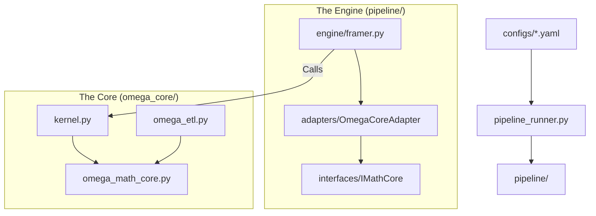

# OMEGA v5.2: The Epistemic Release (Distributed Controller-Worker)

> **"Physics is invariant. Structure is emergent. The observer is bounded."**

OMEGA v5.2 represents the convergence of **Universal Market Physics** (Sato 2025) and **Computational Information Theory** (Finzi 2026), plus a hard engineering pivot:
- **DoD 指标换轨**：`Vector Alignment (Physics)` -> `Model_Alignment (Epistemic)`，并保留 `Phys_Alignment` 作为基线对照。
- **内存/吞吐换轨**：禁用 `to_dicts()` 行级展开；核心算子张量化/向量化；仅保留严格因果的轻量 IIR 递推。
- **分布式执行换轨**：Mac 作为 **Controller（代码与配置权威）**；Windows1 + Linux 作为 **Workers（只拉代码、跑 framing）**；原始 `.7z` 数据不进 Git。

---

## 当前执行方式（2026-02-15，必须读）

你现在的实际环境是：
- **Mac**：Codex IDE 所在机，负责“改代码/写文档/发版本/分片编排”。
- **Windows1 + Linux**：各自外挂 `USB4 8T NVMe SSD`，两块盘内原始 `.7z` 数据完全一致；因此 **不需要内网搬运 raw 数据**，只需要同步代码与分片清单。

对应的落地文件/入口：
- 分布式总纲：`audit/v52_3_machies_sync.md`
- v52 后续实施总计划：`audit/v52_final_implementation_plan.md`
- 运行元信息模板：`audit/runtime/v52/run_meta.template.json`

### 强制纪律（否则会踩坑）

1. **禁止在 SMB/磁盘映射目录里当主工作区改代码**（会和 worker 跑任务互相污染）。
   - Controller（Mac）必须在本机磁盘持有完整 repo（例如 `~/work/Omega_vNext`）。
2. **Workers 永远只读拉取代码**（不要 push；不要在 worker 上改核心逻辑）。
3. **任何 framing/training/run 必须 pin 到明确的 Git commit 或 tag**，并写入 `run_meta.json`（由 `run_meta.template.json` 复制）。
4. `.gitignore` 负责隔离：`.7z` / `.parquet` / artifacts / logs 一律不进 Git。

---

## v5.2 分布式同步与运行（推荐路径）

### 1) Mac Controller：本地 clone + 本地 bare origin

推荐目录约定（示例）：
- 控制工作区（可编辑）：`~/work/Omega_vNext`
- 局域网 origin（bare repo，仅存 git objects）：`~/git/Omega_vNext.git`

> 注意：如果你无法在 macOS 开启 SSH（Remote Login），也可以走只读 `git://`（见下文）。

### 2) Workers：从 Mac 拉代码（两种传输方式选一个）

#### Option A：SSH（安全，需开启 macOS Remote Login）
- URL 形如：`ssh://<mac_user>@<mac_ip>/Users/<mac_user>/git/Omega_vNext.git`

#### Option B：`git://` daemon（只读，免管理员权限）
Controller（Mac）启动方式（一次性/或由 LaunchAgent 常驻）：
```bash
touch ~/git/Omega_vNext.git/git-daemon-export-ok
git daemon --reuseaddr --base-path=$HOME/git --listen=0.0.0.0 --port=9418 $HOME/git/Omega_vNext.git
```
Worker clone URL：
```bash
git clone git://<mac_ip>/Omega_vNext.git
```
验证连通：
```bash
git ls-remote git://<mac_ip>/Omega_vNext.git
```
安全提示：`git://` 无鉴权，仅限可信内网使用。

---

## 并行 framing（Windows1 + Linux 同时跑，零 raw 传输）

### 1) 生成分片清单（在任意一台“有 raw .7z”的机器上执行）

> 因为 Windows1 与 Linux 的 raw 盘内容完全一致，所以分片清单在哪台生成都一样。

```bash
python tools/build_7z_shards.py --root <RAW_ROOT> --out-dir audit/runtime/v52 --rule date_mod2
```

输出：
- `audit/runtime/v52/archive_manifest_7z.txt`
- `audit/runtime/v52/shard_windows1.txt`
- `audit/runtime/v52/shard_linux.txt`

将这 3 个小文件同步回 Mac Controller 的 repo 后，由 Mac 提交并 push（Workers 只 pull）。

### 2) Workers 各跑各的 shard（核心入口：`--archive-list`）

Windows1：
```bash
python pipeline_runner.py --stage frame --config configs/hardware/windows1.yaml --archive-list audit/runtime/v52/shard_windows1.txt
```

Linux：
```bash
python pipeline_runner.py --stage frame --config configs/hardware/linux.yaml --archive-list audit/runtime/v52/shard_linux.txt
```

`--archive-list` 支持：
- 清单内为相对路径（相对 `storage.source_root`）
- 或绝对路径（Windows/Linux 都可）

### 3) staging 与输出目录建议（重要）

- `RAW_ROOT`：USB4 盘（顺序读为主）
- `STAGE_ROOT`：尽量走内置 NVMe（解压/IO 压力大）
- `OUTPUT_ROOT`（frames parquet）：USB4 盘或内置大盘均可，但两台机器不要写同一目录（避免覆盖）

---

## 原始数据双备份同步机制（未来 raw data 变更时）

目标：当 raw `.7z` 有新增/修正时，能快速确认 Windows1 与 Linux 两份 raw 是否一致，并只补齐差异。

### 1) 各自生成 raw manifest（不进 Git）
```bash
python tools/gen_raw_manifest.py --root <RAW_ROOT> --ext .7z --out raw_manifest_<host>.jsonl
```

怀疑静默损坏时用强校验（慢）：
```bash
python tools/gen_raw_manifest.py --root <RAW_ROOT> --ext .7z --hash sha256 --out raw_manifest_<host>.jsonl
```

### 2) 比对 manifest，生成差异清单
```bash
python tools/compare_raw_manifests.py \
  --a raw_manifest_source.jsonl \
  --b raw_manifest_mirror.jsonl \
  --out-missing-in-b raw_missing_or_changed.txt
```

然后用 `rsync/rclone/robocopy` 按清单复制缺失/变更文件；复制后两边重新生成 manifest 再 compare 复核。

---

## 核心哲学 (The Theoretical Pillars)

1.  **The Universal Law (Sato 2025)**
    *   **Principle:** The price impact exponent $\delta$ is **strictly 0.5**.
    *   **Action:** Removed "SRL Race". Hardcoded $\delta = 0.5$.
    *   **Implied Y:** We invert the law ($Y = \frac{\Delta P}{\sigma \sqrt{Q/D}}$) to measure the instantaneous "rigidity" of the market structure.

2.  **Epiplexity as Compression Gain (Finzi 2026)**
    *   **Principle:** Complexity is not randomness. Structure is defined by the ability of a bounded observer (Linear Model) to outperform a naive observer (Mean).
    *   **Metric:** $Gain = 1 - \frac{Var(Residuals)}{Var(Total)}$.
    *   **Action:** Replaced LZ76 with Compression Gain. High Gain = High Structure = Actionable Signal.

3.  **The Holographic Damper**
    *   **Problem:** Updating internal state ($Y$) during noise (Low Epiplexity) causes model drift.
    *   **Solution:** A gating mechanism. The model only learns/updates when Epiplexity > Threshold.
    *   **Metaphor:** A damper that stiffens when it hits a solid object (Structure) but remains loose in air (Noise).

4.  **Causal Volume Projection (Paradox 3 Fix)**
    *   **Fix:** Volume buckets are now sized by linearly extrapolating current cumulative volume based on elapsed time. This eliminates look-ahead bias found in v40.
    *   **Implementation:** `omega_etl.py` now strictly enforces time-sorting of slices to ensure `cum_vol` is monotonic and causal.

---

## 系统架构 (v5.0 Architecture)

OMEGA v5.0 adopts a **Modular Pipeline Architecture**, separating Configuration, Logic, and Execution.



### 目录结构 (Directory Structure)

*   **`pipeline/`**: **The Execution Engine.**
    *   `config/`: Pydantic/Dataclass schemas for Hardware & Model.
    *   `interfaces/`: Abstract Base Classes (IMathCore) for future-proofing.
    *   `adapters/`: Glue code that binds `omega_core` to the pipeline.
    *   `engine/`: The logic for Framing, Training, and Backtesting.
*   **`omega_core/`**: **The Math Core (v5.0).**
    *   `omega_math_core.py`: Pure physics formulas (SRL 0.5, Compression Gain).
    *   `kernel.py`: The Holographic Damper logic.
    *   `trainer.py`: SGD Online Learning implementation (Multi-Symbol Aware).
*   **`configs/`**: **Configuration as Code.**
    *   `hardware/`: Hardware profiles (e.g., `active_profile.yaml`).
*   **`parallel_trainer/`**: **High-Performance Driver.**
    *   Legacy-compatible multiprocessing drivers for Training/Backtesting.
*   **`archive/`**: Legacy v1/v3/v40 code that is no longer active.

---

## 快速开始 (Quick Start)

v5.2 多机（Mac Controller + Windows1/Linux Workers）优先按本 README 上方 “分布式同步与运行 / 并行 framing” 执行。

下方历史章节（Windows Hub / 计划任务 / v5 runtime）仅保留为参考，不再作为 v5.2 推荐路径。

### 1. 配置硬件
OMEGA v5.0 自动检测硬件配置。首次运行会自动生成默认配置：
```bash
python pipeline_runner.py
```
编辑 generated `configs/hardware/active_profile.yaml` to match your paths (e.g., Source on E:, Stage on D:).

### 2. 执行 Framing (Smoke Test)
验证管道是否连通：
```bash
python pipeline_runner.py --stage frame --smoke
```

### 3. 全量 Framing (Phase 1)
```bash
python pipeline_runner.py --stage frame
```
*Note: This process runs massively parallel (48+ workers) and groups data by symbol to ensure Volume Clock integrity.*

### 4. 训练 (Phase 2)
```bash
python parallel_trainer/run_parallel_v31.py --stage-dir D:/Omega_train_stage
```
*Note: Ensure `D:/Omega_train_stage` exists for high-speed IO.*

### 5. 回测 (Phase 3)
```bash
python parallel_trainer/run_parallel_backtest_v31.py
```

### 5.1 命名治理与归档入口（2026-02-13）
- 命名治理方案：`audit/filesystem_naming_archive_plan_2026-02-13.md`
- v5 运行期未使用文件归档索引：`audit/v5_runtime/windows/ARCHIVE_INDEX.md`
- 归档根路径：`archive/legacy/2026-02-13/v5_runtime_unused/`

说明：
- 未来活跃文件命名不再包含版本号（如 `v31` / `v5`）。
- 版本信息改放在元数据、审计文档与 `archive/legacy/...` 路径层级。
- 当前 `run_parallel_v31.py` / `run_parallel_backtest_v31.py` 仍保留为兼容入口，后续按治理方案迁移为无版本入口。

### 6. Mac 主控 SSH（Windows_1）
已验证可从 Mac 无交互连接 Windows_1（仅连通 smoke，不触发 framing/train/backtest）。

Windows_1:
- Hostname: `DESKTOP-41JIDL2`
- User: `jiazi`
- IP: `192.168.3.112`

Mac `~/.ssh/config` 固化条目：
```sshconfig
Host windows1-w1
    HostName 192.168.3.112
    User jiazi
    BindAddress 192.168.3.49
    IdentityFile ~/.ssh/id_ed25519
    IdentitiesOnly yes
    PreferredAuthentications publickey
    StrictHostKeyChecking accept-new
    ConnectTimeout 8
```

连通 smoke:
```bash
ssh windows1-w1 "hostname && whoami"
```

说明：当前 Mac 存在双网卡同网段场景，需绑定源地址（`BindAddress 192.168.3.49`）以避免偶发 `No route to host`。

### 7. Windows_1 后台全链路（训练+回测）执行与监控（v5）
当前 detached 主入口：`audit/v5_runtime/windows/run_full_noresume_detached.ps1`。

1) 在 Mac 侧同步脚本到 Windows_1：
```bash
scp audit/v5_runtime/windows/run_full_noresume_detached.ps1 windows1-w1:/C:/Omega_vNext/audit/v5_runtime/windows/run_full_noresume_detached.ps1
```

2) 首次创建计划任务（只需一次）：
```bash
ssh windows1-w1 "cmd /c schtasks /Create /TN OmegaFullNoResumeDetached /SC ONCE /ST 00:00 /TR \"powershell.exe -NoProfile -ExecutionPolicy Bypass -File C:\\Omega_vNext\\audit\\v5_runtime\\windows\\run_full_noresume_detached.ps1\" /RL HIGHEST /F"
```

3) 每次启动全链路（脱离 SSH 会话）：
```bash
ssh windows1-w1 "cmd /c schtasks /Run /TN OmegaFullNoResumeDetached"
```

4) 监控训练/回测进度（Mac 侧随时执行）：
```bash
ssh windows1-w1 "powershell -NoProfile -Command \"Get-Content 'C:\\Omega_vNext\\audit\\v5_runtime\\windows\\train\\train_status.json'\""
ssh windows1-w1 "powershell -NoProfile -Command \"Get-Content 'C:\\Omega_vNext\\audit\\v5_runtime\\windows\\backtest\\backtest_status.json'\""
ssh windows1-w1 "powershell -NoProfile -Command \"Get-Content 'C:\\Omega_vNext\\audit\\v5_runtime\\windows\\pipeline\\full_noresume.log' -Tail 60\""
```

5) 快速判定是否异常退出：
```bash
ssh windows1-w1 "powershell -NoProfile -Command \"if (Test-Path 'C:\\Omega_vNext\\audit\\v5_runtime\\windows\\pipeline\\full_noresume_exit_code.txt') { Get-Content 'C:\\Omega_vNext\\audit\\v5_runtime\\windows\\pipeline\\full_noresume_exit_code.txt' } else { 'RUNNING' }\""
```

6) 已验证的稳定参数（CPU 训练）：
- `workers=8`
- `batch_rows=750000`
- `checkpoint_rows=1500000`
- `stage_dir=D:/Omega_train_stage`
- `stage_chunk_files=16`
- `stage_copy_workers=4`
- 断点续跑开启（不使用 `--no-resume`）

### 8. 审计门控说明（回测阶段）
- 默认 `fail_on_audit_failed=true`。
- 若最终 `FINAL AUDIT STATUS: FAILED`，进程会以 `exit code 1` 退出（属于策略审计失败，不是进程崩溃）。
- 若希望回测始终产出报告但不因审计失败返回非零，可在脚本参数中加入 `--allow-audit-failed`。

### 9. Mac 一键代码发布到 Windows1/Windows2（推荐）

目标：避免手工复制粘贴，仅同步代码，不同步 `data/`、`artifacts/` 等大目录。

#### 9.1 一次性初始化（Windows1 执行）

1) 在 `Windows1` 建立 bare hub：
```powershell
powershell -ExecutionPolicy Bypass -File tools\git_sync\windows_init_hub.ps1 `
  -SourceRepoPath C:\Omega_vNext `
  -BareHubPath C:\Git\Omega_vNext.git `
  -RemoteName hub
```

2) `Mac` 配置 hub 远端（已存在则 `set-url`）：
```bash
git remote add hub "ssh://<user>@windows1/C:/Git/Omega_vNext.git"
```

3) `Windows2` 首次克隆：
```powershell
git clone "ssh://<user>@windows1/C:/Git/Omega_vNext.git" C:\Omega_vNext
cd C:\Omega_vNext
git remote rename origin hub
```

#### 9.2 SSH 主机别名（Mac `~/.ssh/config`）

至少配置两个目标主机（示例）：
```sshconfig
Host windows1-w1
    HostName 192.168.3.112
    User jiazi
    IdentityFile ~/.ssh/id_ed25519
    IdentitiesOnly yes
    StrictHostKeyChecking accept-new

Host windows2-w2
    HostName <windows2_ip>
    User <windows2_user>
    IdentityFile ~/.ssh/id_ed25519
    IdentitiesOnly yes
    StrictHostKeyChecking accept-new
```

#### 9.3 日常一键发布（Mac 执行）

默认发布当前分支到 `hub`，并依次远程执行 `windows_update_from_hub.ps1`：
```bash
./tools/git_sync/mac_publish_and_rollout.sh --remote hub --branch main
```

带版本标签发布：
```bash
./tools/git_sync/mac_publish_and_rollout.sh --remote hub --branch main --tag v2026.02.12-r2
```

指定目标主机列表：
```bash
./tools/git_sync/mac_publish_and_rollout.sh --remote hub --branch main --hosts windows1-w1,windows2-w2
```

#### 9.4 仅在 Windows 单机更新（手工兜底）

```powershell
powershell -ExecutionPolicy Bypass -File tools\git_sync\windows_update_from_hub.ps1 `
  -RepoPath C:\Omega_vNext `
  -RemoteName hub `
  -Branch main
```

#### 9.5 使用约束（必须遵守）

- Git 仅管理代码、配置、脚本、文档。
- `data/`、`artifacts/`、运行日志保持本地，不进入版本库。
- 发布以 `main`/tag 为准，Windows 侧不要直接在生产目录做临时提交后长期不推送。

---

## 关键文档 (Documentation)

*   **[audit/v5_explain.md](audit/v5_explain.md)**: v5.0 的详细解释文档（理论背景与代码实现）。
*   **[audit/filesystem_naming_archive_plan_2026-02-13.md](audit/filesystem_naming_archive_plan_2026-02-13.md)**: 文件命名去版本号与归档迁移方案（分阶段执行）。
*   **[audit/v5_runtime/windows/ARCHIVE_INDEX.md](audit/v5_runtime/windows/ARCHIVE_INDEX.md)**: 本次 v5 未使用文件归档映射（原路径 -> archive 路径）。
*   **[audit/OMEGA_NextGen_Architecture_Plan.md](audit/OMEGA_NextGen_Architecture_Plan.md)**: 未来架构演进路线图。
*   **[audit/v40_storage_estimation_2020_2026.md](audit/v40_storage_estimation_2020_2026.md)**: 存储规划指南。
*   **[docs/git_multi_machine_hub.md](docs/git_multi_machine_hub.md)**: Mac + Windows1 + Windows2 代码同步/发布规范（避免手工复制粘贴）。
*   **[omega_core/README.md](omega_core/README.md)**: Core 数学内核说明。
*   **[parallel_trainer/README.md](parallel_trainer/README.md)**: 并行训练/回测执行说明。
*   **[rq/README.md](rq/README.md)**: RQ 相关模块说明。

## Agent Skills Index

*   [.agent/skills/ai_handover/SKILL.md](.agent/skills/ai_handover/SKILL.md)
*   [.agent/skills/config_promotion_protocol/SKILL.md](.agent/skills/config_promotion_protocol/SKILL.md)
*   [.agent/skills/data_download/SKILL.md](.agent/skills/data_download/SKILL.md)
*   [.agent/skills/data_integrity_guard/SKILL.md](.agent/skills/data_integrity_guard/SKILL.md)
*   [.agent/skills/engineering/SKILL.md](.agent/skills/engineering/SKILL.md)
*   [.agent/skills/evidence_based_reasoning/SKILL.md](.agent/skills/evidence_based_reasoning/SKILL.md)
*   [.agent/skills/evolution_knowledge/SKILL.md](.agent/skills/evolution_knowledge/SKILL.md)
*   [.agent/skills/hardcode_guard/SKILL.md](.agent/skills/hardcode_guard/SKILL.md)
*   [.agent/skills/innovation_sandbox/SKILL.md](.agent/skills/innovation_sandbox/SKILL.md)
*   [.agent/skills/math_consistency/SKILL.md](.agent/skills/math_consistency/SKILL.md)
*   [.agent/skills/math_core/SKILL.md](.agent/skills/math_core/SKILL.md)
*   [.agent/skills/multi_agent_rule_sync/SKILL.md](.agent/skills/multi_agent_rule_sync/SKILL.md)
*   [.agent/skills/omega_data/SKILL.md](.agent/skills/omega_data/SKILL.md)
*   [.agent/skills/omega_development/SKILL.md](.agent/skills/omega_development/SKILL.md)
*   [.agent/skills/omega_engineering/SKILL.md](.agent/skills/omega_engineering/SKILL.md)
*   [.agent/skills/ops/SKILL.md](.agent/skills/ops/SKILL.md)
*   [.agent/skills/parallel-backtest-debugger/SKILL.md](.agent/skills/parallel-backtest-debugger/SKILL.md)
*   [.agent/skills/physics/SKILL.md](.agent/skills/physics/SKILL.md)
*   [.agent/skills/pipeline_performance/SKILL.md](.agent/skills/pipeline_performance/SKILL.md)
*   [.agent/skills/qmtsdk/SKILL.md](.agent/skills/qmtsdk/SKILL.md)
*   [.agent/skills/rqsdk/SKILL.md](.agent/skills/rqsdk/SKILL.md)
*   [.agent/skills/v3_mainline_guard/SKILL.md](.agent/skills/v3_mainline_guard/SKILL.md)

---

> **Note:** v40 Frames are **NOT COMPATIBLE** with v5.0 due to the Paradox 3 fix. Please re-run framing.
