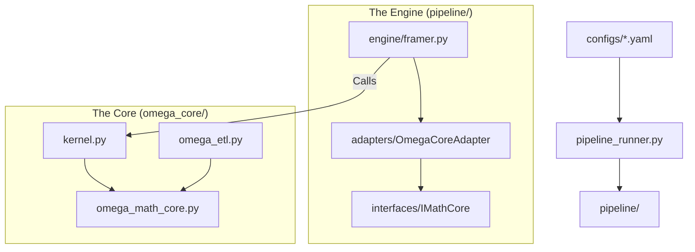

# OMEGA v5.0: The Holographic Damper

> **"Physics is invariant. Structure is emergent. The observer is bounded."**

OMEGA v5.0 represents the convergence of **Universal Market Physics** (Sato 2025) and **Computational Information Theory** (Finzi 2026). It abandons empirical parameter tuning in favor of deriving trading signals from first principles: the universality of the Square-Root Law and the compressibility of market data.

---

## 核心哲学 (The Theoretical Pillars)

1.  **The Universal Law (Sato 2025)**
    *   **Principle:** The price impact exponent $\delta$ is **strictly 0.5**.
    *   **Action:** Removed "SRL Race". Hardcoded $\delta = 0.5$.
    *   **Implied Y:** We invert the law ($Y = \frac{\Delta P}{\sigma \sqrt{Q/D}}$) to measure the instantaneous "rigidity" of the market structure.

2.  **Epiplexity as Compression Gain (Finzi 2026)**
    *   **Principle:** Complexity is not randomness. Structure is defined by the ability of a bounded observer (Linear Model) to outperform a naive observer (Mean).
    *   **Metric:** $Gain = 1 - \frac{Var(Residuals)}{Var(Total)}$.
    *   **Action:** Replaced LZ76 with Compression Gain. High Gain = High Structure = Actionable Signal.

3.  **The Holographic Damper**
    *   **Problem:** Updating internal state ($Y$) during noise (Low Epiplexity) causes model drift.
    *   **Solution:** A gating mechanism. The model only learns/updates when Epiplexity > Threshold.
    *   **Metaphor:** A damper that stiffens when it hits a solid object (Structure) but remains loose in air (Noise).

4.  **Causal Volume Projection (Paradox 3 Fix)**
    *   **Fix:** Volume buckets are now sized by linearly extrapolating current cumulative volume based on elapsed time. This eliminates look-ahead bias found in v40.
    *   **Implementation:** `omega_etl.py` now strictly enforces time-sorting of slices to ensure `cum_vol` is monotonic and causal.

---

## 系统架构 (v5.0 Architecture)

OMEGA v5.0 adopts a **Modular Pipeline Architecture**, separating Configuration, Logic, and Execution.



### 目录结构 (Directory Structure)

*   **`pipeline/`**: **The Execution Engine.**
    *   `config/`: Pydantic/Dataclass schemas for Hardware & Model.
    *   `interfaces/`: Abstract Base Classes (IMathCore) for future-proofing.
    *   `adapters/`: Glue code that binds `omega_core` to the pipeline.
    *   `engine/`: The logic for Framing, Training, and Backtesting.
*   **`omega_core/`**: **The Math Core (v5.0).**
    *   `omega_math_core.py`: Pure physics formulas (SRL 0.5, Compression Gain).
    *   `kernel.py`: The Holographic Damper logic.
    *   `trainer.py`: SGD Online Learning implementation (Multi-Symbol Aware).
*   **`configs/`**: **Configuration as Code.**
    *   `hardware/`: Hardware profiles (e.g., `active_profile.yaml`).
*   **`parallel_trainer/`**: **High-Performance Driver.**
    *   Legacy-compatible multiprocessing drivers for Training/Backtesting.
*   **`archive/`**: Legacy v1/v3/v40 code that is no longer active.

---

## 快速开始 (Quick Start)

### 1. 配置硬件
OMEGA v5.0 自动检测硬件配置。首次运行会自动生成默认配置：
```bash
python pipeline_runner.py
```
编辑 generated `configs/hardware/active_profile.yaml` to match your paths (e.g., Source on E:, Stage on D:).

### 2. 执行 Framing (Smoke Test)
验证管道是否连通：
```bash
python pipeline_runner.py --stage frame --smoke
```

### 3. 全量 Framing (Phase 1)
```bash
python pipeline_runner.py --stage frame
```
*Note: This process runs massively parallel (48+ workers) and groups data by symbol to ensure Volume Clock integrity.*

### 4. 训练 (Phase 2)
```bash
python parallel_trainer/run_parallel_v31.py --stage-dir D:/Omega_train_stage
```
*Note: Ensure `D:/Omega_train_stage` exists for high-speed IO.*

### 5. 回测 (Phase 3)
```bash
python parallel_trainer/run_parallel_backtest_v31.py
```

---

## 关键文档 (Documentation)

*   **[audit/v5_explain.md](audit/v5_explain.md)**: v5.0 的详细解释文档（理论背景与代码实现）。
*   **[audit/OMEGA_NextGen_Architecture_Plan.md](audit/OMEGA_NextGen_Architecture_Plan.md)**: 未来架构演进路线图。
*   **[audit/v40_storage_estimation_2020_2026.md](audit/v40_storage_estimation_2020_2026.md)**: 存储规划指南。

---

> **Note:** v40 Frames are **NOT COMPATIBLE** with v5.0 due to the Paradox 3 fix. Please re-run framing.
