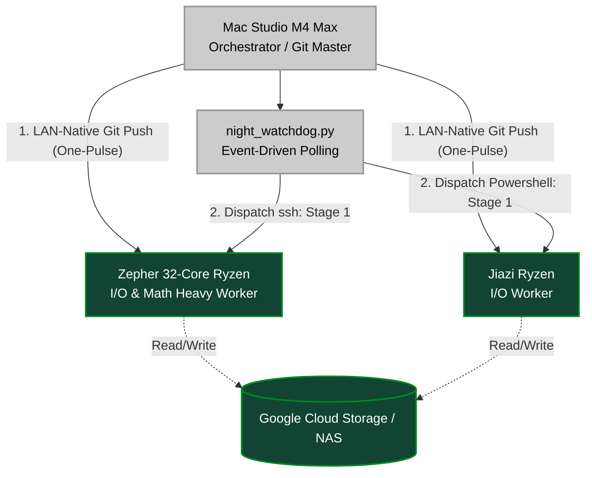

# OMEGA V62 Architecture Topology & Data Flow

**Date:** 2026-02-22
**Status:** V62 Blueprint (Zero-Version)

This topology diagram maps the "Orthogonal Decoupling" architecture, separating objective data extraction from subjective physics mathematics, and illustrating the event-driven control plane.

## 1. Global Process Topology

```mermaid
graph TD
    classDef storage fill:#333,stroke:#666,stroke-width:2px,color:#fff;
    classDef compute fill:#0b4,stroke:#093,stroke-width:2px,color:#fff;
    classDef math fill:#90c,stroke:#609,stroke-width:2px,color:#fff;
    classDef ml fill:#b30,stroke:#800,stroke-width:2px,color:#fff;
    classDef orchestrator fill:#059,stroke:#036,stroke-width:2px,color:#fff;

    subgraph Data Lake [Level-2 Storage Lake]
        Raw7z[(Raw .7z Archives)]:::storage
    end

    subgraph Stage 1: The Objective Extractor [Framing Phase 1]
        Extractor[linux_framing.py / windows_framing.py\nPure Objective Extraction\nBypass ZFS to RAM Disk]:::compute
    end

    subgraph The Base Layer
        BaseParquet[(Base_L1.parquet\nPrice, OFI, Depth, Vol\nNo Physics)]:::storage
    end

    subgraph Stage 2: The Subjective Physics Engine [Framing Phase 2]
        MathCore[omega_math_core.py\n@numba.njit Parallel Engine\nTime-bounded MDL, SRL, Topo]:::math
    end

    subgraph The Feature Layer
        FeatureParquet[(Feature_L2.parquet\nPhysics Feature Manifold)]:::storage
    end

    subgraph ML & Swarm Optimizer
        Swarm[swarm_xgb.py\nOptuna + XGBoost\nOrthogonal Target Isolation]:::ml
    end

    subgraph Local Inference & Verification
        Backtester[run_local_backtest.py\nSpatial Ticker Sharding\nT+1 Causality Preservation]:::compute
    end

    %% Flow Dynamics
    Raw7z -- "Parallel I/O (I/O Bound)" --> Extractor
    Extractor -- "Clean Timestamps" --> BaseParquet
    BaseParquet -- "5GB/s RAM Read" --> MathCore
    MathCore -- "AMD 32-Core CPU Bound" --> FeatureParquet
    
    FeatureParquet -- "Alpha Target Generation" --> Swarm
    Swarm -- "Final V62 Weights" --> Backtester
    FeatureParquet -- "Test Set" --> Backtester
```

## 2. The Internal Mathematical Engine Topology (`omega_math_core.py`)

This details the "Dynamic Model Arena" where three distinct theoretical probes compete for the lowest Minimum Description Length (MDL) at each microsecond.

```mermaid
graph LR
    classDef data fill:#333,stroke:#666,stroke-width:2px,color:#fff;
    classDef probe fill:#90c,stroke:#609,stroke-width:2px,color:#fff;
    classDef decision fill:#059,stroke:#036,stroke-width:2px,color:#fff;

    Input[(Base_L1\nMicrosecond Slice)]:::data

    subgraph MDL Competition Arena [Phase 5: Dynamic Arena]
        P1[Linear Probe\ndelta_k = 2]:::probe
        P2[SRL Probe\ndelta_k = 1\nDelta=0.5]:::probe
        P3[Topology Probe\ndelta_k = 3]:::probe
        
        Calc1[Bits Saved 1]:::data
        Calc2[Bits Saved 2]:::data
        Calc3[Bits Saved 3]:::data
    end

    Decision{Argmax Bits Saved\n(Time-bounded MDL)}:::decision
    Output[(Final State Vector)]:::data

    Input --> P1 --> Calc1
    Input --> P2 --> Calc2
    Input --> P3 --> Calc3
    
    Calc1 --> Decision
    Calc2 --> Decision
    Calc3 --> Decision
    
    Decision -->|Determines Dominant Physics| Output
```

## 3. The Mac Orchestrator Topology (Control Plane)

The Mac acts as the central git authority and orchestrator, dispatching stateless instructions to Windows and Linux nodes.



## Summary of the "Zero-Version" Concept

Notice that in the above topology, **none** of the executable scripts or core engines explicitly contain `v60`, `v61`, or `v62` in their filenames.
Version state is solely resolved via `git hash` and the internal config loader (`GLOBAL_CFG.pipeline_version`), guaranteeing that this architecture persists elegantly across all future iterations.
